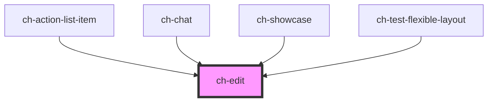

# ch-edit

<!-- Auto Generated Below -->

## Overview

A wrapper for the input and textarea elements. It additionally provides:
 - A placeholder for `"date"`, `"datetime-local"` and `"time"` types.
 - An action button.
 - Useful style resets.
 - Support for picture formatting.
 - Support to auto grow the control when used with multiline (useful to
   model chat inputs).
 - An image which can have multiple states.
 - Support for debouncing the input event.

## Properties

| Property                        | Attribute                            | Description                                                                                                                                                                                                                                                                                                           | Type                                                                                                                                       | Default                                                                                                                                                           |
| ------------------------------- | ------------------------------------ | --------------------------------------------------------------------------------------------------------------------------------------------------------------------------------------------------------------------------------------------------------------------------------------------------------------------- | ------------------------------------------------------------------------------------------------------------------------------------------ | ----------------------------------------------------------------------------------------------------------------------------------------------------------------- |
| `accessibleName`                | `accessible-name`                    | Specifies a short string, typically 1 to 3 words, that authors associate with an element to provide users of assistive technologies with a label for the element.                                                                                                                                                     | `string`                                                                                                                                   | `undefined`                                                                                                                                                       |
| `autoFocus`                     | `auto-focus`                         | Specifies if the control automatically get focus when the page loads.                                                                                                                                                                                                                                                 | `boolean`                                                                                                                                  | `false`                                                                                                                                                           |
| `autoGrow`                      | `auto-grow`                          | This property defines if the control size will grow automatically, to adjust to its content size.                                                                                                                                                                                                                     | `boolean`                                                                                                                                  | `false`                                                                                                                                                           |
| `autocapitalize`                | `autocapitalize`                     | Specifies the auto-capitalization behavior. Same as [autocapitalize](https://developer.apple.com/library/content/documentation/AppleApplications/Reference/SafariHTMLRef/Articles/Attributes.html#//apple_ref/doc/uid/TP40008058-autocapitalize) attribute for `input` elements. Only supported by Safari and Chrome. | `string`                                                                                                                                   | `undefined`                                                                                                                                                       |
| `autocomplete`                  | `autocomplete`                       | This attribute indicates whether the value of the control can be automatically completed by the browser. Same as [autocomplete](https://developer.mozilla.org/en-US/docs/Web/HTML/Element/input#attr-autocomplete) attribute for `input` elements.                                                                    | `"current-password" \| "new-password" \| "off" \| "on"`                                                                                    | `"off"`                                                                                                                                                           |
| `debounce`                      | `debounce`                           | Specifies a debounce for the input event.                                                                                                                                                                                                                                                                             | `number`                                                                                                                                   | `0`                                                                                                                                                               |
| `disabled`                      | `disabled`                           | This attribute lets you specify if the element is disabled. If disabled, it will not fire any user interaction related event (for example, click event).                                                                                                                                                              | `boolean`                                                                                                                                  | `false`                                                                                                                                                           |
| `getImagePathCallback`          | --                                   | This property specifies a callback that is executed when the path for an startImgSrc needs to be resolved.                                                                                                                                                                                                            | `(imageSrc: string) => GxImageMultiState`                                                                                                  | `undefined`                                                                                                                                                       |
| `hostParts`                     | `host-parts`                         | Specifies a set of parts to use in the Host element (`ch-edit`).                                                                                                                                                                                                                                                      | `string`                                                                                                                                   | `undefined`                                                                                                                                                       |
| `maxLength`                     | `max-length`                         | This property defines the maximum string length that the user can enter into the control.                                                                                                                                                                                                                             | `number`                                                                                                                                   | `undefined`                                                                                                                                                       |
| `mode`                          | `mode`                               | This attribute hints at the type of data that might be entered by the user while editing the element or its contents. This allows a browser to display an appropriate virtual keyboard. Only works when `multiline === false`.                                                                                        | `"decimal" \| "email" \| "none" \| "numeric" \| "search" \| "tel" \| "text" \| "url"`                                                      | `undefined`                                                                                                                                                       |
| `multiline`                     | `multiline`                          | Controls if the element accepts multiline text.                                                                                                                                                                                                                                                                       | `boolean`                                                                                                                                  | `false`                                                                                                                                                           |
| `name`                          | `name`                               | This property specifies the `name` of the control when used in a form.                                                                                                                                                                                                                                                | `string`                                                                                                                                   | `undefined`                                                                                                                                                       |
| `pattern`                       | `pattern`                            | This attribute specifies a regular expression the form control's value should match. Only works when `multiline === false`.                                                                                                                                                                                           | `string`                                                                                                                                   | `undefined`                                                                                                                                                       |
| `picture`                       | `picture`                            | Specifies a picture to apply for the value of the control. Only works if not `multiline`.                                                                                                                                                                                                                             | `string`                                                                                                                                   | `undefined`                                                                                                                                                       |
| `pictureCallback`               | --                                   | Specifies the callback to execute when the picture must computed for the new value.                                                                                                                                                                                                                                   | `(value: any, picture: string) => string`                                                                                                  | `undefined`                                                                                                                                                       |
| `placeholder`                   | `placeholder`                        | A hint to the user of what can be entered in the control. Same as [placeholder](https://developer.mozilla.org/en-US/docs/Web/HTML/Element/input#attr-placeholder) attribute for `input` elements.                                                                                                                     | `string`                                                                                                                                   | `undefined`                                                                                                                                                       |
| `preventEnterInInputEditorMode` | `prevent-enter-in-input-editor-mode` | Specifies whether the ch-edit should prevent the default behavior of the `Enter` key when in input editor mode.  In other words, if `true`, pressing `Enter` will not submit the form or trigger the default action of the `Enter` key in an input field when the user-edit is in input editor mode.                  | `boolean`                                                                                                                                  | `false`                                                                                                                                                           |
| `readonly`                      | `readonly`                           | This attribute indicates that the user cannot modify the value of the control. Same as [readonly](https://developer.mozilla.org/en-US/docs/Web/HTML/Element/input#attr-readonly) attribute for `input` elements.                                                                                                      | `boolean`                                                                                                                                  | `false`                                                                                                                                                           |
| `showAdditionalContentAfter`    | `show-additional-content-after`      | If `true`, a slot is rendered in the edit with `"additional-content-after"` name. This slot is intended to customize the internal content of the edit by adding additional elements after the edit content.                                                                                                           | `boolean`                                                                                                                                  | `false`                                                                                                                                                           |
| `showAdditionalContentBefore`   | `show-additional-content-before`     | If `true`, a slot is rendered in the edit with `"additional-content-before"` name. This slot is intended to customize the internal content of the edit by adding additional elements before the edit content.                                                                                                         | `boolean`                                                                                                                                  | `false`                                                                                                                                                           |
| `showPassword`                  | `show-password`                      | Specifies if the password is displayed as plain text when using `type = "password"`.                                                                                                                                                                                                                                  | `boolean`                                                                                                                                  | `false`                                                                                                                                                           |
| `showPasswordButton`            | `show-password-button`               | Specifies if the show password button is displayed when using `type = "password"`.                                                                                                                                                                                                                                    | `boolean`                                                                                                                                  | `false`                                                                                                                                                           |
| `spellcheck`                    | `spellcheck`                         | Specifies whether the element may be checked for spelling errors                                                                                                                                                                                                                                                      | `boolean`                                                                                                                                  | `false`                                                                                                                                                           |
| `startImgSrc`                   | `start-img-src`                      | Specifies the source of the start image.                                                                                                                                                                                                                                                                              | `string`                                                                                                                                   | `undefined`                                                                                                                                                       |
| `startImgType`                  | `start-img-type`                     | Specifies the source of the start image.                                                                                                                                                                                                                                                                              | `"background" \| "mask"`                                                                                                                   | `"background"`                                                                                                                                                    |
| `translations`                  | --                                   | Specifies the literals required in the control.                                                                                                                                                                                                                                                                       | `{ accessibleName: { clearSearchButton?: "Clear search"; hidePasswordButton?: "Hide password"; showPasswordButton?: "Show password"; }; }` | `{     accessibleName: {       clearSearchButton: "Clear search",       hidePasswordButton: "Hide password",       showPasswordButton: "Show password"     }   }` |
| `type`                          | `type`                               | The type of control to render. A subset of the types supported by the `input` element is supported:  * `"date"` * `"datetime-local"` * `"email"` * `"file"` * `"number"` * `"password"` * `"search"` * `"tel"` * `"text"` * `"url"`                                                                                   | `"date" \| "datetime-local" \| "email" \| "file" \| "number" \| "password" \| "search" \| "tel" \| "text" \| "time" \| "url"`              | `"text"`                                                                                                                                                          |
| `value`                         | `value`                              | The initial value of the control.                                                                                                                                                                                                                                                                                     | `string`                                                                                                                                   | `undefined`                                                                                                                                                       |

## Events

| Event                      | Description                                                                                                                                                                                                                                                                                          | Type                   |
| -------------------------- | ---------------------------------------------------------------------------------------------------------------------------------------------------------------------------------------------------------------------------------------------------------------------------------------------------- | ---------------------- |
| `change`                   | The `change` event is emitted when a change to the element's value is committed by the user. Unlike the `input` event, the `change` event is not necessarily fired for each change to an element's value but when the control loses focus. This event is _NOT_ debounced by the `debounce` property. | `CustomEvent<any>`     |
| `input`                    | Fired synchronously when the value is changed. This event is debounced by the `debounce` property.                                                                                                                                                                                                   | `CustomEvent<string>`  |
| `passwordVisibilityChange` | Fired when the visibility of the password (when using `type="password"`) is changed by clicking on the show password button.  The detail contains the new value of the `showPassword` property.                                                                                                      | `CustomEvent<boolean>` |

## Slots

| Slot                          | Description                                                                           |
| ----------------------------- | ------------------------------------------------------------------------------------- |
| `"additional-content-after"`  | The slot used for the additional content when `showAdditionalContentAfter === true`.  |
| `"additional-content-before"` | The slot used for the additional content when `showAdditionalContentBefore === true`. |

## Shadow Parts

| Part                 | Description                                                                                                                                          |
| -------------------- | ---------------------------------------------------------------------------------------------------------------------------------------------------- |
| `"date-placeholder"` | A placeholder displayed when the control is editable (`readonly="false"`), has no value set, and its type is `"datetime-local" \| "date" \| "time"`. |

## CSS Custom Properties

| Name                                   | Description                                                                                                                                                                                                                                                                                                                                                                                                                                                                                                                                                                                                                                                                                                                                                                                                                                                                                                                                                                                                                                                                                                                                                                                                                                                                                                                                                                                                                                                                       |
| -------------------------------------- | --------------------------------------------------------------------------------------------------------------------------------------------------------------------------------------------------------------------------------------------------------------------------------------------------------------------------------------------------------------------------------------------------------------------------------------------------------------------------------------------------------------------------------------------------------------------------------------------------------------------------------------------------------------------------------------------------------------------------------------------------------------------------------------------------------------------------------------------------------------------------------------------------------------------------------------------------------------------------------------------------------------------------------------------------------------------------------------------------------------------------------------------------------------------------------------------------------------------------------------------------------------------------------------------------------------------------------------------------------------------------------------------------------------------------------------------------------------------------------- |
| `--ch-edit-auto-fill-background-color` | Define the background color when the edit is auto filled. (#e8f0fe by default)                                                                                                                                                                                                                                                                                                                                                                                                                                                                                                                                                                                                                                                                                                                                                                                                                                                                                                                                                                                                                                                                                                                                                                                                                                                                                                                                                                                                    |
| `--ch-edit-gap`                        | Specifies the gap between the start image and the value of the control. @default 0px                                                                                                                                                                                                                                                                                                                                                                                                                                                                                                                                                                                                                                                                                                                                                                                                                                                                                                                                                                                                                                                                                                                                                                                                                                                                                                                                                                                              |
| `--ch-edit__background-image-size`     | Specifies the size of the start and clear images of the control. @default 100%                                                                                                                                                                                                                                                                                                                                                                                                                                                                                                                                                                                                                                                                                                                                                                                                                                                                                                                                                                                                                                                                                                                                                                                                                                                                                                                                                                                                    |
| `--ch-edit__clear-button-image`        | Specifies the image for the clear button. @default url('data:image/svg+xml,<svg width="24" height="24" viewBox="0 0 24 24" xmlns="http://www.w3.org/2000/svg"><path d="M19 6.41L17.59 5L12 10.59L6.41 5L5 6.41L10.59 12L5 17.59L6.41 19L12 13.41L17.59 19L19 17.59L13.41 12L19 6.41Z"/></svg>')                                                                                                                                                                                                                                                                                                                                                                                                                                                                                                                                                                                                                                                                                                                                                                                                                                                                                                                                                                                                                                                                                                                                                                                   |
| `--ch-edit__image-size`                | Specifies the box size that contains the start and clear images of the control. @default 0.875em                                                                                                                                                                                                                                                                                                                                                                                                                                                                                                                                                                                                                                                                                                                                                                                                                                                                                                                                                                                                                                                                                                                                                                                                                                                                                                                                                                                  |
| `--ch-edit__password-displayed-image`  | Specifies the image for the show password button when the password is displayed. @default url('data:image/svg+xml,<svg width="24" height="24" style="transform:scale(1.06) translateX(0.5px)" viewBox="0 0 24 24" xmlns="http://www.w3.org/2000/svg"><path d="M19.7306 4.25083C20.065 4.58569 20.065 5.12817 19.7306 5.46303L5.64167 19.6777C5.4817 19.8397 5.26322 19.9304 5.03558 19.9293C4.68891 19.929 4.37651 19.7201 4.24389 19.3998C4.11127 19.0795 4.1845 18.7108 4.42948 18.4656L18.5184 4.25083C18.8533 3.91639 19.3957 3.91639 19.7306 4.25083ZM17.747 9.104L18.1589 9.38794C19.2025 10.1307 20.1595 10.9891 21.0114 11.9471C21.0114 11.9471 16.9746 16.7044 11.9886 16.7044C11.4534 16.686 10.9212 16.6171 10.399 16.4986L11.3253 15.5609C11.5437 15.6047 11.7658 15.6276 11.9886 15.6295C12.9711 15.6386 13.9166 15.2547 14.6146 14.5631C15.3126 13.8716 15.7052 12.9297 15.7052 11.9471C15.7056 11.7016 15.6826 11.4565 15.6366 11.2152L17.747 9.104ZM11.9886 7.1441C12.6002 7.14913 13.2096 7.21812 13.8068 7.34994L12.8005 8.35629C12.534 8.29641 12.2617 8.26573 11.9886 8.2648C9.96827 8.28363 8.34044 9.92676 8.34053 11.9471C8.34586 12.232 8.38035 12.5156 8.44345 12.7934L6.43074 14.8175V14.829C5.16463 14.011 4.01122 13.0306 3 11.9128C3 11.9128 7.03684 7.1441 11.9886 7.1441ZM14.5159 12.336C14.3441 13.402 13.5111 14.2396 12.446 14.4173L14.5159 12.336ZM11.7598 9.44269L9.47267 11.7299C9.57903 10.5135 10.5434 9.54906 11.7598 9.44269Z"/></svg>') |
| `--ch-edit__password-hidden-image`     | Specifies the image for the show password button when the password is hidden. @default url('data:image/svg+xml,<svg width="24" height="24" viewBox="0 0 24 24" xmlns="http://www.w3.org/2000/svg"><path d="M12.5 7C17.7497 7 22 11.988 22 11.988V12.024C22 12.024 17.7376 17 12.5 17C7.26236 17 3 11.988 3 11.988C3 11.988 7.25032 7 12.5 7ZM9.73369 9.28969C8.62237 10.3998 8.29261 12.0676 8.89837 13.5144C9.50412 14.9612 10.9259 15.9017 12.5 15.8969C14.6432 15.8903 16.3771 14.1583 16.3771 12.024C16.3771 10.4564 15.4282 9.0435 13.9735 8.44475C12.5187 7.84601 10.845 8.17956 9.73369 9.28969ZM12.5 9.3741C13.9669 9.38067 15.1544 10.5632 15.161 12.024C15.161 13.4875 13.9696 14.6739 12.5 14.6739C11.0304 14.6739 9.83904 13.4875 9.83904 12.024C9.83904 10.5605 11.0304 9.3741 12.5 9.3741Z"/></svg>')                                                                                                                                                                                                                                                                                                                                                                                                                                                                                                                                                                                                                                                               |
| `--ch-placeholder-color`               | Define the placeholder color when the edit does not have a value set. (currentColor by default)                                                                                                                                                                                                                                                                                                                                                                                                                                                                                                                                                                                                                                                                                                                                                                                                                                                                                                                                                                                                                                                                                                                                                                                                                                                                                                                                                                                   |

## Dependencies

### Used by

 - [ch-action-list-item](../action-list/internal/action-list-item)
 - [ch-chat](../chat)
 - [ch-showcase](../../showcase/assets/components)
 - [ch-test-flexible-layout](../test/test-flexible-layout)

### Graph

----------------------------------------------

*Built with [StencilJS](https://stenciljs.com/)*
