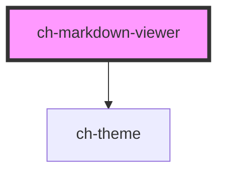

# ch-markdown-viewer

## Table of Contents

- [Overview](#overview)
- [Features](#features)
- [Use when](#use-when)
- [Do not use when](#do-not-use-when)
- [Accessibility](#accessibility)
- [Usage](./docs/usage.md)
- [Properties](#properties)
- [Dependencies](#dependencies)
  - [Depends on](#depends-on)
  - [Graph](#graph)
- [Styling](./docs/styling.md)

<!-- Auto Generated Below -->

## Overview

The `ch-markdown-viewer` component renders Markdown content as rich HTML with GFM support, code highlighting, math rendering, and streaming indicators.

## Features
 - Parses Markdown to [mdast](https://github.com/syntax-tree/mdast) using [micromark](https://github.com/micromark/micromark) via [mdast-util-from-markdown](https://github.com/syntax-tree/mdast-util-from-markdown), with a reactive render layer that only updates changed DOM portions.
 - GitHub Flavored Markdown (GFM) via [mdast-util-gfm](https://github.com/syntax-tree/mdast-util-gfm) and [micromark-extension-gfm](https://github.com/micromark/micromark-extension-gfm).
 - Code highlighting by parsing code blocks to [hast](https://github.com/syntax-tree/hast) using [lowlight](https://github.com/wooorm/lowlight), supporting all [highlight.js](https://github.com/highlightjs/highlight.js) languages.
 - On-demand loading of code parsers and language grammars at runtime.
 - Math rendering (built-in extension), raw HTML pass-through, and streaming indicator for real-time content.
 - Custom extensions for adding new syntax and rendering behavior.
 - Theming support via the `theme` property with optional flash-of-unstyled-content prevention.

## Use when
 - Displaying user-authored or AI-generated Markdown in a polished, interactive way.
 - Rendering Markdown content that includes headings, lists, code blocks, tables, and math expressions.

## Do not use when
 - Only plain text needs to be displayed -- prefer `ch-textblock` for better performance.
 - Full math rendering is needed and Markdown is not involved -- prefer `ch-math-viewer` directly.

## Accessibility
 - Renders semantic HTML elements (headings, lists, tables, code blocks) that are natively accessible to assistive technologies.
 - Code blocks are rendered via `ch-code`, which provides scrollable, labeled code regions.
 - Math expressions rendered via the math extension include MathML for screen reader compatibility.

## Properties

| Property                      | Attribute                         | Description                                                                                                                                                                                                                                                                                                                                                                                                                                                                                       | Type                                                           | Default                |
| ----------------------------- | --------------------------------- | ------------------------------------------------------------------------------------------------------------------------------------------------------------------------------------------------------------------------------------------------------------------------------------------------------------------------------------------------------------------------------------------------------------------------------------------------------------------------------------------------- | -------------------------------------------------------------- | ---------------------- |
| `avoidFlashOfUnstyledContent` | `avoid-flash-of-unstyled-content` | When `true`, visually hides the contents of the root node until the theme stylesheet has loaded, preventing a flash of unstyled content. Only takes effect when the `theme` property is set; otherwise this property has no visible effect.                                                                                                                                                                                                                                                       | `boolean`                                                      | `false`                |
| `extensions`                  | --                                | Specifies an array of custom extensions to extend and customize the rendered markdown language. There a 3 things needed to implement an extension:  - A tokenizer (the heavy part of the extension).  - A mapping between the custom token to the custom mdast nodes (pretty straightforward).  - A render of the custom mdast nodes in Lit's `TemplateResult` (pretty straightforward).  You can see an [example here](./examples/index.ts), which turns syntax like `Some text [[ Value ]]` to: | `MarkdownViewerExtension<object>[]`                            | `undefined`            |
| `rawHtml`                     | `raw-html`                        | When `true`, raw HTML blocks in the Markdown source are rendered as actual HTML elements (with sanitization). When `false`, HTML blocks are ignored and not rendered.  Note: in the current version, `allowDangerousHtml` is always `true` internally, so this flag controls whether HTML is passed through to the rendered output.                                                                                                                                                               | `boolean`                                                      | `false`                |
| `renderCode`                  | --                                | Allows custom rendering of code blocks (fenced code). When `undefined`, the default code renderer (which uses `ch-code`) is used. Provide a custom function to render code blocks with a different component or UI (e.g., adding copy buttons, line numbers, etc.).                                                                                                                                                                                                                               | `(options: MarkdownViewerCodeRenderOptions) => TemplateResult` | `undefined`            |
| `showIndicator`               | `show-indicator`                  | When `true`, a blinking cursor-like indicator is displayed after the last rendered element. Useful for streaming scenarios where Markdown content is being generated in real time (e.g., AI chat responses).  The indicator's appearance is controlled by the CSS custom properties `--ch-markdown-viewer-indicator-color`, `--ch-markdown-viewer-inline-size`, and `--ch-markdown-viewer-block-size`.                                                                                            | `boolean`                                                      | `false`                |
| `theme`                       | `theme`                           | Specifies the theme model name to be used for rendering the control. When set, a `ch-theme` element is rendered to load the theme stylesheet. If `undefined`, no theme will be applied.  Works together with `avoidFlashOfUnstyledContent` to prevent unstyled content from being visible before the theme loads.                                                                                                                                                                                 | `string`                                                       | `"ch-markdown-viewer"` |
| `value`                       | `value`                           | Specifies the Markdown string to parse and render. When `undefined` or empty, the component renders nothing. If parsing fails, the error is logged to the console and the previously rendered content is preserved.                                                                                                                                                                                                                                                                               | `string`                                                       | `undefined`            |

## Dependencies

### Depends on

- [ch-theme](../theme)

### Graph

----------------------------------------------

*Built with [StencilJS](https://stenciljs.com/)*
