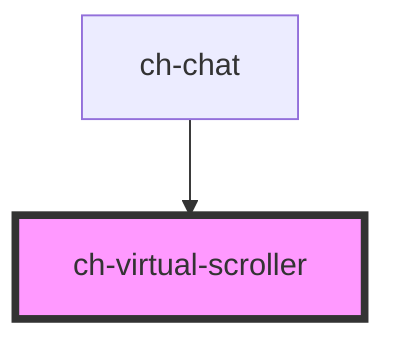

# ch-virtual-scroller

## Table of Contents

- [Overview](#overview)
- [Features](#features)
- [Use when](#use-when)
- [Do not use when](#do-not-use-when)
- [Accessibility](#accessibility)
- [Usage](./docs/usage.md)
- [Properties](#properties)
- [Events](#events)
- [Methods](#methods)
  - [`addItems`](#additemsposition-start--end-items-smartgridmodel--promisevoid)
- [Slots](#slots)
- [Dependencies](#dependencies)
  - [Used by](#used-by)
  - [Graph](#graph)
- [Styling](./docs/styling.md)

<!-- Auto Generated Below -->

## Overview

The `ch-virtual-scroller` component provides efficient virtual scrolling for large lists of items within a `ch-smart-grid`, keeping only visible items plus a configurable buffer in the DOM.

## Features
 - `"virtual-scroll"` mode: removes items outside the viewport from the DOM, using CSS pseudo-element spacers (`::before` / `::after`) to maintain scroll height. Lowest memory footprint.
 - `"lazy-render"` mode: lazily renders items as they scroll into view, but keeps them in the DOM once rendered. Avoids re-rendering costs at the expense of higher memory usage.
 - Configurable buffer amount (`bufferAmount`) for items rendered above and below the viewport.
 - Inverse loading support (`inverseLoading`) for chat-style interfaces where the newest items are at the bottom and the scroll starts at the end.
 - Automatic re-rendering on scroll and resize events via `requestAnimationFrame`-synced updates.
 - Emits `virtualItemsChanged` whenever the visible slice changes, enabling the parent to render only the required cells.
 - Hides content with `opacity: 0` until the initial viewport cells are fully loaded, then fires `virtualScrollerDidLoad`.

## Use when
 - Rendering hundreds or thousands of items inside a `ch-smart-grid`.
 - Building chat interfaces that need efficient inverse-loaded virtual scrolling.

## Do not use when
 - The list has fewer than ~100 items — the overhead of virtual scrolling is not justified.
 - Used outside of `ch-smart-grid` — this component is designed to work exclusively with `ch-smart-grid`.

## Accessibility
 - This component is structural and does not render visible interactive content. Accessibility semantics are handled by the parent `ch-smart-grid` and its cells.

```
  <ch-smart-grid>
    #shadow-root (open)
    |  <slot name="grid-content"></slot>
    <ch-virtual-scroller slot="grid-content">
      <ch-smart-grid-cell>...</ch-smart-grid-cell>
      <ch-smart-grid-cell>...</ch-smart-grid-cell>
      ...
    </ch-virtual-scroller>
  </ch-smart-grid>
```

## Properties

| Property                     | Attribute                       | Description                                                                                                                                                                                                                                                                                                                                                                                                                                                                                          | Type                                | Default            |
| ---------------------------- | ------------------------------- | ---------------------------------------------------------------------------------------------------------------------------------------------------------------------------------------------------------------------------------------------------------------------------------------------------------------------------------------------------------------------------------------------------------------------------------------------------------------------------------------------------- | ----------------------------------- | ------------------ |
| `bufferAmount`               | `buffer-amount`                 | The number of extra elements to render above and below the current container's viewport. A higher value reduces the chance of blank areas during fast scrolling but increases DOM size.  The new value is used on the next scroll or resize update.                                                                                                                                                                                                                                                  | `number`                            | `5`                |
| `initialRenderViewportItems` | `initial-render-viewport-items` | Specifies an estimated count of items that fit in the viewport for the initial render. Combined with `bufferAmount`, this determines how many items are rendered before the first scroll event. A value that is too low may cause visible blank space on initial load; a value that is too high increases initial DOM size.  Defaults to `10`. Init-only — only used during the first render cycle.                                                                                                  | `number`                            | `10`               |
| `inverseLoading`             | `inverse-loading`               | When set to `true`, the grid items will be loaded in inverse order, with the scroll positioned at the bottom on the initial load.  If `mode="virtual-scroll"`, only the items at the start of the viewport that are not visible will be removed from the DOM. The items at the end of the viewport that are not visible will remain rendered to avoid flickering issues.                                                                                                                             | `boolean`                           | `false`            |
| `items` _(required)_         | --                              | The array of items to be rendered in the `ch-smart-grid`. Each item must have a unique `id` property used internally for virtual size tracking.  When a new array reference is assigned, the virtual scroller resets its internal state (indexes, virtual sizes) and performs a fresh initial render. For incremental additions, prefer the `addItems()` method to avoid a full reset.  Setting to `undefined` or an empty array emits an empty `virtualItemsChanged` event.                         | `SmartGridItem[]`                   | `undefined`        |
| `itemsCount`                 | `items-count`                   | The total number of elements in the `items` array. Set this property when you mutate the existing array (e.g., push/splice) without assigning a new reference, so the virtual scroller knows the length has changed.  If `items` is reassigned as a new array reference, this property is not needed since the `@Watch` on `items` will handle the reset.                                                                                                                                            | `number`                            | `undefined`        |
| `mode`                       | `mode`                          | Specifies how the control will behave.   - "virtual-scroll": Only the items at the start of the viewport that are   not visible will be removed from the DOM. The items at the end of the   viewport that are not visible will remain rendered to avoid flickering   issues.    - "lazy-render": It behaves similarly to "virtual-scroll" on the initial   load, but when the user scrolls and new items are rendered, those items   that are outside of the viewport won't be removed from the DOM. | `"lazy-render" \| "virtual-scroll"` | `"virtual-scroll"` |

## Events

| Event                    | Description                                                                                                                                                                                                                                                                                                                    | Type                                                                                                       |
| ------------------------ | ------------------------------------------------------------------------------------------------------------------------------------------------------------------------------------------------------------------------------------------------------------------------------------------------------------------------------ | ---------------------------------------------------------------------------------------------------------- |
| `virtualItemsChanged`    | Emitted when the slice of visible items changes due to scrolling, resizing, or programmatic updates. The payload includes `startIndex`, `endIndex`, `totalItems`, and the `virtualItems` sub-array that should be rendered.  This event is the primary mechanism for the parent `ch-smart-grid` to know which cells to render. | `CustomEvent<{ virtualItems: SmartGridModel; startIndex: number; endIndex: number; totalItems: number; }>` |
| `virtualScrollerDidLoad` | Fired once when all cells in the initial viewport have been rendered and are visible. After this event, the scroller removes `opacity: 0` and starts listening for scroll/resize events. This event has no payload.                                                                                                            | `CustomEvent<any>`                                                                                         |

## Methods

### `addItems(position: "start" | "end", ...items: SmartGridModel) => Promise<void>`

Adds items to the beginning or end of the `items` array without resetting
the virtual scroller's internal indexes. This is the preferred way to
append or prepend items to the collection (e.g., infinite scroll or
chat message loading). When `position` is `"start"`, internal start/end
indexes are shifted by the number of added items to keep the viewport
stable.

After mutation, the scroller triggers a scroll handler update to
recalculate visible items.

#### Parameters

| Name       | Type               | Description                                      |
| ---------- | ------------------ | ------------------------------------------------ |
| `position` | `"start" \| "end"` | - `"start"` to prepend items, `"end"` to append. |
| `items`    | `SmartGridItem[]`  | - One or more `SmartGridModel` items to add.     |

#### Returns

Type: `Promise<void>`

## Slots

| Slot | Description                                                                                               |
| ---- | --------------------------------------------------------------------------------------------------------- |
|      | Default slot. The slot for `ch-smart-grid-cell` elements representing the items to be virtually scrolled. |

## Dependencies

### Used by

 - [ch-chat](../chat)

### Graph


----------------------------------------------

*Built with [StencilJS](https://stenciljs.com/)*
