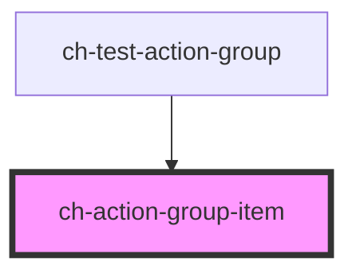

# ch-action-group-item

<!-- Auto Generated Below -->

## Properties

| Property        | Attribute        | Description                                                                                                                                                      | Type      | Default |
| --------------- | ---------------- | ---------------------------------------------------------------------------------------------------------------------------------------------------------------- | --------- | ------- |
| `avoidFloating` | `avoid-floating` | `true` to ignore the floating property value.                                                                                                                    | `boolean` | `false` |
| `floating`      | `floating`       | `true` if the control is floating. Useful to implement the `"ResponsiveCollapse"` value for the `itemsOverflowBehavior` property of the ch-action-group control. | `boolean` | `false` |

## Slots

| Slot | Description                                    |
| ---- | ---------------------------------------------- |
|      | The slot where the ch-dropdown-item is placed. |

## Dependencies

### Used by

 - [ch-test-action-group](../test/test-action-group)

### Graph

----------------------------------------------

*Built with [StencilJS](https://stenciljs.com/)*
