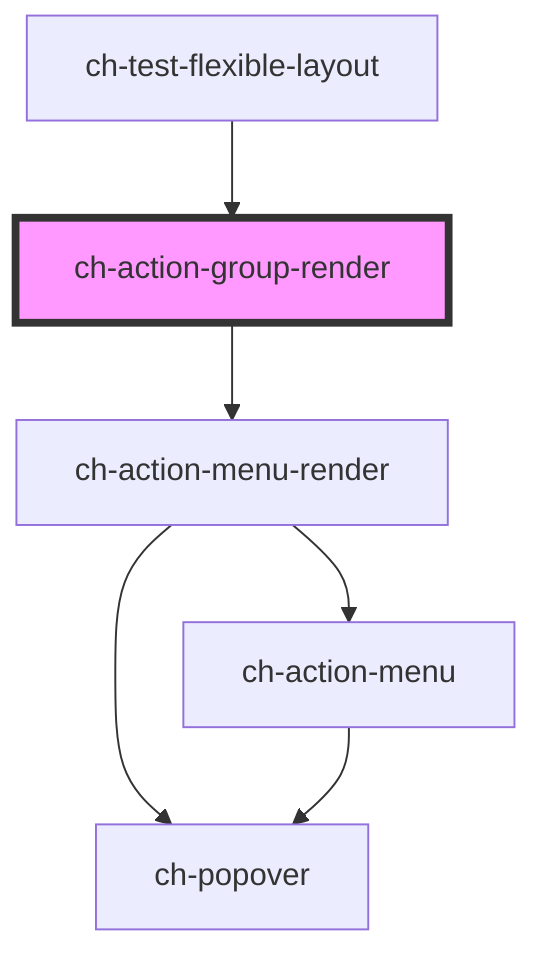

# ch-action-group-render

<!-- Auto Generated Below -->

## Properties

| Property                    | Attribute                      | Description                                                                                                                                                                                                                                                                                                                                                                                                                                                                                                                                                                                                                                                                                                                                                                                                                                                                           | Type                                                                                          | Default                 |
| --------------------------- | ------------------------------ | ------------------------------------------------------------------------------------------------------------------------------------------------------------------------------------------------------------------------------------------------------------------------------------------------------------------------------------------------------------------------------------------------------------------------------------------------------------------------------------------------------------------------------------------------------------------------------------------------------------------------------------------------------------------------------------------------------------------------------------------------------------------------------------------------------------------------------------------------------------------------------------- | --------------------------------------------------------------------------------------------- | ----------------------- |
| `disabled`                  | `disabled`                     | This attribute lets you specify if the element is disabled. If disabled, it will not fire any user interaction related event (for example, click event).                                                                                                                                                                                                                                                                                                                                                                                                                                                                                                                                                                                                                                                                                                                              | `boolean`                                                                                     | `false`                 |
| `getImagePathCallback`      | --                             | This property specifies a callback that is executed when the path for an startImgSrc or endImgSrc (of an item) needs to be resolved.                                                                                                                                                                                                                                                                                                                                                                                                                                                                                                                                                                                                                                                                                                                                                  | `(item: ActionMenuItemActionableModel, iconDirection: "start" \| "end") => GxImageMultiState` | `undefined`             |
| `gxImageConstructor`        | --                             | This property is a WA to implement the Tree View as a UC 2.0 in GeneXus.                                                                                                                                                                                                                                                                                                                                                                                                                                                                                                                                                                                                                                                                                                                                                                                                              | `(name: string) => any`                                                                       | `undefined`             |
| `gxSettings`                | `gx-settings`                  | This property is a WA to implement the Tree View as a UC 2.0 in GeneXus.                                                                                                                                                                                                                                                                                                                                                                                                                                                                                                                                                                                                                                                                                                                                                                                                              | `any`                                                                                         | `undefined`             |
| `itemsOverflowBehavior`     | `items-overflow-behavior`      | This attribute determines how items behave when the content of the ActionGroup overflows horizontal. This property is needed to make the control responsive to changes in the Width of the container of ActionGroup.  \| Value                 \| Details                                                                                          \| \| --------------------- \| ------------------------------------------------------------------------------------------------ \| \| `add-scroll`          \| The items of the ActionGroup that overflow horizontally are shown by means of a scroll.          \| \| `multiline`           \| The ActionGroup items that overflow horizontally are shown in a second line of the control.      \| \| `responsive-collapse` \| The Action Group items, when they start to overflow the control, are placed in the More Actions. \| | `"add-scroll" \| "multiline" \| "responsive-collapse"`                                        | `"responsive-collapse"` |
| `model`                     | --                             | This property lets you define the model of the ch-action-group control.                                                                                                                                                                                                                                                                                                                                                                                                                                                                                                                                                                                                                                                                                                                                                                                                               | `ActionGroupItemModel[]`                                                                      | `undefined`             |
| `moreActionsAccessibleName` | `more-actions-accessible-name` | This property lets you specify the label for the more actions button. Important for accessibility.                                                                                                                                                                                                                                                                                                                                                                                                                                                                                                                                                                                                                                                                                                                                                                                    | `string`                                                                                      | `"Show more actions"`   |
| `moreActionsBlockAlign`     | `more-actions-block-align`     | Specifies the block alignment of the more actions dropdown that is placed relative to the "more actions" button.                                                                                                                                                                                                                                                                                                                                                                                                                                                                                                                                                                                                                                                                                                                                                                      | `"center" \| "inside-end" \| "inside-start" \| "outside-end" \| "outside-start"`              | `"outside-end"`         |
| `moreActionsCaption`        | `more-actions-caption`         | This attribute lets you specify the caption for the more actions button.                                                                                                                                                                                                                                                                                                                                                                                                                                                                                                                                                                                                                                                                                                                                                                                                              | `string`                                                                                      | `undefined`             |
| `moreActionsInlineAlign`    | `more-actions-inline-align`    | Specifies the inline alignment of the more actions dropdown that is placed relative to the "more actions" button.                                                                                                                                                                                                                                                                                                                                                                                                                                                                                                                                                                                                                                                                                                                                                                     | `"center" \| "inside-end" \| "inside-start" \| "outside-end" \| "outside-start"`              | `"inside-start"`        |
| `useGxRender`               | `use-gx-render`                | This property is a WA to implement the Tree View as a UC 2.0 in GeneXus.                                                                                                                                                                                                                                                                                                                                                                                                                                                                                                                                                                                                                                                                                                                                                                                                              | `boolean`                                                                                     | `false`                 |

## Dependencies

### Used by

 - [ch-test-flexible-layout](../test/test-flexible-layout)

### Depends on

- [ch-action-menu-render](../action-menu)

### Graph

----------------------------------------------

*Built with [StencilJS](https://stenciljs.com/)*
