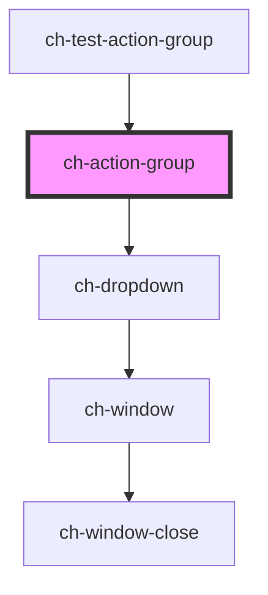

# ch-action-group

<!-- Auto Generated Below -->

## Properties

| Property                      | Attribute                        | Description                                                                                                                                                                                                                                                                                                                                                                                                                                                                                                                                                                                                                                                                                                                                                                                                                                                                           | Type                                                                                                                                                                                                                                                                                                                                                                                                                                               | Default                    |
| ----------------------------- | -------------------------------- | ------------------------------------------------------------------------------------------------------------------------------------------------------------------------------------------------------------------------------------------------------------------------------------------------------------------------------------------------------------------------------------------------------------------------------------------------------------------------------------------------------------------------------------------------------------------------------------------------------------------------------------------------------------------------------------------------------------------------------------------------------------------------------------------------------------------------------------------------------------------------------------- | -------------------------------------------------------------------------------------------------------------------------------------------------------------------------------------------------------------------------------------------------------------------------------------------------------------------------------------------------------------------------------------------------------------------------------------------------- | -------------------------- |
| `accessibleName`              | `accessible-name`                | Specifies a short string, typically 1 to 3 words, that authors associate with an element to provide users of assistive technologies with a label for the element.                                                                                                                                                                                                                                                                                                                                                                                                                                                                                                                                                                                                                                                                                                                     | `string`                                                                                                                                                                                                                                                                                                                                                                                                                                           | `undefined`                |
| `buttonLabel`                 | `button-label`                   | This attribute lets you specify the label for the more actions button. Important for accessibility.                                                                                                                                                                                                                                                                                                                                                                                                                                                                                                                                                                                                                                                                                                                                                                                   | `string`                                                                                                                                                                                                                                                                                                                                                                                                                                           | `"More actions"`           |
| `expandBehavior`              | `expand-behavior`                | Determine which mouse actions on the expandable button display the dropdown section.                                                                                                                                                                                                                                                                                                                                                                                                                                                                                                                                                                                                                                                                                                                                                                                                  | `"Click" \| "ClickOrHover"`                                                                                                                                                                                                                                                                                                                                                                                                                        | `"ClickOrHover"`           |
| `itemsOverflowBehavior`       | `items-overflow-behavior`        | This attribute determines how items behave when the content of the ActionGroup overflows horizontal. This property is needed to make the control responsive to changes in the Width of the container of ActionGroup.  \| Value                 \| Details                                                                                          \| \| --------------------- \| ------------------------------------------------------------------------------------------------ \| \| `Add Scroll`          \| The items of the ActionGroup that overflow horizontally are shown by means of a scroll.          \| \| `Multiline`           \| The ActionGroup items that overflow horizontally are shown in a second line of the control.      \| \| `Responsive Collapse` \| The Action Group items, when they start to overflow the control, are placed in the More Actions. \| | `"AddScroll" \| "Multiline" \| "ResponsiveCollapse"`                                                                                                                                                                                                                                                                                                                                                                                               | `"ResponsiveCollapse"`     |
| `moreActionsButtonPosition`   | `more-actions-button-position`   |                                                                                                                                                                                                                                                                                                                                                                                                                                                                                                                                                                                                                                                                                                                                                                                                                                                                                       | `"End" \| "Start"`                                                                                                                                                                                                                                                                                                                                                                                                                                 | `"Start"`                  |
| `moreActionsDropdownPosition` | `more-actions-dropdown-position` | Specifies the position of the dropdown section that is placed relative to the more actions button.                                                                                                                                                                                                                                                                                                                                                                                                                                                                                                                                                                                                                                                                                                                                                                                    | `"Center_OutsideEnd" \| "Center_OutsideStart" \| "InsideEnd_OutsideEnd" \| "InsideEnd_OutsideStart" \| "InsideStart_OutsideEnd" \| "InsideStart_OutsideStart" \| "OutsideEnd_Center" \| "OutsideEnd_InsideEnd" \| "OutsideEnd_InsideStart" \| "OutsideEnd_OutsideEnd" \| "OutsideEnd_OutsideStart" \| "OutsideStart_Center" \| "OutsideStart_InsideEnd" \| "OutsideStart_InsideStart" \| "OutsideStart_OutsideEnd" \| "OutsideStart_OutsideStart"` | `"InsideStart_OutsideEnd"` |
| `openOnFocus`                 | `open-on-focus`                  | Determine if the dropdowns should be opened when the action is focused.                                                                                                                                                                                                                                                                                                                                                                                                                                                                                                                                                                                                                                                                                                                                                                                                               | `boolean`                                                                                                                                                                                                                                                                                                                                                                                                                                          | `false`                    |

## Events

| Event                       | Description                             | Type                  |
| --------------------------- | --------------------------------------- | --------------------- |
| `displayedItemsCountChange` | Fired when the item is targeted or not. | `CustomEvent<number>` |

## Slots

| Slot           | Description                                                                            |
| -------------- | -------------------------------------------------------------------------------------- |
| `"items"`      | The slot for the actions.                                                              |
| `"more-items"` | The slot for the hidden actions when `itemsOverflowBehavior === "ResponsiveCollapse"`. |

## Shadow Parts

| Part             | Description                                                                                           |
| ---------------- | ----------------------------------------------------------------------------------------------------- |
| `"actions"`      | The container of the visible actions.                                                                 |
| `"more-actions"` | The ch-dropdown control to show hidden actions when `itemsOverflowBehavior === "ResponsiveCollapse"`. |

## Dependencies

### Used by

 - [ch-test-action-group](../test/test-action-group)

### Depends on

- [ch-dropdown](../dropdown)

### Graph

----------------------------------------------

*Built with [StencilJS](https://stenciljs.com/)*
