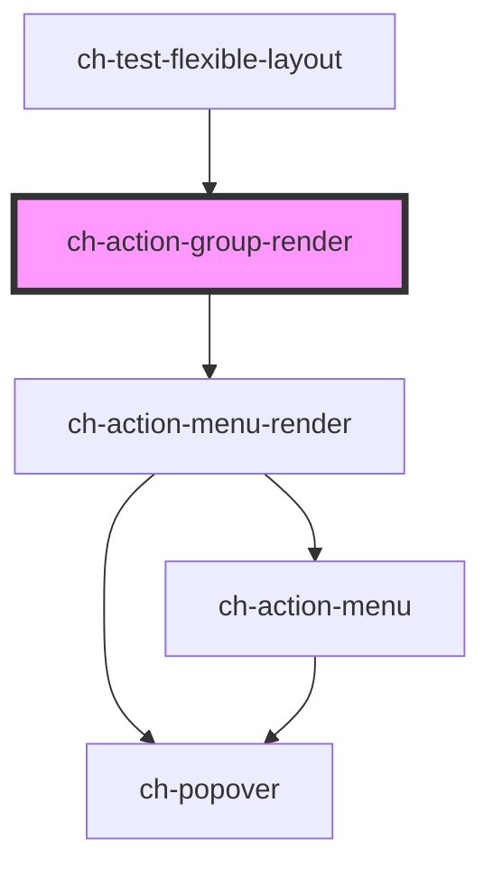

# ch-action-group-render

## Table of Contents

- [Overview](#overview)
- [Features](#features)
- [Use when](#use-when)
- [Do not use when](#do-not-use-when)
- [Accessibility](#accessibility)
- [Properties](#properties)
- [Slots](#slots)
- [Dependencies](#dependencies)
  - [Used by](#used-by)
  - [Depends on](#depends-on)
  - [Graph](#graph)
- [Styling](./docs/styling.md)

<!-- Auto Generated Below -->

## Overview

The `ch-action-group-render` component displays a horizontal group of actionable items that adapts to the available space by collapsing overflowing items into a "more actions" dropdown menu.

## Features
 - Three overflow strategies: horizontal scroll, multiline wrap, or responsive collapse into a dropdown.
 - Responsive-collapse mode uses `IntersectionObserver` to detect hidden items in real time.
 - Overflow dropdown powered by `ch-action-menu-render`.
 - Supports custom slot content that is forwarded into the overflow menu when collapsed.

## Use when
 - You have a dynamic set of toolbar-style actions that must remain usable at every viewport width.
 - Building command bars or toolbars that need graceful degradation on smaller screens.
 - Toolbars or command bars with a variable number of actions that must adapt to available space.

## Do not use when
 - The actions do not need responsive overflow handling -- prefer a plain list or `ch-action-menu-render` instead.
 - All actions should always be visible — use individual buttons or `ch-action-list-render` instead.

## Accessibility
 - The host element has `role="list"`, and the overflow menu item has `role="listitem"`.
 - The "more actions" button carries a configurable `aria-label` (`moreActionsAccessibleName`).
 - The component delegates click, keyboard, and expanded-change events to
   its embedded `ch-action-menu-render` for the overflow dropdown.

## Properties

| Property                    | Attribute                      | Description                                                                                                                                                                                                                                                                                                                                                                                                                                                                                                                                                                                                                                                                                                                                                                                                                                                                           | Type                                                                                          | Default                 |
| --------------------------- | ------------------------------ | ------------------------------------------------------------------------------------------------------------------------------------------------------------------------------------------------------------------------------------------------------------------------------------------------------------------------------------------------------------------------------------------------------------------------------------------------------------------------------------------------------------------------------------------------------------------------------------------------------------------------------------------------------------------------------------------------------------------------------------------------------------------------------------------------------------------------------------------------------------------------------------- | --------------------------------------------------------------------------------------------- | ----------------------- |
| `disabled`                  | `disabled`                     | This attribute lets you specify if the element is disabled. If disabled, it will not fire any user interaction related event (for example, click event).                                                                                                                                                                                                                                                                                                                                                                                                                                                                                                                                                                                                                                                                                                                              | `boolean`                                                                                     | `false`                 |
| `getImagePathCallback`      | --                             | This property specifies a callback that is executed when the path for an startImgSrc or endImgSrc (of an item) needs to be resolved.                                                                                                                                                                                                                                                                                                                                                                                                                                                                                                                                                                                                                                                                                                                                                  | `(item: ActionMenuItemActionableModel, iconDirection: "start" \| "end") => GxImageMultiState` | `undefined`             |
| `gxImageConstructor`        | --                             | This property is a WA to implement the Tree View as a UC 2.0 in GeneXus.                                                                                                                                                                                                                                                                                                                                                                                                                                                                                                                                                                                                                                                                                                                                                                                                              | `(name: string) => any`                                                                       | `undefined`             |
| `gxSettings`                | `gx-settings`                  | This property is a WA to implement the Tree View as a UC 2.0 in GeneXus.                                                                                                                                                                                                                                                                                                                                                                                                                                                                                                                                                                                                                                                                                                                                                                                                              | `any`                                                                                         | `undefined`             |
| `itemsOverflowBehavior`     | `items-overflow-behavior`      | This attribute determines how items behave when the content of the ActionGroup overflows horizontal. This property is needed to make the control responsive to changes in the width of the container of ActionGroup.  \| Value                 \| Details                                                                                          \| \| --------------------- \| ------------------------------------------------------------------------------------------------ \| \| `add-scroll`          \| The items of the ActionGroup that overflow horizontally are shown by means of a scroll.          \| \| `multiline`           \| The ActionGroup items that overflow horizontally are shown in a second line of the control.      \| \| `responsive-collapse` \| The Action Group items, when they start to overflow the control, are placed in the More Actions. \| | `"add-scroll" \| "multiline" \| "responsive-collapse"`                                        | `"responsive-collapse"` |
| `model`                     | --                             | This property lets you define the model of the ch-action-group control.                                                                                                                                                                                                                                                                                                                                                                                                                                                                                                                                                                                                                                                                                                                                                                                                               | `ActionGroupItemModel[]`                                                                      | `undefined`             |
| `moreActionsAccessibleName` | `more-actions-accessible-name` | This property lets you specify the label for the more actions button. Important for accessibility.                                                                                                                                                                                                                                                                                                                                                                                                                                                                                                                                                                                                                                                                                                                                                                                    | `string`                                                                                      | `"Show more actions"`   |
| `moreActionsBlockAlign`     | `more-actions-block-align`     | Specifies the block alignment of the more actions dropdown that is placed relative to the "more actions" button.                                                                                                                                                                                                                                                                                                                                                                                                                                                                                                                                                                                                                                                                                                                                                                      | `"center" \| "inside-end" \| "inside-start" \| "outside-end" \| "outside-start"`              | `"outside-end"`         |
| `moreActionsCaption`        | `more-actions-caption`         | This attribute lets you specify the caption for the more actions button.                                                                                                                                                                                                                                                                                                                                                                                                                                                                                                                                                                                                                                                                                                                                                                                                              | `string`                                                                                      | `undefined`             |
| `moreActionsInlineAlign`    | `more-actions-inline-align`    | Specifies the inline alignment of the more actions dropdown that is placed relative to the "more actions" button.                                                                                                                                                                                                                                                                                                                                                                                                                                                                                                                                                                                                                                                                                                                                                                     | `"center" \| "inside-end" \| "inside-start" \| "outside-end" \| "outside-start"`              | `"inside-start"`        |
| `useGxRender`               | `use-gx-render`                | This property is a WA to implement the Tree View as a UC 2.0 in GeneXus.                                                                                                                                                                                                                                                                                                                                                                                                                                                                                                                                                                                                                                                                                                                                                                                                              | `boolean`                                                                                     | `false`                 |

## Slots

| Slot       | Description                                                                                                                                                                                              |
| ---------- | -------------------------------------------------------------------------------------------------------------------------------------------------------------------------------------------------------- |
| `"{name}"` | Named slots matching each item of `type: "slot"` in the model. These slots allow projecting custom content for individual action items and are forwarded into the overflow menu when the item collapses. |

## Dependencies

### Used by

 - [ch-test-flexible-layout](../test/test-flexible-layout)

### Depends on

- [ch-action-menu-render](../action-menu)

### Graph

```mermaid
graph TD;
  ch-action-group-render --> ch-action-menu-render
  ch-action-menu-render --> ch-action-menu
  ch-action-menu-render --> ch-popover
  ch-action-menu --> ch-popover
  ch-test-flexible-layout --> ch-action-group-render
  style ch-action-group-render fill:#f9f,stroke:#333,stroke-width:4px
```

----------------------------------------------

*Built with [StencilJS](https://stenciljs.com/)*
