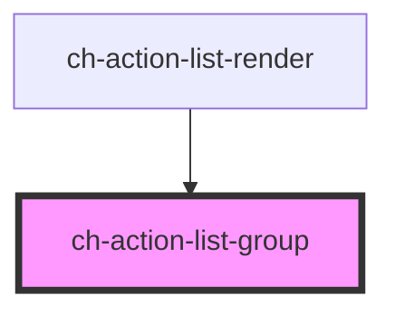

# ch-action-list-group

<!-- Auto Generated Below -->

## Properties

| Property                 | Attribute                  | Description                                                                                                                                              | Type      | Default     |
| ------------------------ | -------------------------- | -------------------------------------------------------------------------------------------------------------------------------------------------------- | --------- | ----------- |
| `caption`                | `caption`                  | This attributes specifies the caption of the control                                                                                                     | `string`  | `undefined` |
| `disabled`               | `disabled`                 | This attribute lets you specify if the element is disabled. If disabled, it will not fire any user interaction related event (for example, click event). | `boolean` | `false`     |
| `downloading`            | `downloading`              | This attribute lets you specify when items are being lazy loaded in the control.                                                                         | `boolean` | `false`     |
| `expandable`             | `expandable`               | If the item has a sub-tree, this attribute determines if the subtree is displayed.                                                                       | `boolean` | `undefined` |
| `expanded`               | `expanded`                 | If the item has a sub-tree, this attribute determines if the subtree is displayed.                                                                       | `boolean` | `undefined` |
| `lazyLoad`               | `lazy-load`                | Determine if the items are lazy loaded when opening the first time the control.                                                                          | `boolean` | `false`     |
| `metadata`               | `metadata`                 | This attribute represents additional info for the control that is included when dragging the item.                                                       | `string`  | `undefined` |
| `parts`                  | `parts`                    | Specifies a set of parts to use in every DOM element of the control.                                                                                     | `string`  | `undefined` |
| `selected`               | `selected`                 | This attribute lets you specify if the item is selected                                                                                                  | `boolean` | `false`     |
| `showDownloadingSpinner` | `show-downloading-spinner` | `true` to show the downloading spinner when lazy loading the sub items of the control.                                                                   | `boolean` | `true`      |

## Events

| Event             | Description                                                            | Type                  |
| ----------------- | ---------------------------------------------------------------------- | --------------------- |
| `loadLazyContent` | Fired when the lazy control is expanded an its content must be loaded. | `CustomEvent<string>` |

## Methods

### `setFocus() => Promise<void>`

Set the focus in the control if `expandable === true`.

#### Returns

Type: `Promise<void>`

## Dependencies

### Used by

 - [ch-action-list-render](../..)

### Graph

----------------------------------------------

*Built with [StencilJS](https://stenciljs.com/)*
