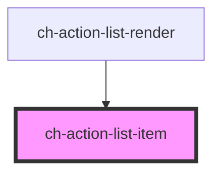

# ch-action-list-item

<!-- Auto Generated Below -->

## Properties

| Property                 | Attribute                  | Description                                                                                                                                              | Type                                                                                                                                                                                                                                                | Default     |
| ------------------------ | -------------------------- | -------------------------------------------------------------------------------------------------------------------------------------------------------- | --------------------------------------------------------------------------------------------------------------------------------------------------------------------------------------------------------------------------------------------------- | ----------- |
| `additionalInfo`         | --                         |                                                                                                                                                          | `{ "stretch-start"?: ActionListItemAdditionalModel; "block-start"?: ActionListItemAdditionalModel; "inline-caption"?: ActionListItemAdditionalModel; "block-end"?: ActionListItemAdditionalModel; "stretch-end"?: ActionListItemAdditionalModel; }` | `undefined` |
| `caption`                | `caption`                  | This attributes specifies the caption of the control                                                                                                     | `string`                                                                                                                                                                                                                                            | `undefined` |
| `checkbox`               | `checkbox`                 | Set this attribute if you want display a checkbox in the control.                                                                                        | `boolean`                                                                                                                                                                                                                                           | `false`     |
| `checked`                | `checked`                  | Set this attribute if you want the checkbox to be checked by default. Only works if `checkbox = true`                                                    | `boolean`                                                                                                                                                                                                                                           | `false`     |
| `customRender`           | `custom-render`            | Set this attribute if you want to set a custom render for the control, by passing a slot.                                                                | `boolean`                                                                                                                                                                                                                                           | `false`     |
| `disabled`               | `disabled`                 | This attribute lets you specify if the element is disabled. If disabled, it will not fire any user interaction related event (for example, click event). | `boolean`                                                                                                                                                                                                                                           | `false`     |
| `downloading`            | `downloading`              | This attribute lets you specify when items are being lazy loaded in the control.                                                                         | `boolean`                                                                                                                                                                                                                                           | `false`     |
| `editable`               | `editable`                 | This attribute lets you specify if the edit operation is enabled in the control. If `true`, the control can edit its caption in place.                   | `boolean`                                                                                                                                                                                                                                           | `undefined` |
| `editing`                | `editing`                  | Set this attribute when the item is in edit mode                                                                                                         | `boolean`                                                                                                                                                                                                                                           | `false`     |
| `expanded`               | `expanded`                 | If the item has a sub-tree, this attribute determines if the subtree is displayed.                                                                       | `boolean`                                                                                                                                                                                                                                           | `false`     |
| `fixed`                  | `fixed`                    |                                                                                                                                                          | `boolean`                                                                                                                                                                                                                                           | `false`     |
| `indeterminate`          | `indeterminate`            | `true` if the checkbox's value is indeterminate.                                                                                                         | `boolean`                                                                                                                                                                                                                                           | `false`     |
| `metadata`               | `metadata`                 | This attribute represents additional info for the control that is included when dragging the item.                                                       | `string`                                                                                                                                                                                                                                            | `undefined` |
| `parts`                  | `parts`                    | Specifies a set of parts to use in every DOM element of the control.                                                                                     | `string`                                                                                                                                                                                                                                            | `undefined` |
| `selected`               | `selected`                 | This attribute lets you specify if the item is selected                                                                                                  | `boolean`                                                                                                                                                                                                                                           | `false`     |
| `showDownloadingSpinner` | `show-downloading-spinner` | `true` to show the downloading spinner when lazy loading the sub items of the control.                                                                   | `boolean`                                                                                                                                                                                                                                           | `true`      |

## Events

| Event         | Description                                              | Type                                               |
| ------------- | -------------------------------------------------------- | -------------------------------------------------- |
| `fixedChange` | Fired when the fixed value of the control is changed.    | `CustomEvent<{ itemId: string; value: boolean; }>` |
| `itemDragEnd` | Fired when the item is no longer being dragged.          | `CustomEvent<any>`                                 |
| `remove`      | Fired when the remove button was clicked in the control. | `CustomEvent<string>`                              |

## Shadow Parts

| Part                     | Description |
| ------------------------ | ----------- |
| `"center"`               |             |
| `"end"`                  |             |
| `"item__action"`         |             |
| `"item__block-end"`      |             |
| `"item__block-start"`    |             |
| `"item__caption"`        |             |
| `"item__inline-caption"` |             |
| `"item__stretch-end"`    |             |
| `"item__stretch-start"`  |             |
| `"start"`                |             |

## Dependencies

### Used by

 - [ch-action-list-render](../..)

### Graph

----------------------------------------------

*Built with [StencilJS](https://stenciljs.com/)*
