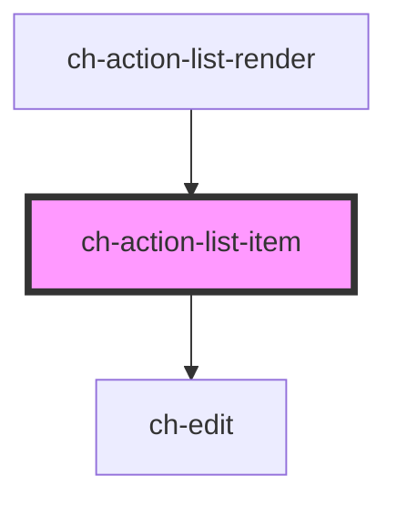

# ch-action-list-item

<!-- Auto Generated Below -->

## Properties

| Property                    | Attribute                  | Description                                                                                                                                              | Type                                                                                                                                                                                                                                                | Default     |
| --------------------------- | -------------------------- | -------------------------------------------------------------------------------------------------------------------------------------------------------- | --------------------------------------------------------------------------------------------------------------------------------------------------------------------------------------------------------------------------------------------------- | ----------- |
| `additionalInfo`            | --                         |                                                                                                                                                          | `{ "stretch-start"?: ActionListItemAdditionalModel; "block-start"?: ActionListItemAdditionalModel; "inline-caption"?: ActionListItemAdditionalModel; "block-end"?: ActionListItemAdditionalModel; "stretch-end"?: ActionListItemAdditionalModel; }` | `undefined` |
| `caption`                   | `caption`                  | This attributes specifies the caption of the control.                                                                                                    | `string`                                                                                                                                                                                                                                            | `undefined` |
| `checkbox`                  | `checkbox`                 | Set this attribute if you want display a checkbox in the control.                                                                                        | `boolean`                                                                                                                                                                                                                                           | `false`     |
| `checked`                   | `checked`                  | Set this attribute if you want the checkbox to be checked by default. Only works if `checkbox = true`                                                    | `boolean`                                                                                                                                                                                                                                           | `false`     |
| `customRender`              | `custom-render`            | Set this attribute if you want to set a custom render for the control, by passing a slot.                                                                | `boolean`                                                                                                                                                                                                                                           | `false`     |
| `deleting`                  | `deleting`                 | Set this property when the control is in delete mode.                                                                                                    | `boolean`                                                                                                                                                                                                                                           | `false`     |
| `disabled`                  | `disabled`                 | This attribute lets you specify if the element is disabled. If disabled, it will not fire any user interaction related event (for example, click event). | `boolean`                                                                                                                                                                                                                                           | `false`     |
| `downloading`               | `downloading`              | This attribute lets you specify when items are being lazy loaded in the control.                                                                         | `boolean`                                                                                                                                                                                                                                           | `false`     |
| `editable`                  | `editable`                 | This property lets you specify if the edit operation is enabled in the control. If `true`, the control can edit its caption in place.                    | `boolean`                                                                                                                                                                                                                                           | `undefined` |
| `editing`                   | `editing`                  | Set this property when the control is in edit mode.                                                                                                      | `boolean`                                                                                                                                                                                                                                           | `false`     |
| `fixed`                     | `fixed`                    |                                                                                                                                                          | `boolean`                                                                                                                                                                                                                                           | `false`     |
| `getImagePathCallback`      | --                         | This property specifies a callback that is executed when the path for an imgSrc needs to be resolved.                                                    | `(item: ActionListItemAdditionalBase) => GxImageMultiState`                                                                                                                                                                                         | `undefined` |
| `indeterminate`             | `indeterminate`            | `true` if the checkbox's value is indeterminate.                                                                                                         | `boolean`                                                                                                                                                                                                                                           | `false`     |
| `metadata`                  | `metadata`                 | This attribute represents additional info for the control that is included when dragging the item.                                                       | `string`                                                                                                                                                                                                                                            | `undefined` |
| `nested`                    | `nested`                   | Specifies if the item is inside of a ch-action-list-group control.                                                                                       | `boolean`                                                                                                                                                                                                                                           | `false`     |
| `nestedExpandable`          | `nested-expandable`        | Specifies if the item is inside of a ch-action-list-group control that is expandable.                                                                    | `boolean`                                                                                                                                                                                                                                           | `false`     |
| `parts`                     | `parts`                    | Specifies a set of parts to use in every DOM element of the control.                                                                                     | `string`                                                                                                                                                                                                                                            | `undefined` |
| `selectable`                | `selectable`               | Specifies if the item can be selected.                                                                                                                   | `boolean`                                                                                                                                                                                                                                           | `false`     |
| `selected`                  | `selected`                 | This attribute lets you specify if the item is selected                                                                                                  | `boolean`                                                                                                                                                                                                                                           | `false`     |
| `showDownloadingSpinner`    | `show-downloading-spinner` | `true` to show the downloading spinner when lazy loading the sub items of the control.                                                                   | `boolean`                                                                                                                                                                                                                                           | `true`      |
| `translations` _(required)_ | --                         | Specifies the literals required for the control.                                                                                                         | `{ confirmDelete: string; cancelDelete: string; confirmModify: string; cancelModify: string; }`                                                                                                                                                     | `undefined` |

## Events

| Event           | Description                                              | Type                                                   |
| --------------- | -------------------------------------------------------- | ------------------------------------------------------ |
| `captionChange` | Fired when the fixed value of the control is changed.    | `CustomEvent<{ itemId: string; newCaption: string; }>` |
| `fixedChange`   | Fired when the control is asking to modify its caption   | `CustomEvent<{ itemId: string; value: boolean; }>`     |
| `itemDragEnd`   | Fired when the item is no longer being dragged.          | `CustomEvent<any>`                                     |
| `remove`        | Fired when the remove button was clicked in the control. | `CustomEvent<string>`                                  |

## Shadow Parts

| Part                     | Description |
| ------------------------ | ----------- |
| `"end"`                  |             |
| `"item__inline-caption"` |             |
| `"start"`                |             |

## Dependencies

### Used by

 - [ch-action-list-render](../..)

### Depends on

- [ch-edit](../../../edit)

### Graph

----------------------------------------------

*Built with [StencilJS](https://stenciljs.com/)*
