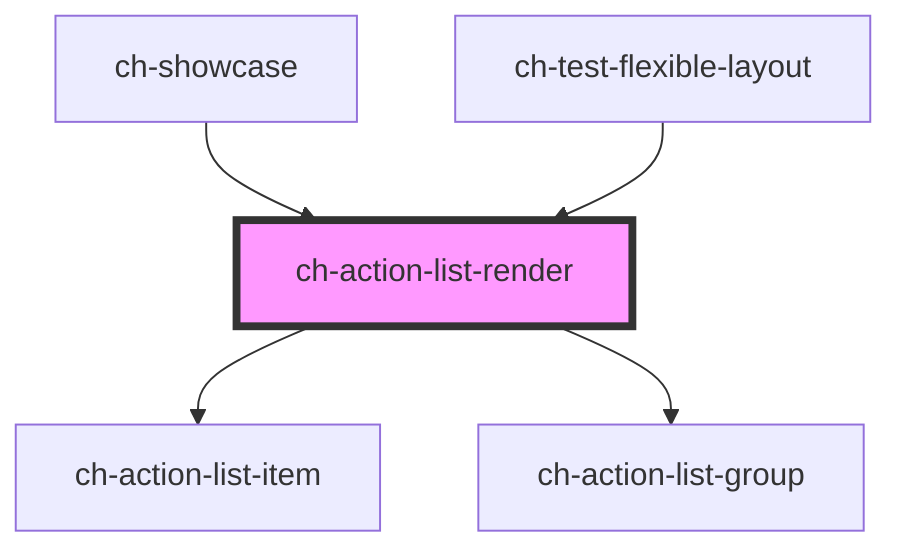

# ch-action-list-render

<!-- Auto Generated Below -->

## Properties

| Property             | Attribute        | Description                                                                                                                                            | Type                                                                                 | Default                        |
| -------------------- | ---------------- | ------------------------------------------------------------------------------------------------------------------------------------------------------ | ------------------------------------------------------------------------------------ | ------------------------------ |
| `checkbox`           | `checkbox`       | Set this attribute if you want display a checkbox in all items by default.                                                                             | `boolean`                                                                            | `false`                        |
| `checked`            | `checked`        | Set this attribute if you want the checkbox to be checked in all items by default. Only works if `checkbox = true`                                     | `boolean`                                                                            | `false`                        |
| `editableItems`      | `editable-items` | This attribute lets you specify if the edit operation is enabled in all items by default. If `true`, the items can edit its caption in place.          | `boolean`                                                                            | `DEFAULT_EDITABLE_ITEMS_VALUE` |
| `model`              | --               | This property lets you define the model of the control.                                                                                                | `ActionListItemModel[]`                                                              | `[]`                           |
| `removeItemCallback` | --               | Callback that is executed when and item requests to be removed. If the callback is not defined, the item will be removed without further confirmation. | `(itemInfo: ActionListItemActionable) => Promise<boolean>`                           | `undefined`                    |
| `renderItem`         | --               | This property allows us to implement custom rendering of tree items.                                                                                   | `(itemModel: ActionListItemModel, actionListRenderState: ChActionListRender) => any` | `defaultRenderItem`            |
| `sortItemsCallback`  | --               | Callback that is executed when the treeModel is changed to order its items.                                                                            | `(subModel: ActionListModel) => void`                                                | `defaultSortItemsCallback`     |

## CSS Custom Properties

| Name                                           | Description                                                                                 |
| ---------------------------------------------- | ------------------------------------------------------------------------------------------- |
| `--ch-action-list-item__background-image-size` | Specifies the image size of the additional images. @default 100%                            |
| `--ch-action-list-item__image-size`            | Specifies the box size that contains the images for the additional images. @default 0.875em |

## Dependencies

### Used by

 - [ch-showcase](../../showcase/assets/components)
 - [ch-test-flexible-layout](../test/test-flexible-layout)

### Depends on

- [ch-action-list-item](./internal/action-list-item)
- [ch-action-list-group](./internal/action-list-group)

### Graph

----------------------------------------------

*Built with [StencilJS](https://stenciljs.com/)*
