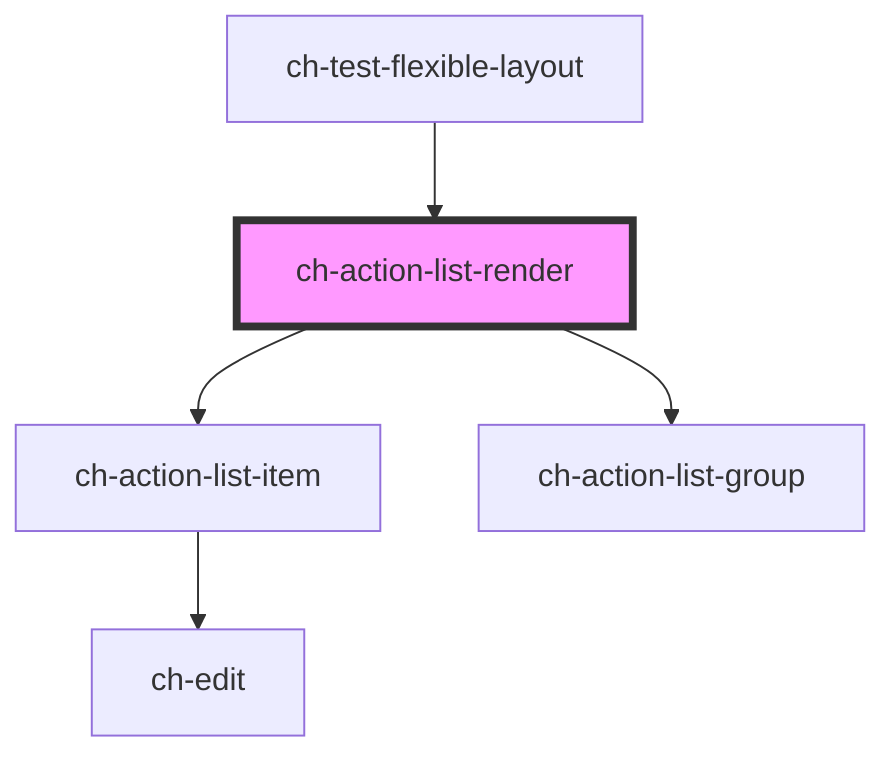

# ch-action-list-render

## Item Layout

<!-- Auto Generated Below -->

## Properties

| Property                    | Attribute        | Description                                                                                                                                                                            | Type                                                                                                                                                                                         | Default                         |
| --------------------------- | ---------------- | -------------------------------------------------------------------------------------------------------------------------------------------------------------------------------------- | -------------------------------------------------------------------------------------------------------------------------------------------------------------------------------------------- | ------------------------------- |
| `checkbox`                  | `checkbox`       | Set this attribute if you want display a checkbox in all items by default.                                                                                                             | `boolean`                                                                                                                                                                                    | `false`                         |
| `checked`                   | `checked`        | Set this attribute if you want the checkbox to be checked in all items by default. Only works if `checkbox = true`                                                                     | `boolean`                                                                                                                                                                                    | `false`                         |
| `disabled`                  | `disabled`       | This attribute lets you specify if all items are disabled. If disabled, action list items will not fire any user interaction related event (for example, `selectedItemsChange` event). | `boolean`                                                                                                                                                                                    | `false`                         |
| `editableItems`             | `editable-items` | This attribute lets you specify if the edit operation is enabled in all items by default. If `true`, the items can edit its caption in place.                                          | `boolean`                                                                                                                                                                                    | `DEFAULT_EDITABLE_ITEMS_VALUE`  |
| `fixItemCallback`           | --               | Callback that is executed when and item requests to be fixed/unfixed. If the callback is not defined, the item will be fixed/unfixed without further confirmation.                     | `(itemInfo: ActionListItemActionable, newFixedValue: boolean) => Promise<boolean>`                                                                                                           | `undefined`                     |
| `model`                     | --               | This property lets you define the model of the control.                                                                                                                                | `ActionListItemModel[]`                                                                                                                                                                      | `[]`                            |
| `modifyItemCaptionCallback` | --               | Callback that is executed when a item request to modify its caption.                                                                                                                   | `(actionListItemId: string, newCaption: string) => Promise<void>`                                                                                                                            | `undefined`                     |
| `removeItemCallback`        | --               | Callback that is executed when and item requests to be removed. If the callback is not defined, the item will be removed without further confirmation.                                 | `(itemInfo: ActionListItemActionable) => Promise<boolean>`                                                                                                                                   | `undefined`                     |
| `renderItem`                | --               | This property allows us to implement custom rendering of tree items.                                                                                                                   | `(itemModel: ActionListItemModel, actionListRenderState: ChActionListRender, disabled?: boolean, nested?: boolean, nestedExpandable?: boolean) => any`                                       | `defaultRenderItem`             |
| `selection`                 | `selection`      | Specifies the type of selection implemented by the control.                                                                                                                            | `"multiple" \| "none" \| "single"`                                                                                                                                                           | `"none"`                        |
| `sortItemsCallback`         | --               | Callback that is executed when the treeModel is changed to order its items.                                                                                                            | `(subModel: ActionListModel) => void`                                                                                                                                                        | `defaultSortItemsCallback`      |
| `translations`              | --               | Specifies the literals required for the control.                                                                                                                                       | `{ confirm: string; cancel: string; confirmDelete: string; cancelDelete: string; confirmModify: string; cancelModify: string; pin: string; unpin: string; delete: string; modify: string; }` | `actionListDefaultTranslations` |

## Events

| Event                 | Description                                                                                                                                                     | Type                                                                                                                                    |
| --------------------- | --------------------------------------------------------------------------------------------------------------------------------------------------------------- | --------------------------------------------------------------------------------------------------------------------------------------- |
| `itemClick`           | Fired when an item is clicked and `selection === "none"`. Applies for items that have `type === "actionable"` or (`type === "group"` and `expandable === true`) | `CustomEvent<{ parentItem: ActionListItemGroup; item: ActionListItemModel; } \| { root: ActionListModel; item: ActionListItemModel; }>` |
| `selectedItemsChange` | Fired when the selected items change and `selection !== "none"`                                                                                                 | `CustomEvent<ActionListItemModelExtended[]>`                                                                                            |

## Methods

### `addItem(itemInfo: ActionListItemModel, groupParentId?: string) => Promise<void>`

Adds an item in the control.

If the item already exists, the operation is canceled.

If the `groupParentId` property is specified the item is added in the
group determined by `groupParentId`. It only works if the item to add
has `type === "actionable"`

#### Parameters

| Name            | Type                                                                         | Description |
| --------------- | ---------------------------------------------------------------------------- | ----------- |
| `itemInfo`      | `ActionListItemActionable \| ActionListItemGroup \| ActionListItemSeparator` |             |
| `groupParentId` | `string`                                                                     |             |

#### Returns

Type: `Promise<void>`

### `getItemsInfo(itemsId: string[]) => Promise<ActionListItemModelExtended[]>`

Given a list of ids, it returns an array of the items that exists in the
given list.

#### Parameters

| Name      | Type       | Description |
| --------- | ---------- | ----------- |
| `itemsId` | `string[]` |             |

#### Returns

Type: `Promise<ActionListItemModelExtended[]>`

### `removeItem(itemId: string) => Promise<void>`

Remove the item and all its descendants from the control.

#### Parameters

| Name     | Type     | Description |
| -------- | -------- | ----------- |
| `itemId` | `string` |             |

#### Returns

Type: `Promise<void>`

### `updateItemProperties(itemId: string, properties: Partial<ActionListItemModel> & { type: ActionListItemType; }) => Promise<void>`

Given an itemId and the properties to update, it updates the properties
of the items in the list.

#### Parameters

| Name         | Type                                                           | Description |
| ------------ | -------------------------------------------------------------- | ----------- |
| `itemId`     | `string`                                                       |             |
| `properties` | `Partial<ActionListItemModel> & { type: ActionListItemType; }` |             |

#### Returns

Type: `Promise<void>`

## CSS Custom Properties

| Name                                                   | Description                                                                                 |
| ------------------------------------------------------ | ------------------------------------------------------------------------------------------- |
| `--ch-action-list-group__expandable-button-image-size` | Specifies the image size of the expandable button. @default 100%                            |
| `--ch-action-list-group__expandable-button-size`       | Specifies the box size that contains the expandable button image. @default 0.875em          |
| `--ch-action-list-item__background-image-size`         | Specifies the image size of the additional images. @default 100%                            |
| `--ch-action-list-item__image-size`                    | Specifies the box size that contains the images for the additional images. @default 0.875em |

## Dependencies

### Used by

 - [ch-test-flexible-layout](../test/test-flexible-layout)

### Depends on

- [ch-action-list-item](./internal/action-list-item)
- [ch-action-list-group](./internal/action-list-group)

### Graph

----------------------------------------------

*Built with [StencilJS](https://stenciljs.com/)*
