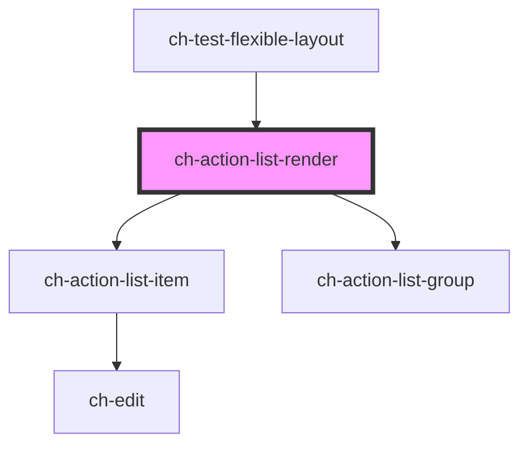

# ch-action-list-render

## Table of Contents

- [Overview](#overview)
- [Features](#features)
- [Use when](#use-when)
- [Do not use when](#do-not-use-when)
- [Accessibility](#accessibility)
- [Properties](#properties)
- [Events](#events)
- [Methods](#methods)
  - [`addItem`](#additem)
  - [`getItemsInfo`](#getitemsinfo)
  - [`removeItem`](#removeitem)
  - [`updateItemProperties`](#updateitemproperties)
- [Dependencies](#dependencies)
  - [Used by](#used-by)
  - [Depends on](#depends-on)
  - [Graph](#graph)
- [Styling](./docs/styling.md)

<!-- Auto Generated Below -->

## Overview

The `ch-action-list-render` component renders an interactive list of actionable items driven by a declarative model.

## Features
 - Single and multiple selection with modifier-key multi-select.
 - In-place caption editing with optimistic UI updates.
 - Item pinning (fixed) and sorting.
 - Grouping with expandable/collapsible sections.
 - Programmatic add/remove operations.
 - Three item types: `actionable`, `group`, and `separator`.
 - Keyboard navigation.

## Use when
 - You need a rich, data-driven list with selection semantics (e.g., panel lists, filterable sidebars, or reorderable collections).
 - Command palettes, selection panels, or item management lists where users can pick, pin, edit, or remove items.

## Do not use when
 - You need a simple static list without selection or editing -- use a plain HTML list instead.
 - Navigation is the primary purpose — prefer `ch-navigation-list-render`.
 - The list is hierarchical — prefer `ch-tree-view-render`.

## Accessibility
 - The host element has `role="list"` with `aria-multiselectable` when `selection` is `"multiple"`.
 - Separator items have `role="separator"` and `aria-hidden="true"`.
 - Supports keyboard navigation: arrow keys move focus between items, Enter/Space selects, and modifier-click enables multi-select.

## Properties

| Property                    | Attribute        | Description                                                                                                                                                                                                                                                                                                            | Type                                                                                                                                                   | Default                         |
| --------------------------- | ---------------- | ---------------------------------------------------------------------------------------------------------------------------------------------------------------------------------------------------------------------------------------------------------------------------------------------------------------------- | ------------------------------------------------------------------------------------------------------------------------------------------------------ | ------------------------------- |
| `checkbox`                  | `checkbox`       | Set this attribute if you want display a checkbox in all items by default.                                                                                                                                                                                                                                             | `boolean`                                                                                                                                              | `false`                         |
| `checked`                   | `checked`        | Set this attribute if you want the checkbox to be checked in all items by default. Only works if `checkbox = true`                                                                                                                                                                                                     | `boolean`                                                                                                                                              | `false`                         |
| `disabled`                  | `disabled`       | This attribute lets you specify if all items are disabled. If disabled, action list items will not fire any user interaction related event (for example, `selectedItemsChange` event).                                                                                                                                 | `boolean`                                                                                                                                              | `false`                         |
| `editableItems`             | `editable-items` | This attribute lets you specify if the edit operation is enabled in all items by default. If `true`, the items can edit its caption in place. Note: the default value is `true`, so items are editable unless explicitly disabled.                                                                                     | `boolean`                                                                                                                                              | `DEFAULT_EDITABLE_ITEMS_VALUE`  |
| `fixItemCallback`           | --               | Callback that is executed when and item requests to be fixed/unfixed. If the callback is not defined, the item will be fixed/unfixed without further confirmation.                                                                                                                                                     | `(itemInfo: ActionListItemActionable, newFixedValue: boolean) => Promise<boolean>`                                                                     | `undefined`                     |
| `getImagePathCallback`      | --               | This property specifies a callback that is executed when the path for an imgSrc needs to be resolved.                                                                                                                                                                                                                  | `(additionalItem: ActionListItemAdditionalBase) => GxImageMultiState`                                                                                  | `undefined`                     |
| `model`                     | --               | This property lets you define the model of the control. The model is an array of `ActionListItemModel` objects. Each item has a `type` (`"actionable"`, `"group"`, or `"separator"`), an `id`, a `caption`, and optional properties such as `selected`, `disabled`, `fixed`, `order`, and nested `items` (for groups). | `ActionListItemModel[]`                                                                                                                                | `[]`                            |
| `modifyItemCaptionCallback` | --               | Callback that is executed when a item request to modify its caption.                                                                                                                                                                                                                                                   | `(actionListItemId: string, newCaption: string) => Promise<void>`                                                                                      | `undefined`                     |
| `removeItemCallback`        | --               | Callback that is executed when and item requests to be removed. If the callback is not defined, the item will be removed without further confirmation.                                                                                                                                                                 | `(itemInfo: ActionListItemActionable) => Promise<boolean>`                                                                                             | `undefined`                     |
| `renderItem`                | --               | This property allows us to implement custom rendering of action-list items.                                                                                                                                                                                                                                            | `(itemModel: ActionListItemModel, actionListRenderState: ChActionListRender, disabled?: boolean, nested?: boolean, nestedExpandable?: boolean) => any` | `defaultRenderItem`             |
| `selection`                 | `selection`      | Specifies the type of selection implemented by the control.  - `"none"`: No selection; item clicks fire the `itemClick` event.  - `"single"`: Only one item can be selected at a time.  - `"multiple"`: Multiple items can be selected using modifier-key clicks.                                                      | `"multiple" \| "none" \| "single"`                                                                                                                     | `"none"`                        |
| `sortItemsCallback`         | --               | Callback that is executed when the action-list model is changed to order its items.                                                                                                                                                                                                                                    | `(subModel: ActionListModel) => void`                                                                                                                  | `defaultSortItemsCallback`      |
| `translations`              | --               | Specifies the literals required for the control.                                                                                                                                                                                                                                                                       | `{ confirmDelete: string; cancelDelete: string; confirmModify: string; cancelModify: string; }`                                                        | `actionListDefaultTranslations` |

## Events

| Event                 | Description                                                                                                                                                     | Type                                                                                                                                    |
| --------------------- | --------------------------------------------------------------------------------------------------------------------------------------------------------------- | --------------------------------------------------------------------------------------------------------------------------------------- |
| `itemClick`           | Fired when an item is clicked and `selection === "none"`. Applies for items that have `type === "actionable"` or (`type === "group"` and `expandable === true`) | `CustomEvent<{ parentItem: ActionListItemGroup; item: ActionListItemModel; } \| { root: ActionListModel; item: ActionListItemModel; }>` |
| `selectedItemsChange` | Fired when the selected items change and `selection !== "none"`                                                                                                 | `CustomEvent<ActionListItemModelExtended[]>`                                                                                            |

## Methods

### `addItem(itemInfo: ActionListItemModel, groupParentId?: string) => Promise<void>`

Adds an item in the control.

If the item already exists, the operation is canceled.

If the `groupParentId` property is specified the item is added in the
group determined by `groupParentId`. It only works if the item to add
has `type === "actionable"`

#### Parameters

| Name            | Type                                                                         | Description |
| --------------- | ---------------------------------------------------------------------------- | ----------- |
| `itemInfo`      | `ActionListItemActionable \| ActionListItemGroup \| ActionListItemSeparator` |             |
| `groupParentId` | `string`                                                                     |             |

#### Returns

Type: `Promise<void>`

### `getItemsInfo(itemsId: string[]) => Promise<ActionListItemModelExtended[]>`

Given a list of ids, it returns an array of the items that exists in the
given list.

#### Parameters

| Name      | Type       | Description |
| --------- | ---------- | ----------- |
| `itemsId` | `string[]` |             |

#### Returns

Type: `Promise<ActionListItemModelExtended[]>`

### `removeItem(itemId: string) => Promise<void>`

Remove the item and all its descendants from the control.

#### Parameters

| Name     | Type     | Description |
| -------- | -------- | ----------- |
| `itemId` | `string` |             |

#### Returns

Type: `Promise<void>`

### `updateItemProperties(itemId: string, properties: Partial<ActionListItemModel> & { type: ActionListItemType; }) => Promise<void>`

Given an itemId and the properties to update, it updates the properties
of the items in the list.

#### Parameters

| Name         | Type                                                           | Description |
| ------------ | -------------------------------------------------------------- | ----------- |
| `itemId`     | `string`                                                       |             |
| `properties` | `Partial<ActionListItemModel> & { type: ActionListItemType; }` |             |

#### Returns

Type: `Promise<void>`

## Dependencies

### Used by

 - [ch-test-flexible-layout](../test/test-flexible-layout)

### Depends on

- [ch-action-list-item](./internal/action-list-item)
- [ch-action-list-group](./internal/action-list-group)

### Graph

```mermaid
graph TD;
  ch-action-list-render --> ch-action-list-item
  ch-action-list-render --> ch-action-list-group
  ch-action-list-item --> ch-edit
  ch-test-flexible-layout --> ch-action-list-render
  style ch-action-list-render fill:#f9f,stroke:#333,stroke-width:4px
```

----------------------------------------------

*Built with [StencilJS](https://stenciljs.com/)*
