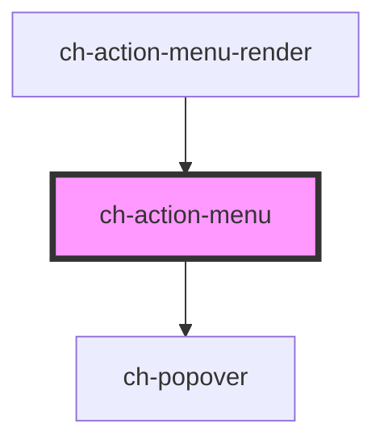

# ch-action-menu

<!-- Auto Generated Below -->

## Properties

| Property                   | Attribute             | Description                                                                                                                                                                               | Type                                                                                                                                                                                                                                                                                                                                                                                                                            | Default        |
| -------------------------- | --------------------- | ----------------------------------------------------------------------------------------------------------------------------------------------------------------------------------------- | ------------------------------------------------------------------------------------------------------------------------------------------------------------------------------------------------------------------------------------------------------------------------------------------------------------------------------------------------------------------------------------------------------------------------------- | -------------- |
| `actionGroupParent`        | `action-group-parent` | Specifies if the current parent of the item is the action-group control.                                                                                                                  | `boolean`                                                                                                                                                                                                                                                                                                                                                                                                                       | `false`        |
| `blockAlign`               | `block-align`         | Specifies the block alignment of the dropdown menu that is placed relative to the expandable button.                                                                                      | `"center" \| "inside-end" \| "inside-start" \| "outside-end" \| "outside-start"`                                                                                                                                                                                                                                                                                                                                                | `"center"`     |
| `caption`                  | `caption`             | Specifies the caption that the control will display.                                                                                                                                      | `string`                                                                                                                                                                                                                                                                                                                                                                                                                        | `undefined`    |
| `disabled`                 | `disabled`            | This attribute lets you specify if the element is disabled. If disabled, it will not fire any user interaction related event (for example, click event).                                  | `boolean`                                                                                                                                                                                                                                                                                                                                                                                                                       | `false`        |
| `endImgSrc`                | `end-img-src`         | Specifies the src of the end image.                                                                                                                                                       | `string`                                                                                                                                                                                                                                                                                                                                                                                                                        | `undefined`    |
| `endImgType`               | `end-img-type`        | Specifies how the end image will be rendered.                                                                                                                                             | `"background" \| "img" \| "mask"`                                                                                                                                                                                                                                                                                                                                                                                               | `"background"` |
| `expandable`               | `expandable`          | Specifies whether the item contains a subtree. `true` if the item has a subtree.                                                                                                          | `boolean`                                                                                                                                                                                                                                                                                                                                                                                                                       | `false`        |
| `expanded`                 | `expanded`            | `true` to display the dropdown menu.                                                                                                                                                      | `boolean`                                                                                                                                                                                                                                                                                                                                                                                                                       | `false`        |
| `getImagePathCallback`     | --                    | This property specifies a callback that is executed when the path for an startImgSrc or endImgSrc needs to be resolved.                                                                   | `(item: ActionMenuItemActionableModel, iconDirection: "start" \| "end") => GxImageMultiState`                                                                                                                                                                                                                                                                                                                                   | `undefined`    |
| `inlineAlign`              | `inline-align`        | Specifies the inline alignment of the dropdown menu that is placed relative to the expandable button.                                                                                     | `"center" \| "inside-end" \| "inside-start" \| "outside-end" \| "outside-start"`                                                                                                                                                                                                                                                                                                                                                | `"center"`     |
| `link`                     | --                    | Specifies the hyperlink properties of the item. If this property is defined, the `ch-action-menu` will render an anchor tag with this properties. Otherwise, it will render a button tag. | `{ url: string; rel?: string; target?: "_self" \| "_blank" \| "_parent" \| "_top" \| "_unfencedTop"; }`                                                                                                                                                                                                                                                                                                                         | `undefined`    |
| `model` _(required)_       | --                    | Specifies the extended model of the control. This property is only needed to know the UI Model on each event                                                                              | `{ id?: string; caption: string; disabled?: boolean; endImgSrc?: string; endImgType?: "mask" \| "background"; expanded?: boolean; items?: ActionMenuModel; itemsBlockAlign?: ChPopoverAlign; itemsInlineAlign?: ChPopoverAlign; link?: ItemLink; parts?: string; positionTry?: "none" \| "flip-block" \| "flip-inline"; shortcut?: string; startImgSrc?: string; startImgType?: "mask" \| "background"; type?: "actionable"; }` | `undefined`    |
| `openOnFocus`              | `open-on-focus`       | Determine if the dropdown menu should be opened when the expandable button of the control is focused. TODO: Add implementation                                                            | `boolean`                                                                                                                                                                                                                                                                                                                                                                                                                       | `false`        |
| `parts`                    | `parts`               | Specifies a set of parts to use in every DOM element of the control.                                                                                                                      | `string`                                                                                                                                                                                                                                                                                                                                                                                                                        | `undefined`    |
| `positionTry` _(required)_ | `position-try`        | Specifies an alternative position to try when the popover overflows the window.                                                                                                           | `"flip-block" \| "flip-inline" \| "none"`                                                                                                                                                                                                                                                                                                                                                                                       | `undefined`    |
| `shortcut`                 | `shortcut`            | Specifies the shortcut caption that the control will display.                                                                                                                             | `string`                                                                                                                                                                                                                                                                                                                                                                                                                        | `undefined`    |
| `startImgSrc`              | `start-img-src`       | Specifies the src for the left img.                                                                                                                                                       | `string`                                                                                                                                                                                                                                                                                                                                                                                                                        | `undefined`    |
| `startImgType`             | `start-img-type`      | Specifies how the start image will be rendered.                                                                                                                                           | `"background" \| "img" \| "mask"`                                                                                                                                                                                                                                                                                                                                                                                               | `"background"` |

## Dependencies

### Used by

 - [ch-action-menu-render](../..)

### Depends on

- [ch-popover](../../../popover)

### Graph

----------------------------------------------

*Built with [StencilJS](https://stenciljs.com/)*
