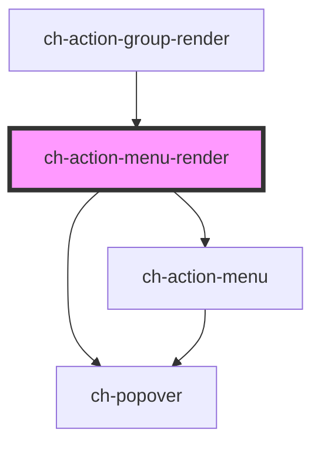

# ch-action-menu-render

<!-- Auto Generated Below -->

## Properties

| Property               | Attribute                | Description                                                                                                                                              | Type                                                                                          | Default         |
| ---------------------- | ------------------------ | -------------------------------------------------------------------------------------------------------------------------------------------------------- | --------------------------------------------------------------------------------------------- | --------------- |
| `blockAlign`           | `block-align`            | Specifies the block alignment of the dropdown menu that is placed relative to the expandable button.                                                     | `"center" \| "inside-end" \| "inside-start" \| "outside-end" \| "outside-start"`              | `"outside-end"` |
| `buttonAccessibleName` | `button-accessible-name` | This attribute lets you specify the label for the first expandable button. Important for accessibility.                                                  | `string`                                                                                      | `undefined`     |
| `disabled`             | `disabled`               | This attribute lets you specify if the element is disabled. If disabled, it will not fire any user interaction related event (for example, click event). | `boolean`                                                                                     | `false`         |
| `expanded`             | `expanded`               | `true` to expand the dropdown window.                                                                                                                    | `boolean`                                                                                     | `false`         |
| `getImagePathCallback` | --                       | This property specifies a callback that is executed when the path for an startImgSrc or endImgSrc (of an item) needs to be resolved.                     | `(item: ActionMenuItemActionableModel, iconDirection: "start" \| "end") => GxImageMultiState` | `undefined`     |
| `gxImageConstructor`   | --                       | This property is a WA to implement the Tree View as a UC 2.0 in GeneXus.                                                                                 | `(name: string) => any`                                                                       | `undefined`     |
| `gxSettings`           | `gx-settings`            | This property is a WA to implement the Tree View as a UC 2.0 in GeneXus.                                                                                 | `any`                                                                                         | `undefined`     |
| `inlineAlign`          | `inline-align`           | Specifies the inline alignment of the dropdown section that is placed relative to the expandable button.                                                 | `"center" \| "inside-end" \| "inside-start" \| "outside-end" \| "outside-start"`              | `"center"`      |
| `model`                | --                       | This property lets you define the model of the control.                                                                                                  | `ActionMenuItemModel[]`                                                                       | `undefined`     |
| `positionTry`          | `position-try`           | Specifies an alternative position to try when the popover overflows the window.                                                                          | `"flip-block" \| "flip-inline" \| "none"`                                                     | `"none"`        |
| `useGxRender`          | `use-gx-render`          | This property is a WA to implement the Tree View as a UC 2.0 in GeneXus.                                                                                 | `boolean`                                                                                     | `false`         |

## Events

| Event                | Description                                                                                                                      | Type                                                                                                                                                                                                                                                                                                                                                                                                                                         |
| -------------------- | -------------------------------------------------------------------------------------------------------------------------------- | -------------------------------------------------------------------------------------------------------------------------------------------------------------------------------------------------------------------------------------------------------------------------------------------------------------------------------------------------------------------------------------------------------------------------------------------- |
| `buttonClick`        | Fired when a button is clicked. This event can be prevented.                                                                     | `CustomEvent<{ id?: string; caption: string; disabled?: boolean; endImgSrc?: string; endImgType?: "mask" \| "background"; expanded?: boolean; items?: ActionMenuModel; itemsBlockAlign?: ChPopoverAlign; itemsInlineAlign?: ChPopoverAlign; link?: ItemLink; parts?: string; positionTry?: "none" \| "flip-block" \| "flip-inline"; shortcut?: string; startImgSrc?: string; startImgType?: "mask" \| "background"; type?: "actionable"; }>` |
| `expandedChange`     | Fired when the visibility of the main dropdown is changed.                                                                       | `CustomEvent<boolean>`                                                                                                                                                                                                                                                                                                                                                                                                                       |
| `expandedItemChange` | Fired when the visibility of a dropdown item is changed.                                                                         | `CustomEvent<{ item: ActionMenuItemActionableModel; expanded: boolean; }>`                                                                                                                                                                                                                                                                                                                                                                   |
| `hyperlinkClick`     | Fired when an hyperlink is clicked. This event can be prevented, but the dropdown will be closed in any case (prevented or not). | `CustomEvent<{ event: PointerEvent; item: ActionMenuItemActionableModel; }>`                                                                                                                                                                                                                                                                                                                                                                 |

## CSS Custom Properties

| Name                                           | Description                                                                                 |
| ---------------------------------------------- | ------------------------------------------------------------------------------------------- |
| `--ch-action-menu-item__background-image-size` | Specifies the size of the start and end images of the items. @default 100%                  |
| `--ch-action-menu-item__image-size`            | Specifies the box size that contains the start or end images of the items. @default 0.875em |

## Dependencies

### Used by

 - [ch-action-group-render](../action-group)

### Depends on

- [ch-action-menu](./internal/action-menu)
- [ch-popover](../popover)

### Graph

----------------------------------------------

*Built with [StencilJS](https://stenciljs.com/)*
