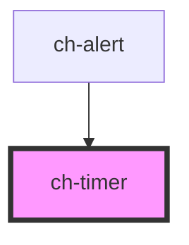

# ch-timer

<!-- Auto Generated Below -->

## Properties

| Property         | Attribute         | Description                                                         | Type      | Default   |
| ---------------- | ----------------- | ------------------------------------------------------------------- | --------- | --------- |
| `accessibleName` | `accessible-name` | Sets the accesible name of the timer.                               | `string`  | `"timer"` |
| `animationTime`  | `animation-time`  | Sets the animationTime to set the custom var for the css animation. | `number`  | `0`       |
| `presented`      | `presented`       | Sets the presented property to handle the component presentation.   | `boolean` | `false`   |
| `progress`       | `progress`        | Sets the progress propiety to determine the progress.               | `number`  | `0`       |

## Shadow Parts

| Part          | Description |
| ------------- | ----------- |
| `"indicator"` |             |

## Dependencies

### Used by

 - [ch-alert](..)

### Graph

----------------------------------------------

*Built with [StencilJS](https://stenciljs.com/)*
