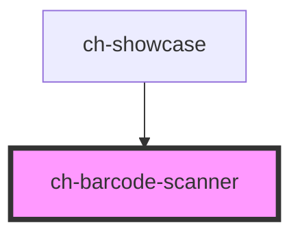

# Barcode Scanner

<!-- Auto Generated Below -->

## Overview

This component allows you to scan a wide variety of types of barcode and QR
codes.

## Properties

| Property           | Attribute            | Description                                                                                                                                                                                           | Type                                         | Default     |
| ------------------ | -------------------- | ----------------------------------------------------------------------------------------------------------------------------------------------------------------------------------------------------- | -------------------------------------------- | ----------- |
| `barcodeBoxHeight` | `barcode-box-height` | The height (in pixels) of the QR box displayed at the center of the video.                                                                                                                            | `number`                                     | `200`       |
| `barcodeBoxWidth`  | `barcode-box-width`  | The width (in pixels) of the QR box displayed at the center of the video.                                                                                                                             | `number`                                     | `200`       |
| `cameraId`         | `camera-id`          | Specifies the ID of the selected camera. Only works if `cameraPreference === "SelectedById"`.                                                                                                         | `string`                                     | `undefined` |
| `cameraPreference` | `camera-preference`  | Specifies the camera preference for scanning.                                                                                                                                                         | `"BackCamera" \| "Default" \| "FrontCamera"` | `"Default"` |
| `readDebounce`     | `read-debounce`      | Specifies how much time (in ms) should pass before to emit the read event with the same last decoded text. If the last decoded text is different from the new decoded text, this property is ignored. | `number`                                     | `200`       |
| `scanning`         | `scanning`           | `true` if the control is scanning.                                                                                                                                                                    | `boolean`                                    | `true`      |

## Events

| Event     | Description                                                                             | Type                    |
| --------- | --------------------------------------------------------------------------------------- | ----------------------- |
| `cameras` | Fired when the control is first rendered. Contains the ids about all available cameras. | `CustomEvent<string[]>` |
| `read`    | Fired when a new barcode is decoded.                                                    | `CustomEvent<string>`   |

## Methods

### `scan(imageFile: File) => Promise<string>`

Scan a file a return a promise with the decoded text.

#### Parameters

| Name        | Type   | Description |
| ----------- | ------ | ----------- |
| `imageFile` | `File` |             |

#### Returns

Type: `Promise<string>`

## Dependencies

### Used by

 - [ch-showcase](../../showcase/assets/components)

### Graph

----------------------------------------------

*Built with [StencilJS](https://stenciljs.com/)*
