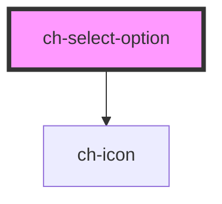

# ch-select-item

<!-- Auto Generated Below -->

## Properties

| Property       | Attribute        | Description                                                          | Type      | Default     |
| -------------- | ---------------- | -------------------------------------------------------------------- | --------- | ----------- |
| `autoColor`    | `auto-color`     | If enabled, the option icons will display its inherent/natural color | `boolean` | `true`      |
| `disabled`     | `disabled`       | Determines if the option is disabled                                 | `boolean` | `undefined` |
| `leftIconSrc`  | `left-icon-src`  | Set the left side icon                                               | `string`  | `undefined` |
| `rightIconSrc` | `right-icon-src` | Set the right side icon                                              | `string`  | `undefined` |
| `selected`     | `selected`       | Determines the selected option                                       | `boolean` | `undefined` |

## Events

| Event         | Description       | Type               |
| ------------- | ----------------- | ------------------ |
| `itemClicked` | Emits the item id | `CustomEvent<any>` |

## Shadow Parts

| Part            | Description |
| --------------- | ----------- |
| `"option-text"` |             |

## Dependencies

### Depends on

- [ch-icon](../icon)

### Graph

----------------------------------------------

*Built with [StencilJS](https://stenciljs.com/)*
