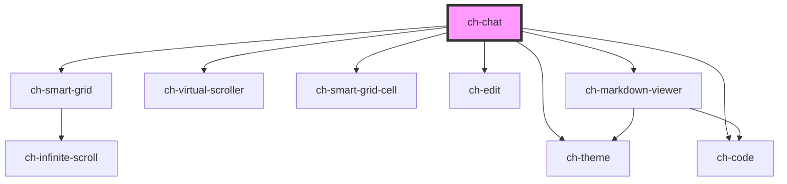

# ch-chat

<!-- Auto Generated Below -->

## Overview

TODO: Add description

## Properties

| Property                   | Attribute                     | Description                                                                                                                                                                                                                                                                                                                                                                                                                                                  | Type                                                                                                                                                                                                                                                                                                                                                                                    | Default                                                                                                                                                                                                                                                                                                                                                                                                                                                                                                                                                                                                                               |
| -------------------------- | ----------------------------- | ------------------------------------------------------------------------------------------------------------------------------------------------------------------------------------------------------------------------------------------------------------------------------------------------------------------------------------------------------------------------------------------------------------------------------------------------------------ | --------------------------------------------------------------------------------------------------------------------------------------------------------------------------------------------------------------------------------------------------------------------------------------------------------------------------------------------------------------------------------------- | ------------------------------------------------------------------------------------------------------------------------------------------------------------------------------------------------------------------------------------------------------------------------------------------------------------------------------------------------------------------------------------------------------------------------------------------------------------------------------------------------------------------------------------------------------------------------------------------------------------------------------------- |
| `autoScroll`               | `auto-scroll`                 | Specifies how the scroll position will be adjusted when the chat messages are updated with the methods `addNewMessage`, `updateChatMessage` or `updateLastMessage`.   - "at-scroll-end": If the scroll is positioned at the end of the content,   the chat will maintain the scroll at the end while the content of the   messages is being updated.   - "never": The scroll position won't be adjusted when the content of the   messages is being updated. | `"at-scroll-end" \| "never"`                                                                                                                                                                                                                                                                                                                                                            | `"at-scroll-end"`                                                                                                                                                                                                                                                                                                                                                                                                                                                                                                                                                                                                                     |
| `callbacks`                | --                            | Specifies the callbacks required in the control.                                                                                                                                                                                                                                                                                                                                                                                                             | `{ clear: () => Promise<void>; sendChatToLLM: (chat: ChatMessage[]) => void; stopGeneratingAnswer?: () => Promise<void>; uploadImage: (imageFile: File) => Promise<string>; validateSendChatMessage?: (chat: ChatMessage) => boolean \| Promise<boolean>; }`                                                                                                                            | `undefined`                                                                                                                                                                                                                                                                                                                                                                                                                                                                                                                                                                                                                           |
| `disabled`                 | `disabled`                    | Specifies if all interactions are disabled                                                                                                                                                                                                                                                                                                                                                                                                                   | `boolean`                                                                                                                                                                                                                                                                                                                                                                               | `false`                                                                                                                                                                                                                                                                                                                                                                                                                                                                                                                                                                                                                               |
| `generatingResponse`       | `generating-response`         | `true` if a response for the assistant is being generated.                                                                                                                                                                                                                                                                                                                                                                                                   | `boolean`                                                                                                                                                                                                                                                                                                                                                                               | `false`                                                                                                                                                                                                                                                                                                                                                                                                                                                                                                                                                                                                                               |
| `hyperlinkToDownloadFile`  | --                            | Specifies an object containing an HTMLAnchorElement reference. Use this property to render a button to download the code when displaying a code block.                                                                                                                                                                                                                                                                                                       | `{ anchor: HTMLAnchorElement; }`                                                                                                                                                                                                                                                                                                                                                        | `undefined`                                                                                                                                                                                                                                                                                                                                                                                                                                                                                                                                                                                                                           |
| `imageUpload`              | `image-upload`                | Specifies if the control can render a button to load images from the file system.                                                                                                                                                                                                                                                                                                                                                                            | `boolean`                                                                                                                                                                                                                                                                                                                                                                               | `false`                                                                                                                                                                                                                                                                                                                                                                                                                                                                                                                                                                                                                               |
| `isMobile`                 | `is-mobile`                   | Specifies if the chat is used in a mobile device.                                                                                                                                                                                                                                                                                                                                                                                                            | `boolean`                                                                                                                                                                                                                                                                                                                                                                               | `false`                                                                                                                                                                                                                                                                                                                                                                                                                                                                                                                                                                                                                               |
| `items`                    | --                            | Specifies the items that the chat will display.                                                                                                                                                                                                                                                                                                                                                                                                              | `ChatMessage[]`                                                                                                                                                                                                                                                                                                                                                                         | `[]`                                                                                                                                                                                                                                                                                                                                                                                                                                                                                                                                                                                                                                  |
| `loadingState`             | `loading-state`               | Specifies if the chat is waiting for the data to be loaded.                                                                                                                                                                                                                                                                                                                                                                                                  | `"all-records-loaded" \| "initial" \| "loading" \| "more-data-to-fetch"`                                                                                                                                                                                                                                                                                                                | `"initial"`                                                                                                                                                                                                                                                                                                                                                                                                                                                                                                                                                                                                                           |
| `markdownTheme`            | `markdown-theme`              | Specifies the theme to be used for rendering the markdown. If `null`, no theme will be applied.                                                                                                                                                                                                                                                                                                                                                              | `string`                                                                                                                                                                                                                                                                                                                                                                                | `"ch-markdown-viewer"`                                                                                                                                                                                                                                                                                                                                                                                                                                                                                                                                                                                                                |
| `newMessageAlignment`      | `new-message-alignment`       | Specifies how the messages added by the user interaction method will be aligned in the chat.  If `newMessageAlignment === "start"` the chat will reserve the necessary space to visualize the message at the start of the content viewport if the content is not large enough. This behavior is the same as the Monaco editor does for reserving space when visualizing the last lines positioned at the top of the editor.                                  | `"end" \| "start"`                                                                                                                                                                                                                                                                                                                                                                      | `"end"`                                                                                                                                                                                                                                                                                                                                                                                                                                                                                                                                                                                                                               |
| `newMessageScrollBehavior` | `new-message-scroll-behavior` | Specifies how the chat will scroll to the position of the messages added by user interaction.                                                                                                                                                                                                                                                                                                                                                                | `"instant" \| "smooth"`                                                                                                                                                                                                                                                                                                                                                                 | `"instant"`                                                                                                                                                                                                                                                                                                                                                                                                                                                                                                                                                                                                                           |
| `renderCode`               | --                            | This property allows us to implement custom rendering for the code blocks.                                                                                                                                                                                                                                                                                                                                                                                   | `(options: MarkdownViewerCodeRenderOptions) => any`                                                                                                                                                                                                                                                                                                                                     | `undefined`                                                                                                                                                                                                                                                                                                                                                                                                                                                                                                                                                                                                                           |
| `renderItem`               | --                            | This property allows us to implement custom rendering of chat items. If allow us to implement the render of the cell content.                                                                                                                                                                                                                                                                                                                                | `(messageModel: ChatMessageByRole<"error" \| "user" \| "assistant">) => any`                                                                                                                                                                                                                                                                                                            | `undefined`                                                                                                                                                                                                                                                                                                                                                                                                                                                                                                                                                                                                                           |
| `showAdditionalContent`    | `show-additional-content`     | `true` to render a slot named "additional-content" to project elements between the "content" slot (grid messages) and the "send-container" slot.  This slot can only be rendered if loadingState !== "initial" and (loadingState !== "all-records-loaded" && items.length > 0).                                                                                                                                                                              | `boolean`                                                                                                                                                                                                                                                                                                                                                                               | `false`                                                                                                                                                                                                                                                                                                                                                                                                                                                                                                                                                                                                                               |
| `theme`                    | `theme`                       | Specifies the theme to be used for rendering the chat. If `undefined`, no theme will be applied.                                                                                                                                                                                                                                                                                                                                                             | `ThemeItemBaseModel & { styleSheet: string; } \| ThemeItemBaseModel & { url?: string; } \| ThemeItemModel[] \| string \| string[]`                                                                                                                                                                                                                                                      | `undefined`                                                                                                                                                                                                                                                                                                                                                                                                                                                                                                                                                                                                                           |
| `translations`             | --                            | Specifies the literals required in the control.                                                                                                                                                                                                                                                                                                                                                                                                              | `{ accessibleName: { clearChat: string; copyResponseButton: string; downloadCodeButton: string; imagePicker: string; removeUploadedImage: string; sendButton: string; sendInput: string; stopGeneratingAnswerButton: string; }; placeholder: { sendInput: string; }; text: { stopGeneratingAnswerButton: string; copyCodeButton: string; processing: string; sourceFiles: string; }; }` | `{     accessibleName: {       clearChat: "Clear chat",       copyResponseButton: "Copy assistant response",       downloadCodeButton: "Download code",       imagePicker: "Select images",       removeUploadedImage: "Remove uploaded image",       sendButton: "Send",       sendInput: "Message",       stopGeneratingAnswerButton: "Stop generating answer"     },     placeholder: {       sendInput: "Ask me a question..."     },     text: {       stopGeneratingAnswerButton: "Stop generating answer",       copyCodeButton: "Copy code",       processing: `Processing...`,       sourceFiles: "Source files:"     }   }` |

## Methods

### `addNewMessage(message: ChatMessage) => Promise<void>`

Add a new message at the end of the record, performing a re-render.

#### Parameters

| Name      | Type                                                                               | Description |
| --------- | ---------------------------------------------------------------------------------- | ----------- |
| `message` | `ChatMessageError \| ChatMessageSystem \| ChatMessageUser \| ChatMessageAssistant` |             |

#### Returns

Type: `Promise<void>`

### `focusChatInput() => Promise<void>`

Focus the chat input

#### Returns

Type: `Promise<void>`

### `setChatInputMessage(text: string) => Promise<void>`

Set the text for the chat input

#### Parameters

| Name   | Type     | Description |
| ------ | -------- | ----------- |
| `text` | `string` |             |

#### Returns

Type: `Promise<void>`

### `updateChatMessage(messageIndex: number, message: ChatMessageByRoleNoId<"system" | "assistant">, mode: "concat" | "replace") => Promise<void>`

Given the id of the message, it updates the content of the indexed message.

#### Parameters

| Name           | Type                                                                | Description |
| -------------- | ------------------------------------------------------------------- | ----------- |
| `messageIndex` | `number`                                                            |             |
| `message`      | `Omit<ChatMessageSystem, "id"> \| Omit<ChatMessageAssistant, "id">` |             |
| `mode`         | `"concat" \| "replace"`                                             |             |

#### Returns

Type: `Promise<void>`

### `updateLastMessage(message: ChatMessageByRoleNoId<"system" | "assistant">, mode: "concat" | "replace") => Promise<void>`

Update the content of the last message, performing a re-render.

#### Parameters

| Name      | Type                                                                | Description |
| --------- | ------------------------------------------------------------------- | ----------- |
| `message` | `Omit<ChatMessageSystem, "id"> \| Omit<ChatMessageAssistant, "id">` |             |
| `mode`    | `"concat" \| "replace"`                                             |             |

#### Returns

Type: `Promise<void>`

## Shadow Parts

| Part                              | Description |
| --------------------------------- | ----------- |
| `"content"`                       |             |
| `"image-to-upload"`               |             |
| `"images-to-upload"`              |             |
| `"remove-image-to-upload-button"` |             |
| `"send-button"`                   |             |
| `"send-container"`                |             |
| `"send-input-wrapper"`            |             |
| `"stop-generating-answer-button"` |             |

## Dependencies

### Depends on

- [ch-smart-grid](../smart-grid)
- [ch-virtual-scroller](../virtual-scroller)
- [ch-smart-grid-cell](../smart-grid/internal/smart-grid-cell)
- [ch-theme](../theme)
- [ch-edit](../edit)
- [ch-code](../code)
- [ch-markdown-viewer](../markdown-viewer)

### Graph

----------------------------------------------

*Built with [StencilJS](https://stenciljs.com/)*
