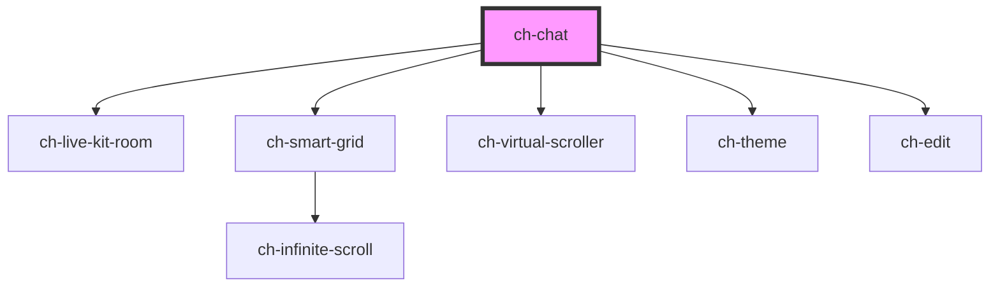

# ch-chat

## Layout

<!-- Auto Generated Below -->

## Overview

TODO: Add description

## Properties

| Property                       | Attribute                          | Description                                                                                                                                                                                                                                                                                                                                                                                                                                                                                                                                                                                                                                                                                                                                                                                                                                                                                                                                         | Type                                                                                                                                                                                                                                                                                                                                                                                                                                 | Default                                                                                                                                                                                                                                                                                                                                                                                                                                                                                                  |
| ------------------------------ | ---------------------------------- | --------------------------------------------------------------------------------------------------------------------------------------------------------------------------------------------------------------------------------------------------------------------------------------------------------------------------------------------------------------------------------------------------------------------------------------------------------------------------------------------------------------------------------------------------------------------------------------------------------------------------------------------------------------------------------------------------------------------------------------------------------------------------------------------------------------------------------------------------------------------------------------------------------------------------------------------------- | ------------------------------------------------------------------------------------------------------------------------------------------------------------------------------------------------------------------------------------------------------------------------------------------------------------------------------------------------------------------------------------------------------------------------------------ | -------------------------------------------------------------------------------------------------------------------------------------------------------------------------------------------------------------------------------------------------------------------------------------------------------------------------------------------------------------------------------------------------------------------------------------------------------------------------------------------------------- |
| `autoScroll`                   | `auto-scroll`                      | Specifies how the scroll position will be adjusted when the chat messages are updated with the methods `addNewMessage`, `updateChatMessage` or `updateLastMessage`.   - "at-scroll-end": If the scroll is positioned at the end of the content,   the chat will maintain the scroll at the end while the content of the   messages is being updated.   - "never": The scroll position won't be adjusted when the content of the   messages is being updated.                                                                                                                                                                                                                                                                                                                                                                                                                                                                                        | `"at-scroll-end" \| "never"`                                                                                                                                                                                                                                                                                                                                                                                                         | `"at-scroll-end"`                                                                                                                                                                                                                                                                                                                                                                                                                                                                                        |
| `callbacks`                    | --                                 | Specifies the callbacks required in the control.                                                                                                                                                                                                                                                                                                                                                                                                                                                                                                                                                                                                                                                                                                                                                                                                                                                                                                    | `{ downloadCodeBlock?: (plainText: string, language: string) => void; getChatMessageFiles?: () => File[] \| Promise<File[]>; liveMode?: Pick<LiveKitCallbacks, "activeSpeakersChanged">; sendChatMessages: (chat: ChatMessage[]) => void; stopResponse?: () => Promise<void>; validateSendChatMessage?: (chat: ChatMessage, files: File[]) => boolean \| Promise<boolean>; uploadFile?: (file: File) => Promise<ChatMessageFile>; }` | `undefined`                                                                                                                                                                                                                                                                                                                                                                                                                                                                                              |
| `disabled`                     | `disabled`                         | Specifies if all interactions are disabled                                                                                                                                                                                                                                                                                                                                                                                                                                                                                                                                                                                                                                                                                                                                                                                                                                                                                                          | `boolean`                                                                                                                                                                                                                                                                                                                                                                                                                            | `false`                                                                                                                                                                                                                                                                                                                                                                                                                                                                                                  |
| `items`                        | --                                 | Specifies the items that the chat will display.                                                                                                                                                                                                                                                                                                                                                                                                                                                                                                                                                                                                                                                                                                                                                                                                                                                                                                     | `ChatMessage[]`                                                                                                                                                                                                                                                                                                                                                                                                                      | `[]`                                                                                                                                                                                                                                                                                                                                                                                                                                                                                                     |
| `liveMode`                     | `live-mode`                        | Specifies if the live mode is set.  When this mode is enabled, the chat will disable sending messages by user interactions and the only way to send messages will be throughout the voice. The user will have to enable the microphone input in their Operative System and it will voice chat with the remote participants.  When any participant speaks, the transcribed conversation will be displayed as new messages in the chat (`items` property).  When the `liveMode` ends, the transcribed conversation will be pushed to the `items` of the chat.                                                                                                                                                                                                                                                                                                                                                                                         | `boolean`                                                                                                                                                                                                                                                                                                                                                                                                                            | `false`                                                                                                                                                                                                                                                                                                                                                                                                                                                                                                  |
| `liveModeConfiguration`        | --                                 | Specifies the live mode configuration. The `token` and `url` are required to enable the `liveMode`.                                                                                                                                                                                                                                                                                                                                                                                                                                                                                                                                                                                                                                                                                                                                                                                                                                                 | `{ url: string; token: string; localParticipant?: { microphoneEnabled?: boolean; }; }`                                                                                                                                                                                                                                                                                                                                               | `undefined`                                                                                                                                                                                                                                                                                                                                                                                                                                                                                              |
| `loadingState`                 | `loading-state`                    | Specifies if the chat is waiting for the data to be loaded.                                                                                                                                                                                                                                                                                                                                                                                                                                                                                                                                                                                                                                                                                                                                                                                                                                                                                         | `"all-records-loaded" \| "initial" \| "loading" \| "more-data-to-fetch"`                                                                                                                                                                                                                                                                                                                                                             | `"initial"`                                                                                                                                                                                                                                                                                                                                                                                                                                                                                              |
| `markdownTheme`                | `markdown-theme`                   | Specifies the theme to be used for rendering the markdown. If `null`, no theme will be applied.                                                                                                                                                                                                                                                                                                                                                                                                                                                                                                                                                                                                                                                                                                                                                                                                                                                     | `string`                                                                                                                                                                                                                                                                                                                                                                                                                             | `"ch-markdown-viewer"`                                                                                                                                                                                                                                                                                                                                                                                                                                                                                   |
| `newUserMessageAlignment`      | `new-user-message-alignment`       | Specifies how the messages added by the user interaction will be aligned in the chat.  If `newUserMessageAlignment === "start"` the chat will reserve the necessary space to visualize the message at the start of the content viewport if the content is not large enough. This behavior is the same as the Monaco editor does for reserving space when visualizing the last lines positioned at the top of the editor.                                                                                                                                                                                                                                                                                                                                                                                                                                                                                                                            | `"end" \| "start"`                                                                                                                                                                                                                                                                                                                                                                                                                   | `"end"`                                                                                                                                                                                                                                                                                                                                                                                                                                                                                                  |
| `newUserMessageScrollBehavior` | `new-user-message-scroll-behavior` | Specifies how the chat will scroll to the position of the messages added by user interaction.                                                                                                                                                                                                                                                                                                                                                                                                                                                                                                                                                                                                                                                                                                                                                                                                                                                       | `"instant" \| "smooth"`                                                                                                                                                                                                                                                                                                                                                                                                              | `"instant"`                                                                                                                                                                                                                                                                                                                                                                                                                                                                                              |
| `renderItem`                   | --                                 | This property allows us to implement custom rendering of chat items.  This works by providing a custom render of the cell content in two possible ways:   1. Replacing the render of the entire cell with a function of the   message model.    2. Replacing the render of specific parts of the message by providing an   object with the specific renders of the message sections (`codeBlock`,   `contentBefore`, `content`, `contentAfter`, `files` and/or   `messageStructure`).                                                                                                                                                                                                                                                                                                                                                                                                                                                               | `((messageModel: ChatMessageError \| ChatMessageUser \| ChatMessageAssistant) => string \| TemplateResult) \| { actions?: ChatActionsRender; codeBlock?: ChatCodeBlockRender; contentBefore?: ChatContentRender; content?: ChatContentRender; contentAfter?: ChatContentRender; file?: ChatFileRender; messageStructure?: ChatMessageStructureRender; source?: ChatSourceRender; }`                                                  | `undefined`                                                                                                                                                                                                                                                                                                                                                                                                                                                                                              |
| `sendButtonDisabled`           | `send-button-disabled`             | `true` to disable the send-button element.                                                                                                                                                                                                                                                                                                                                                                                                                                                                                                                                                                                                                                                                                                                                                                                                                                                                                                          | `boolean`                                                                                                                                                                                                                                                                                                                                                                                                                            | `false`                                                                                                                                                                                                                                                                                                                                                                                                                                                                                                  |
| `sendContainerLayout`          | --                                 | Specifies the position of the elements in the `send-container` part. There are four positions for distributing elements:   - `sendContainerBefore`: Before the contents of the `send-container` part.   - `sendInputBefore`: Before the contents of the `send-input` part.   - `sendInputAfter`: After the contents of the `send-input` part.   - `sendContainerAfter`: After the contents of the `send-container` part.  At each position you can specify reserved elements, such as the `send-button` and `stop-response-button`, but can also be specified non-reserved elements, which will be projected as content slots.  If the reserved `stop-response-button` element is not specified anywhere, the send button will be replaced with the stop-response button when `waitingResponse = true` and the `stopResponse` callback is specified.  If the `send-button` is not specified in any position, it won't be rendered in the `ch-chat`. | `{ sendContainerBefore?: ChatSendContainerLayoutElement[]; sendInputBefore?: ChatSendContainerLayoutElement[]; sendInputAfter?: ChatSendContainerLayoutElement[]; sendContainerAfter?: ChatSendContainerLayoutElement[]; }`                                                                                                                                                                                                          | `{     sendContainerAfter: ["send-button"]   }`                                                                                                                                                                                                                                                                                                                                                                                                                                                          |
| `sendInputDisabled`            | `send-input-disabled`              | `true` to disable the send-input element.                                                                                                                                                                                                                                                                                                                                                                                                                                                                                                                                                                                                                                                                                                                                                                                                                                                                                                           | `boolean`                                                                                                                                                                                                                                                                                                                                                                                                                            | `false`                                                                                                                                                                                                                                                                                                                                                                                                                                                                                                  |
| `showAdditionalContent`        | `show-additional-content`          | `true` to render a slot named "additional-content" to project elements between the "content" slot (grid messages) and the "send-container" slot.  This slot can only be rendered if loadingState !== "initial" and (loadingState !== "all-records-loaded" && items.length > 0).                                                                                                                                                                                                                                                                                                                                                                                                                                                                                                                                                                                                                                                                     | `boolean`                                                                                                                                                                                                                                                                                                                                                                                                                            | `false`                                                                                                                                                                                                                                                                                                                                                                                                                                                                                                  |
| `theme`                        | `theme`                            | Specifies the theme to be used for rendering the chat. If `undefined`, no theme will be applied.                                                                                                                                                                                                                                                                                                                                                                                                                                                                                                                                                                                                                                                                                                                                                                                                                                                    | `ThemeItemBaseModel & { styleSheet: string; } \| ThemeItemBaseModel & { url?: string; } \| ThemeItemModel[] \| string \| string[]`                                                                                                                                                                                                                                                                                                   | `undefined`                                                                                                                                                                                                                                                                                                                                                                                                                                                                                              |
| `translations`                 | --                                 | Specifies the literals required in the control.                                                                                                                                                                                                                                                                                                                                                                                                                                                                                                                                                                                                                                                                                                                                                                                                                                                                                                     | `{ accessibleName: { clearChat: string; copyMessageContent?: string; downloadCodeButton?: string; sendButton: string; sendInput: string; stopResponseButton?: string; }; placeholder: { sendInput: string; }; text: { copyCodeButton: string; copyMessageContent?: string; downloadCodeButton?: string; processing?: string; sourceFiles?: string; stopResponseButton?: string; }; }`                                                | `{     accessibleName: {       clearChat: "Clear chat",       copyMessageContent: "Copy message content",       downloadCodeButton: "Download code",       sendButton: "Send",       sendInput: "Message",       stopResponseButton: "Stop generating answer"     },     placeholder: {       sendInput: "Ask me a question..."     },     text: {       copyCodeButton: "Copy code",       copyMessageContent: "Copy",       processing: "Processing...",       sourceFiles: "Source files:"     }   }` |
| `virtualScrollerBufferSize`    | `virtual-scroller-buffer-size`     | Specifies the number of elements to be rendered above and below the virtual scroll.                                                                                                                                                                                                                                                                                                                                                                                                                                                                                                                                                                                                                                                                                                                                                                                                                                                                 | `number`                                                                                                                                                                                                                                                                                                                                                                                                                             | `5`                                                                                                                                                                                                                                                                                                                                                                                                                                                                                                      |
| `waitingResponse`              | `waiting-response`                 | `true` if the `ch-chat` is waiting for a response from the server. If so, the `sendChatMessages` won't be executed when the user tries to send a new message. Although, the `send-input` and `send-button` won't be disabled, so the user can interact with the chat.                                                                                                                                                                                                                                                                                                                                                                                                                                                                                                                                                                                                                                                                               | `boolean`                                                                                                                                                                                                                                                                                                                                                                                                                            | `false`                                                                                                                                                                                                                                                                                                                                                                                                                                                                                                  |

## Events

| Event              | Description                                                                                                                                                                                                                                                                                                                                            | Type                                                                                                                             |
| ------------------ | ------------------------------------------------------------------------------------------------------------------------------------------------------------------------------------------------------------------------------------------------------------------------------------------------------------------------------------------------------ | -------------------------------------------------------------------------------------------------------------------------------- |
| `userMessageAdded` | Fired when a new user message is added in the chat via user interaction.  Since developers can define their own render for file attachment, this event serves to synchronize the cleanup of the `send-input` with the cleanup of the custom file attachment, or or even blocking user interactions before the `sendChatMessages` callback is executed. | `CustomEvent<{ id: string; role: "user"; content: ChatMessageContent; metadata?: any; parts?: string; transcribed?: boolean; }>` |

## Methods

### `addNewMessage(message: ChatMessage) => Promise<void>`

Add a new message at the end of the record, performing a re-render.

#### Parameters

| Name      | Type                                                                               | Description |
| --------- | ---------------------------------------------------------------------------------- | ----------- |
| `message` | `ChatMessageError \| ChatMessageSystem \| ChatMessageUser \| ChatMessageAssistant` |             |

#### Returns

Type: `Promise<void>`

### `focusChatInput() => Promise<void>`

Focus the chat input

#### Returns

Type: `Promise<void>`

### `sendChatMessage(content?: ChatMessageUser | undefined, files?: File[]) => Promise<void>`

Send the current message of the ch-chat's `send-input` element. This
method executes the same callbacks and interoperates with the same
features as if the message were sent through user interaction. The only
things to keep in mind are the following:
 - If the `content` parameter is provided, it will be used in replacement
   of the input content.

 - If the `files` parameter is provided, the `getChatMessageFiles`
   callback won't be executed to get the current files of the chat.

Whether or not the `content` parameter is provided, the content of the
`send-input` element will be cleared.

#### Parameters

| Name      | Type                                                                                                                | Description |
| --------- | ------------------------------------------------------------------------------------------------------------------- | ----------- |
| `content` | `{ id: string; role: "user"; content: ChatMessageContent; metadata?: any; parts?: string; transcribed?: boolean; }` |             |
| `files`   | `File[]`                                                                                                            |             |

#### Returns

Type: `Promise<void>`

### `setChatInputMessage(text: string) => Promise<void>`

Set the text for the chat input

#### Parameters

| Name   | Type     | Description |
| ------ | -------- | ----------- |
| `text` | `string` |             |

#### Returns

Type: `Promise<void>`

### `updateChatMessage(messageIndex: number, message: ChatMessageByRoleNoId<"system" | "assistant">, mode: "concat" | "replace") => Promise<void>`

Given the id of the message, it updates the content of the indexed message.

#### Parameters

| Name           | Type                                                                | Description |
| -------------- | ------------------------------------------------------------------- | ----------- |
| `messageIndex` | `number`                                                            |             |
| `message`      | `Omit<ChatMessageSystem, "id"> \| Omit<ChatMessageAssistant, "id">` |             |
| `mode`         | `"concat" \| "replace"`                                             |             |

#### Returns

Type: `Promise<void>`

### `updateLastMessage(message: ChatMessageByRoleNoId<"system" | "assistant">, mode: "concat" | "replace") => Promise<void>`

Update the content of the last message, performing a re-render.

#### Parameters

| Name      | Type                                                                | Description |
| --------- | ------------------------------------------------------------------- | ----------- |
| `message` | `Omit<ChatMessageSystem, "id"> \| Omit<ChatMessageAssistant, "id">` |             |
| `mode`    | `"concat" \| "replace"`                                             |             |

#### Returns

Type: `Promise<void>`

## Shadow Parts

| Part                     | Description |
| ------------------------ | ----------- |
| `"messages-container"`   |             |
| `"send-button"`          |             |
| `"send-container"`       |             |
| `"stop-response-button"` |             |

## Dependencies

### Depends on

- [ch-live-kit-room](../live-kit-room)
- [ch-smart-grid](../smart-grid)
- [ch-virtual-scroller](../virtual-scroller)
- [ch-theme](../theme)
- [ch-edit](../edit)

### Graph

----------------------------------------------

*Built with [StencilJS](https://stenciljs.com/)*
