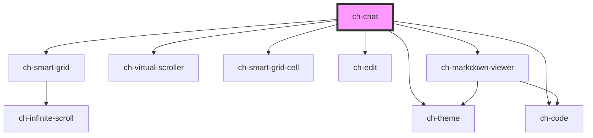

# ch-chat

<!-- Auto Generated Below -->

## Overview

TODO: Add description

## Properties

| Property                               | Attribute                                   | Description                                                                                                                                                                                                                                                                                                                                                                                                                                                  | Type                                                                                                                                                                                                                                                                                                                                                                                                  | Default                                                                                                                                                                                                                                                                                                                                                                                                                                                                                                                                                                      |
| -------------------------------------- | ------------------------------------------- | ------------------------------------------------------------------------------------------------------------------------------------------------------------------------------------------------------------------------------------------------------------------------------------------------------------------------------------------------------------------------------------------------------------------------------------------------------------ | ----------------------------------------------------------------------------------------------------------------------------------------------------------------------------------------------------------------------------------------------------------------------------------------------------------------------------------------------------------------------------------------------------- | ---------------------------------------------------------------------------------------------------------------------------------------------------------------------------------------------------------------------------------------------------------------------------------------------------------------------------------------------------------------------------------------------------------------------------------------------------------------------------------------------------------------------------------------------------------------------------- |
| `autoScroll`                           | `auto-scroll`                               | Specifies how the scroll position will be adjusted when the chat messages are updated with the methods `addNewMessage`, `updateChatMessage` or `updateLastMessage`.   - "at-scroll-end": If the scroll is positioned at the end of the content,   the chat will maintain the scroll at the end while the content of the   messages is being updated.   - "never": The scroll position won't be adjusted when the content of the   messages is being updated. | `"at-scroll-end" \| "never"`                                                                                                                                                                                                                                                                                                                                                                          | `"at-scroll-end"`                                                                                                                                                                                                                                                                                                                                                                                                                                                                                                                                                            |
| `callbacks`                            | --                                          | Specifies the callbacks required in the control.                                                                                                                                                                                                                                                                                                                                                                                                             | `{ downloadCodeBlock?: (plainText: string, language: string) => void; getChatMessageFiles?: () => File[] \| Promise<File[]>; sendChatMessages: (chat: ChatMessage[]) => void; stopGeneratingAnswer?: () => Promise<void>; validateSendChatMessage?: (chat: ChatMessage, files: File[]) => boolean \| Promise<boolean>; uploadFile?: (file: File) => Promise<ChatMessageFile>; }`                      | `undefined`                                                                                                                                                                                                                                                                                                                                                                                                                                                                                                                                                                  |
| `disabled`                             | `disabled`                                  | Specifies if all interactions are disabled                                                                                                                                                                                                                                                                                                                                                                                                                   | `boolean`                                                                                                                                                                                                                                                                                                                                                                                             | `false`                                                                                                                                                                                                                                                                                                                                                                                                                                                                                                                                                                      |
| `generatingResponse`                   | `generating-response`                       | `true` if a response for the assistant is being generated.                                                                                                                                                                                                                                                                                                                                                                                                   | `boolean`                                                                                                                                                                                                                                                                                                                                                                                             | `false`                                                                                                                                                                                                                                                                                                                                                                                                                                                                                                                                                                      |
| `items`                                | --                                          | Specifies the items that the chat will display.                                                                                                                                                                                                                                                                                                                                                                                                              | `ChatMessage[]`                                                                                                                                                                                                                                                                                                                                                                                       | `[]`                                                                                                                                                                                                                                                                                                                                                                                                                                                                                                                                                                         |
| `loadingState`                         | `loading-state`                             | Specifies if the chat is waiting for the data to be loaded.                                                                                                                                                                                                                                                                                                                                                                                                  | `"all-records-loaded" \| "initial" \| "loading" \| "more-data-to-fetch"`                                                                                                                                                                                                                                                                                                                              | `"initial"`                                                                                                                                                                                                                                                                                                                                                                                                                                                                                                                                                                  |
| `markdownTheme`                        | `markdown-theme`                            | Specifies the theme to be used for rendering the markdown. If `null`, no theme will be applied.                                                                                                                                                                                                                                                                                                                                                              | `string`                                                                                                                                                                                                                                                                                                                                                                                              | `"ch-markdown-viewer"`                                                                                                                                                                                                                                                                                                                                                                                                                                                                                                                                                       |
| `newUserMessageAlignment`              | `new-user-message-alignment`                | Specifies how the messages added by the user interaction will be aligned in the chat.  If `newUserMessageAlignment === "start"` the chat will reserve the necessary space to visualize the message at the start of the content viewport if the content is not large enough. This behavior is the same as the Monaco editor does for reserving space when visualizing the last lines positioned at the top of the editor.                                     | `"end" \| "start"`                                                                                                                                                                                                                                                                                                                                                                                    | `"end"`                                                                                                                                                                                                                                                                                                                                                                                                                                                                                                                                                                      |
| `newUserMessageScrollBehavior`         | `new-user-message-scroll-behavior`          | Specifies how the chat will scroll to the position of the messages added by user interaction.                                                                                                                                                                                                                                                                                                                                                                | `"instant" \| "smooth"`                                                                                                                                                                                                                                                                                                                                                                               | `"instant"`                                                                                                                                                                                                                                                                                                                                                                                                                                                                                                                                                                  |
| `renderItem`                           | --                                          | This property allows us to implement custom rendering of chat items.  This works by providing a custom render of the cell content in two possible ways:   1. Replacing the render of the entire cell with a function of the   message model.    2. Replacing the render of specific parts of the message by providing an   object with the specific renders of the message sections (`codeBlock`,   `content`, `files` and/or `messageStructure`).           | `((messageModel: ChatMessageError \| ChatMessageAssistant \| ChatMessageUser) => any) \| { actions?: ChatActionsRender; codeBlock?: ChatCodeBlockRender; content?: ChatContentRender; file?: ChatFileRender; messageStructure?: ChatMessageStructureRender; source?: ChatSourceRender; }`                                                                                                             | `undefined`                                                                                                                                                                                                                                                                                                                                                                                                                                                                                                                                                                  |
| `showAdditionalContent`                | `show-additional-content`                   | `true` to render a slot named "additional-content" to project elements between the "content" slot (grid messages) and the "send-container" slot.  This slot can only be rendered if loadingState !== "initial" and (loadingState !== "all-records-loaded" && items.length > 0).                                                                                                                                                                              | `boolean`                                                                                                                                                                                                                                                                                                                                                                                             | `false`                                                                                                                                                                                                                                                                                                                                                                                                                                                                                                                                                                      |
| `showSendInputAdditionalContentAfter`  | `show-send-input-additional-content-after`  | If `true`, a slot is rendered in the `send-input` with `"send-input-additional-content-after"` name. This slot is intended to customize the internal content of the send-input by adding additional elements after the send-input content.                                                                                                                                                                                                                   | `boolean`                                                                                                                                                                                                                                                                                                                                                                                             | `false`                                                                                                                                                                                                                                                                                                                                                                                                                                                                                                                                                                      |
| `showSendInputAdditionalContentBefore` | `show-send-input-additional-content-before` | If `true`, a slot is rendered in the `send-input` with `"send-input-additional-content-before"` name. This slot is intended to customize the internal content of the send-input by adding additional elements before the send-input content.                                                                                                                                                                                                                 | `boolean`                                                                                                                                                                                                                                                                                                                                                                                             | `false`                                                                                                                                                                                                                                                                                                                                                                                                                                                                                                                                                                      |
| `theme`                                | `theme`                                     | Specifies the theme to be used for rendering the chat. If `undefined`, no theme will be applied.                                                                                                                                                                                                                                                                                                                                                             | `ThemeItemBaseModel & { styleSheet: string; } \| ThemeItemBaseModel & { url?: string; } \| ThemeItemModel[] \| string \| string[]`                                                                                                                                                                                                                                                                    | `undefined`                                                                                                                                                                                                                                                                                                                                                                                                                                                                                                                                                                  |
| `translations`                         | --                                          | Specifies the literals required in the control.                                                                                                                                                                                                                                                                                                                                                                                                              | `{ accessibleName: { clearChat: string; copyMessageContent?: string; downloadCodeButton?: string; sendButton: string; sendInput: string; stopGeneratingAnswerButton?: string; }; placeholder: { sendInput: string; }; text: { copyCodeButton: string; copyMessageContent?: string; downloadCodeButton?: string; processing?: string; sourceFiles?: string; stopGeneratingAnswerButton?: string; }; }` | `{     accessibleName: {       clearChat: "Clear chat",       copyMessageContent: "Copy message content",       downloadCodeButton: "Download code",       sendButton: "Send",       sendInput: "Message",       stopGeneratingAnswerButton: "Stop generating answer"     },     placeholder: {       sendInput: "Ask me a question..."     },     text: {       copyCodeButton: "Copy code",       copyMessageContent: "Copy",       processing: `Processing...`,       sourceFiles: "Source files:",       stopGeneratingAnswerButton: "Stop generating answer"     }   }` |

## Events

| Event              | Description                                                                                                                                                                                                                                                                                                                                            | Type                                                                                                      |
| ------------------ | ------------------------------------------------------------------------------------------------------------------------------------------------------------------------------------------------------------------------------------------------------------------------------------------------------------------------------------------------------ | --------------------------------------------------------------------------------------------------------- |
| `userMessageAdded` | Fired when a new user message is added in the chat via user interaction.  Since developers can define their own render for file attachment, this event serves to synchronize the cleanup of the `send-input` with the cleanup of the custom file attachment, or or even blocking user interactions before the `sendChatMessages` callback is executed. | `CustomEvent<{ id: string; role: "user"; content: ChatMessageContent; metadata?: any; parts?: string; }>` |

## Methods

### `addNewMessage(message: ChatMessage) => Promise<void>`

Add a new message at the end of the record, performing a re-render.

#### Parameters

| Name      | Type                                                                               | Description |
| --------- | ---------------------------------------------------------------------------------- | ----------- |
| `message` | `ChatMessageError \| ChatMessageSystem \| ChatMessageAssistant \| ChatMessageUser` |             |

#### Returns

Type: `Promise<void>`

### `focusChatInput() => Promise<void>`

Focus the chat input

#### Returns

Type: `Promise<void>`

### `setChatInputMessage(text: string) => Promise<void>`

Set the text for the chat input

#### Parameters

| Name   | Type     | Description |
| ------ | -------- | ----------- |
| `text` | `string` |             |

#### Returns

Type: `Promise<void>`

### `updateChatMessage(messageIndex: number, message: ChatMessageByRoleNoId<"system" | "assistant">, mode: "concat" | "replace") => Promise<void>`

Given the id of the message, it updates the content of the indexed message.

#### Parameters

| Name           | Type                                                                | Description |
| -------------- | ------------------------------------------------------------------- | ----------- |
| `messageIndex` | `number`                                                            |             |
| `message`      | `Omit<ChatMessageSystem, "id"> \| Omit<ChatMessageAssistant, "id">` |             |
| `mode`         | `"concat" \| "replace"`                                             |             |

#### Returns

Type: `Promise<void>`

### `updateLastMessage(message: ChatMessageByRoleNoId<"system" | "assistant">, mode: "concat" | "replace") => Promise<void>`

Update the content of the last message, performing a re-render.

#### Parameters

| Name      | Type                                                                | Description |
| --------- | ------------------------------------------------------------------- | ----------- |
| `message` | `Omit<ChatMessageSystem, "id"> \| Omit<ChatMessageAssistant, "id">` |             |
| `mode`    | `"concat" \| "replace"`                                             |             |

#### Returns

Type: `Promise<void>`

## Shadow Parts

| Part                              | Description |
| --------------------------------- | ----------- |
| `"content"`                       |             |
| `"send-button"`                   |             |
| `"send-container"`                |             |
| `"send-input-wrapper"`            |             |
| `"stop-generating-answer-button"` |             |

## Dependencies

### Depends on

- [ch-smart-grid](../smart-grid)
- [ch-virtual-scroller](../virtual-scroller)
- [ch-smart-grid-cell](../smart-grid/internal/smart-grid-cell)
- [ch-theme](../theme)
- [ch-edit](../edit)
- [ch-code](../code)
- [ch-markdown-viewer](../markdown-viewer)

### Graph

----------------------------------------------

*Built with [StencilJS](https://stenciljs.com/)*
