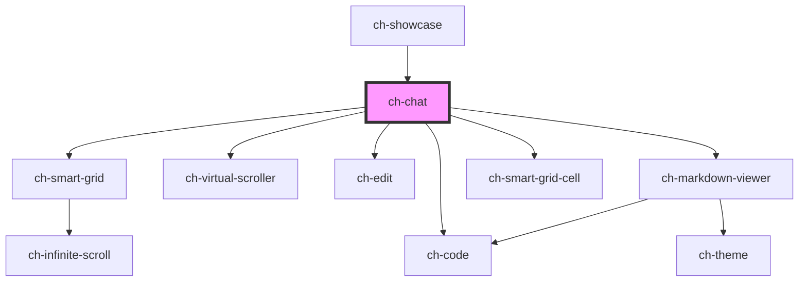

# ch-chat

<!-- Auto Generated Below -->

## Overview

TODO: Add description

## Properties

| Property                          | Attribute             | Description                                                                                                                                            | Type                                                                                                                                                                                                                                                                                                                                                              | Default                                                                                                                               |
| --------------------------------- | --------------------- | ------------------------------------------------------------------------------------------------------------------------------------------------------ | ----------------------------------------------------------------------------------------------------------------------------------------------------------------------------------------------------------------------------------------------------------------------------------------------------------------------------------------------------------------- | ------------------------------------------------------------------------------------------------------------------------------------- |
| `callbacks` _(required)_          | --                    | Specifies the callbacks required in the control.                                                                                                       | `{ clear: () => Promise<void>; sendChatToLLM: (chat: ChatMessage[]) => void; stopGeneratingAnswer?: () => Promise<void>; uploadImage: (imageFile: File) => Promise<string>; }`                                                                                                                                                                                    | `undefined`                                                                                                                           |
| `disabled`                        | `disabled`            | Specifies if all interactions are disabled                                                                                                             | `boolean`                                                                                                                                                                                                                                                                                                                                                         | `false`                                                                                                                               |
| `generatingResponse` _(required)_ | `generating-response` | `true` if a response for the assistant is being generated.                                                                                             | `boolean`                                                                                                                                                                                                                                                                                                                                                         | `undefined`                                                                                                                           |
| `hyperlinkToDownloadFile`         | --                    | Specifies an object containing an HTMLAnchorElement reference. Use this property to render a button to download the code when displaying a code block. | `{ anchor: HTMLAnchorElement; }`                                                                                                                                                                                                                                                                                                                                  | `undefined`                                                                                                                           |
| `imageUpload`                     | `image-upload`        | Specifies if the control can render a button to load images from the file system.                                                                      | `boolean`                                                                                                                                                                                                                                                                                                                                                         | `false`                                                                                                                               |
| `isMobile` _(required)_           | `is-mobile`           | Specifies if the chat is used in a mobile device.                                                                                                      | `boolean`                                                                                                                                                                                                                                                                                                                                                         | `undefined`                                                                                                                           |
| `items`                           | --                    | Specifies the items that the chat will display.                                                                                                        | `ChatMessage[]`                                                                                                                                                                                                                                                                                                                                                   | `[]`                                                                                                                                  |
| `loadingState` _(required)_       | `loading-state`       | Specifies if the chat is waiting for the data to be loaded.                                                                                            | `"all-records-loaded" \| "initial" \| "loading" \| "more-data-to-fetch"`                                                                                                                                                                                                                                                                                          | `undefined`                                                                                                                           |
| `markdownTheme`                   | `markdown-theme`      | Specifies the theme to be used for rendering the markdown. If `undefined`, no theme will be applied.                                                   | `string`                                                                                                                                                                                                                                                                                                                                                          | `"ch-markdown-viewer"`                                                                                                                |
| `renderItem`                      | --                    | This property allows us to implement custom rendering of chat items.                                                                                   | `(messageModel: ChatMessage) => any`                                                                                                                                                                                                                                                                                                                              | `defaultChatRender(       this.translations,       this.isMobile,       this.markdownTheme,       this.hyperlinkToDownloadFile     )` |
| `translations` _(required)_       | --                    | Specifies the literals required in the control.                                                                                                        | `{ accessibleName: { chat: string; clearChat: string; copyResponseButton: string; downloadCodeButton: string; imagePicker: string; removeUploadedImage: string; sendButton: string; sendInput: string; stopGeneratingAnswerButton: string; }; placeholder: { sendInput: string; }; text: { copyCodeButton: string; processing: string; sourceFiles: string; }; }` | `undefined`                                                                                                                           |

## Methods

### `addNewMessage(message: ChatMessage) => Promise<void>`

Add a new message at the end of the record, performing a re-render.

#### Parameters

| Name      | Type                                                                               | Description |
| --------- | ---------------------------------------------------------------------------------- | ----------- |
| `message` | `ChatMessageError \| ChatMessageSystem \| ChatMessageUser \| ChatMessageAssistant` |             |

#### Returns

Type: `Promise<void>`

### `focusChatInput() => Promise<void>`

Focus the chat input

#### Returns

Type: `Promise<void>`

### `setChatInputMessage(text: string) => Promise<void>`

Set the text for the chat input

#### Parameters

| Name   | Type     | Description |
| ------ | -------- | ----------- |
| `text` | `string` |             |

#### Returns

Type: `Promise<void>`

### `updateChatMessage(messageIndex: number, message: ChatMessageByRoleNoId<"system" | "assistant">, mode: "concat" | "replace") => Promise<void>`

Given the id of the message, it updates the content of the indexed message.

#### Parameters

| Name           | Type                                                                | Description |
| -------------- | ------------------------------------------------------------------- | ----------- |
| `messageIndex` | `number`                                                            |             |
| `message`      | `Omit<ChatMessageSystem, "id"> \| Omit<ChatMessageAssistant, "id">` |             |
| `mode`         | `"concat" \| "replace"`                                             |             |

#### Returns

Type: `Promise<void>`

### `updateLastMessage(message: ChatMessageByRoleNoId<"system" | "assistant">, mode: "concat" | "replace") => Promise<void>`

Update the content of the last message, performing a re-render.

#### Parameters

| Name      | Type                                                                | Description |
| --------- | ------------------------------------------------------------------- | ----------- |
| `message` | `Omit<ChatMessageSystem, "id"> \| Omit<ChatMessageAssistant, "id">` |             |
| `mode`    | `"concat" \| "replace"`                                             |             |

#### Returns

Type: `Promise<void>`

## Shadow Parts

| Part                              | Description |
| --------------------------------- | ----------- |
| `"content"`                       |             |
| `"image-to-upload"`               |             |
| `"images-to-upload"`              |             |
| `"remove-image-to-upload-button"` |             |
| `"send-button"`                   |             |
| `"send-container"`                |             |
| `"send-input"`                    |             |
| `"send-input-wrapper"`            |             |
| `"stop-generating-answer-button"` |             |

## Dependencies

### Used by

 - [ch-showcase](../../showcase/assets/components)

### Depends on

- [ch-smart-grid](../smart-grid)
- [ch-virtual-scroller](../smart-grid/internal/smart-grid-virtual-scroller)
- [ch-edit](../edit)
- [ch-code](../code)
- [ch-markdown-viewer](../markdown-viewer)
- [ch-smart-grid-cell](../smart-grid/internal/smart-grid-cell)

### Graph

----------------------------------------------

*Built with [StencilJS](https://stenciljs.com/)*
