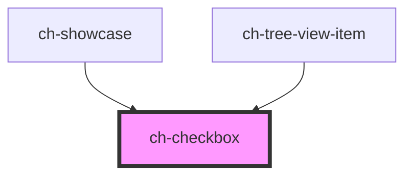

# ch-checkbox

<!-- Auto Generated Below -->

## Properties

| Property                      | Attribute          | Description                                                                                                                                                                                                      | Type      | Default     |
| ----------------------------- | ------------------ | ---------------------------------------------------------------------------------------------------------------------------------------------------------------------------------------------------------------- | --------- | ----------- |
| `accessibleName`              | `accessible-name`  | Specifies a short string, typically 1 to 3 words, that authors associate with an element to provide users of assistive technologies with a label for the element.                                                | `string`  | `undefined` |
| `caption`                     | `caption`          | Specifies the label of the checkbox.                                                                                                                                                                             | `string`  | `undefined` |
| `checkedValue` _(required)_   | `checked-value`    | The value when the checkbox is 'on'                                                                                                                                                                              | `string`  | `undefined` |
| `disabled`                    | `disabled`         | This attribute lets you specify if the element is disabled. If disabled, it will not fire any user interaction related event (for example, click event).                                                         | `boolean` | `false`     |
| `highlightable`               | `highlightable`    | True to highlight control when an action is fired.                                                                                                                                                               | `boolean` | `false`     |
| `indeterminate`               | `indeterminate`    | `true` if the control's value is indeterminate.                                                                                                                                                                  | `boolean` | `false`     |
| `readonly`                    | `readonly`         | This attribute indicates that the user cannot modify the value of the control. Same as [readonly](https://developer.mozilla.org/en-US/docs/Web/HTML/Element/input#attr-readonly) attribute for `input` elements. | `boolean` | `false`     |
| `unCheckedValue` _(required)_ | `un-checked-value` | The value when the checkbox is 'off'                                                                                                                                                                             | `string`  | `undefined` |
| `value` _(required)_          | `value`            | The value of the control.                                                                                                                                                                                        | `string`  | `undefined` |

## Events

| Event   | Description                                                                                 | Type               |
| ------- | ------------------------------------------------------------------------------------------- | ------------------ |
| `click` | Emitted when the element is clicked or the space key is pressed and released.               | `CustomEvent<any>` |
| `input` | The `input` event is emitted when a change to the element's value is committed by the user. | `CustomEvent<any>` |

## Shadow Parts

| Part              | Description                                                                                                                                                                      |
| ----------------- | -------------------------------------------------------------------------------------------------------------------------------------------------------------------------------- |
| `"checked"`       | Present in the `input`, `option`, `label` and `container` parts when the control is checked and not indeterminate (`value` === `checkedValue` and `indeterminate !== true`).     |
| `"container"`     | The container that serves as a wrapper for the `input` and the `option` parts.                                                                                                   |
| `"disabled"`      | Present in the `input`, `option`, `label` and `container` parts when the control is disabled (`disabled` === `true`).                                                            |
| `"indeterminate"` | Present in the `input`, `option`, `label` and `container` parts when the control is indeterminate (`indeterminate` === `true`).                                                  |
| `"input"`         | The input element that implements the interactions for the component.                                                                                                            |
| `"label"`         | The label that is rendered when the `caption` property is not empty.                                                                                                             |
| `"option"`        | The actual "input" that is rendered above the `input` part. This part has `position: absolute` and `pointer-events: none`.                                                       |
| `"unchecked"`     | Present in the `input`, `option`, `label` and `container` parts when the control is unchecked and not indeterminate (`value` === `unCheckedValue` and `indeterminate !== true`). |

## CSS Custom Properties

| Name                                        | Description                                                                                                                                                                                                                                                |
| ------------------------------------------- | ---------------------------------------------------------------------------------------------------------------------------------------------------------------------------------------------------------------------------------------------------------- |
| `--ch-checkbox__checked-image`              | Specifies the image of the checkbox when is checked. @default url("data:image/svg+xml, <svg xmlns='http://www.w3.org/2000/svg' viewBox='0 0 8 8'><path fill='currentColor' d='M6.564.75l-3.59 3.612-1.538-1.55L0 4.26l2.974 2.99L8 2.193z'/></svg>")       |
| `--ch-checkbox__container-size`             | Specifies the size for the container of the `input` and `option` elements. @default min(1em, 20px)                                                                                                                                                         |
| `--ch-checkbox__option-image-size`          | Specifies the image size of the `option` element. @default 100%                                                                                                                                                                                            |
| `--ch-checkbox__option-indeterminate-image` | Specifies the image of the checkbox when is indeterminate. @default url("data:image/svg+xml, <svg xmlns='http://www.w3.org/2000/svg' viewBox='0 0 8 8'><path fill='currentColor' d='M6.564.75l-3.59 3.612-1.538-1.55L0 4.26l2.974 2.99L8 2.193z'/></svg>") |
| `--ch-checkbox__option-size`                | Specifies the size for the `option` element. @default 50%                                                                                                                                                                                                  |

## Dependencies

### Used by

 - [ch-showcase](../../showcase/assets/components)
 - [ch-tree-view-item](../tree-view/internal/tree-view-item)

### Graph

----------------------------------------------

*Built with [StencilJS](https://stenciljs.com/)*
