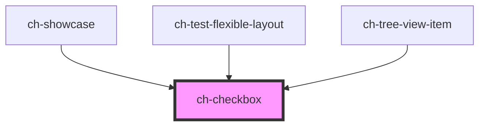

# ch-checkbox

## Table of Contents

- [Overview](#overview)
- [Features](#features)
- [Use when](#use-when)
- [Do not use when](#do-not-use-when)
- [Slots](#slots)
- [Accessibility](#accessibility)
- [Properties](#properties)
- [Events](#events)
- [Dependencies](#dependencies)
  - [Used by](#used-by)
  - [Graph](#graph)
- [Styling](./docs/styling.md)

<!-- Auto Generated Below -->

## Overview

The `ch-checkbox` component is a form-associated checkbox control that allows users to toggle between checked, unchecked, and optionally indeterminate states.

## Features
 - Tri-state support: checked, unchecked, and indeterminate.
 - Optional label and start images with multi-state support (hover, active, focus, disabled).
 - Read-only mode to prevent user modifications.
 - Form-associated via `ElementInternals` for native form participation.
 - Accessible name resolution from external `<label>` elements via `ElementInternals.labels`.

## Use when
 - A binary or tri-state selection is needed in forms, settings panels, or tree views.
 - Multiple independent options can be selected from a list.
 - Filtering content where multiple criteria can apply simultaneously.
 - Batch operations in data tables (e.g., select-all rows).
 - Acknowledging terms or conditions before submitting a form.

## Do not use when
 - The semantics are closer to an on/off toggle — prefer `ch-switch` instead.
 - Only one option can be selected from a group — prefer `ch-radio-group-render` instead.
 - The change must take immediate effect without a confirmation step — prefer `ch-switch` instead.
 - The list of options exceeds 7 items — prefer `ch-combo-box-render` with multiple selection instead.
 - A single checkbox is used in isolation as a binary toggle for a live system setting — prefer `ch-switch`.

## Slots
This component does not project any slots. All content is rendered from the `caption` and `startImgSrc` properties.

## Accessibility
 - Uses a native `<input type="checkbox">` internally, providing built-in ARIA semantics.
 - Form-associated via `ElementInternals` — participates in native form validation and submission.
 - Delegates focus into the shadow DOM (`delegatesFocus: true`), so clicking the host or an associated external `<label>` automatically focuses the internal input.
 - Resolves its accessible name from an external `<label>` element (via `ElementInternals.labels`) or the `accessibleName` property. The external label takes priority.
 - The decorative option overlay is hidden from assistive technology with `aria-hidden`.
 - Keyboard: Space toggles the checkbox (native `<input type="checkbox">` behavior). Tab moves focus in/out.
 - The `indeterminate` IDL property is set on the native input, so screen readers announce the mixed state.

## Properties

| Property                    | Attribute          | Description                                                                                                                                                                                                                                                                                                                                                                               | Type                                      | Default        |
| --------------------------- | ------------------ | ----------------------------------------------------------------------------------------------------------------------------------------------------------------------------------------------------------------------------------------------------------------------------------------------------------------------------------------------------------------------------------------- | ----------------------------------------- | -------------- |
| `accessibleName`            | `accessible-name`  | Specifies a short string, typically 1 to 3 words, that authors associate with an element to provide users of assistive technologies with a label for the element.                                                                                                                                                                                                                         | `string`                                  | `undefined`    |
| `caption`                   | `caption`          | Specifies the visible label text of the checkbox. When set (or when `startImgSrc` resolves to a valid image), the checkbox is wrapped in a `<label>` element that also exposes the `label` part.                                                                                                                                                                                          | `string`                                  | `undefined`    |
| `checkedValue` _(required)_ | `checked-value`    | The value assigned to the control when it is checked. This property is required — the component determines its checked state by comparing `value === checkedValue`.                                                                                                                                                                                                                       | `string`                                  | `undefined`    |
| `disabled`                  | `disabled`         | If `true`, the checkbox is disabled: it will not respond to user interaction and will not fire any events. The internal `<input>` receives the native `disabled` attribute, and the `disabled` state part is added to all structural parts.                                                                                                                                               | `boolean`                                 | `false`        |
| `getImagePathCallback`      | --                 | A callback executed when `startImgSrc` needs to be resolved into a multi-state image object (`GxImageMultiState`). If not provided, the component falls back to the global registry (`getControlRegisterProperty("getImagePathCallback", "ch-checkbox")`), then to `DEFAULT_GET_IMAGE_PATH_CALLBACK`.                                                                                     | `(imageSrc: string) => GxImageMultiState` | `undefined`    |
| `highlightable`             | `highlightable`    | When `true`, the control emits the `click` event after each value change and applies the `ch-checkbox--actionable` CSS class even in `readonly` mode. This is a GeneXus-specific behavior for action highlighting.                                                                                                                                                                        | `boolean`                                 | `false`        |
| `indeterminate`             | `indeterminate`    | `true` if the control's value is indeterminate (mixed state). When `indeterminate` is `true`, neither the `checked` nor `unchecked` state parts are applied — only the `indeterminate` part is present.  This property is automatically reset to `false` on any user interaction (toggle). To re-enter the indeterminate state, the parent must set this property again from the outside. | `boolean`                                 | `false`        |
| `name`                      | `name`             | This property specifies the `name` of the control when used in a form.                                                                                                                                                                                                                                                                                                                    | `string`                                  | `undefined`    |
| `readonly`                  | `readonly`         | When `true`, the user cannot modify the value of the control. Internally, this sets `disabled` on the native `<input>` (since `<input type="checkbox">` does not support the HTML `readonly` attribute). Unlike `disabled`, the form value is still submitted.  If both `readonly` and `highlightable` are `true`, the `ch-checkbox--actionable` class is still applied.                  | `boolean`                                 | `false`        |
| `startImgSrc`               | `start-img-src`    | Specifies the source of the start image.                                                                                                                                                                                                                                                                                                                                                  | `string`                                  | `undefined`    |
| `startImgType`              | `start-img-type`   | Specifies the rendering mode for the start image. `"background"` uses a CSS `background-image`, while `"mask"` uses `-webkit-mask` (which allows the image to inherit `currentColor`).                                                                                                                                                                                                    | `"background" \| "mask"`                  | `"background"` |
| `unCheckedValue`            | `un-checked-value` | The value assigned to the control when it is unchecked. If left as `undefined`, no value is submitted in forms when the checkbox is off. Also used as the initial value in `connectedCallback` when `value` is not set.                                                                                                                                                                   | `string`                                  | `undefined`    |
| `value`                     | `value`            | The current value of the control. The checked state is derived from `value === checkedValue`. When changed externally, the form value is updated via `ElementInternals.setFormValue()`.  Mutated internally on user interaction: set to `checkedValue` when toggled on, or `unCheckedValue` when toggled off.                                                                             | `string`                                  | `undefined`    |

## Events

| Event   | Description                                                                                                                                                                                                                | Type                  |
| ------- | -------------------------------------------------------------------------------------------------------------------------------------------------------------------------------------------------------------------------- | --------------------- |
| `click` | Emitted after a value change **only when `highlightable` is `true`**. This is a GeneXus-specific event for action highlighting — it does NOT fire on every click or space press by default.                                | `CustomEvent<any>`    |
| `input` | Emitted when the user toggles the checkbox (via click, Space key, or external label activation). Contains the new `value` string (`checkedValue` or `unCheckedValue`). The native input event is stopped from propagating. | `CustomEvent<string>` |

## Dependencies

### Used by

 - [ch-showcase](../../showcase/assets/components)
 - [ch-test-flexible-layout](../test/test-flexible-layout)
 - [ch-tree-view-item](../tree-view/internal/tree-view-item)

### Graph

```mermaid
graph TD;
  ch-showcase --> ch-checkbox
  ch-test-flexible-layout --> ch-checkbox
  ch-tree-view-item --> ch-checkbox
  style ch-checkbox fill:#f9f,stroke:#333,stroke-width:4px
```

----------------------------------------------

*Built with [StencilJS](https://stenciljs.com/)*
