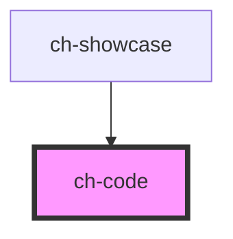

# ch-code

<!-- Auto Generated Below -->

## Overview

A control to highlight code blocks.
- It supports code highlight by parsing the incoming code string to [hast](https://github.com/micromark/micromark-extension-gfm) using [lowlight](lowlight). After that, it implements a reactivity layer by implementing its own render for the hast.

- It also supports all programming languages from [highlight.js](https://github.com/highlightjs/highlight.js).

- When the code highlighting is needed at runtime, the control will load on demand the code parser and the programming language needed to parse the code.

## Properties

| Property                  | Attribute                     | Description                                                                | Type                                          | Default               |
| ------------------------- | ----------------------------- | -------------------------------------------------------------------------- | --------------------------------------------- | --------------------- |
| `addLastNestedChildClass` | `add-last-nested-child-class` |                                                                            | `boolean`                                     | `false`               |
| `language`                | `language`                    | Specifies the code language to highlight.                                  | `string`                                      | `undefined`           |
| `lastNestedChildClass`    | `last-nested-child-class`     |                                                                            | `string`                                      | `"last-nested-child"` |
| `renderCode`              | --                            | This property allows us to implement custom rendering for the code blocks. | `(options: MarkdownCodeRenderOptions) => any` | `defaultCodeRender`   |
| `value`                   | `value`                       | Specifies the code string to highlight.                                    | `string`                                      | `undefined`           |

## Dependencies

### Used by

 - [ch-showcase](../../showcase/assets/components)

### Graph

----------------------------------------------

*Built with [StencilJS](https://stenciljs.com/)*
