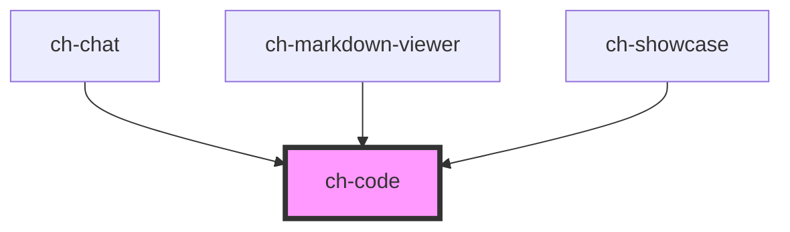

# ch-code

<!-- Auto Generated Below -->

## Overview

A control to highlight code blocks.
- It supports code highlight by parsing the incoming code string to [hast](https://github.com/micromark/micromark-extension-gfm) using [lowlight](lowlight). After that, it implements a reactivity layer by implementing its own render for the hast.

- It also supports all programming languages from [highlight.js](https://github.com/highlightjs/highlight.js).

- When the code highlighting is needed at runtime, the control will load on demand the code parser and the programming language needed to parse the code.

## Properties

| Property               | Attribute                 | Description                                                                                                                              | Type      | Default               |
| ---------------------- | ------------------------- | ---------------------------------------------------------------------------------------------------------------------------------------- | --------- | --------------------- |
| `language`             | `language`                | Specifies the code language to highlight.                                                                                                | `string`  | `undefined`           |
| `lastNestedChildClass` | `last-nested-child-class` |                                                                                                                                          | `string`  | `"last-nested-child"` |
| `showIndicator`        | `show-indicator`          | Specifies if an indicator is displayed in the last element rendered. Useful for streaming scenarios where a loading indicator is needed. | `boolean` | `false`               |
| `value`                | `value`                   | Specifies the code string to highlight.                                                                                                  | `string`  | `undefined`           |

## Shadow Parts

| Part    | Description |
| ------- | ----------- |
| `"pre"` |             |

## CSS Custom Properties

| Name                               | Description                                                                             |
| ---------------------------------- | --------------------------------------------------------------------------------------- |
| `--ch-code__addition`              | Specifies the color for the addition tokens @default currentColor                       |
| `--ch-code__attr`                  | Specifies the color for the attr tokens @default currentColor                           |
| `--ch-code__attribute`             | Specifies the color for the attribute tokens @default currentColor                      |
| `--ch-code__built-in`              | Specifies the color for the built-in tokens @default currentColor                       |
| `--ch-code__bullet`                | Specifies the color for the bullet tokens @default currentColor                         |
| `--ch-code__class`                 | Specifies the color for the class tokens @default currentColor                          |
| `--ch-code__code`                  | Specifies the color for the code tokens @default currentColor                           |
| `--ch-code__comment`               | Specifies the color for the comment tokens @default currentColor                        |
| `--ch-code__deletion`              | Specifies the color for the deletion tokens @default currentColor                       |
| `--ch-code__doctag`                | Specifies the color for the doctag tokens @default currentColor                         |
| `--ch-code__formula`               | Specifies the color for the formula tokens @default currentColor                        |
| `--ch-code__function`              | Specifies the color for the function tokens @default currentColor                       |
| `--ch-code__function-variable`     | Specifies the color for the function variable tokens @default currentColor              |
| `--ch-code__keyword`               | Specifies the color for the keyword tokens @default currentColor                        |
| `--ch-code__link`                  | Specifies the color for the link tokens @default currentColor                           |
| `--ch-code__literal`               | Specifies the color for the literal tokens @default currentColor                        |
| `--ch-code__meta`                  | Specifies the color for the meta tokens @default currentColor                           |
| `--ch-code__meta__keyword`         | Specifies the color for the keyword tokens inside the meta token. @default currentColor |
| `--ch-code__meta__string`          | Specifies the color for the string tokens inside the meta token. @default currentColor  |
| `--ch-code__name`                  | Specifies the color for the name tokens @default currentColor                           |
| `--ch-code__number`                | Specifies the color for the number tokens @default currentColor                         |
| `--ch-code__operator`              | Specifies the color for the operator tokens @default currentColor                       |
| `--ch-code__quote`                 | Specifies the color for the quote tokens @default currentColor                          |
| `--ch-code__regexp`                | Specifies the color for the regexp tokens @default currentColor                         |
| `--ch-code__selector-attr`         | Specifies the color for the selector-attr tokens @default currentColor                  |
| `--ch-code__selector-class`        | Specifies the color for the selector-class tokens @default currentColor                 |
| `--ch-code__selector-id`           | Specifies the color for the selector-id tokens @default currentColor                    |
| `--ch-code__selector-pseudo`       | Specifies the color for the selector-pseudo tokens @default currentColor                |
| `--ch-code__selector-tag`          | Specifies the color for the selector-tag tokens @default currentColor                   |
| `--ch-code__string`                | Specifies the color for the string tokens @default currentColor                         |
| `--ch-code__subst`                 | Specifies the color for the substitution tokens @default currentColor                   |
| `--ch-code__symbol`                | Specifies the color for the symbol tokens @default currentColor                         |
| `--ch-code__tag`                   | Specifies the color for the tag tokens @default currentColor                            |
| `--ch-code__template-tag`          | Specifies the color for the template-tag tokens @default currentColor                   |
| `--ch-code__template-variable`     | Specifies the color for the template-variable tokens @default currentColor              |
| `--ch-code__title`                 | Specifies the color for the title tokens @default currentColor                          |
| `--ch-code__title-class`           | Specifies the color for the title-class tokens @default currentColor                    |
| `--ch-code__title-class-inherited` | Specifies the color for the title-class-inherited tokens @default currentColor          |
| `--ch-code__title-function`        | Specifies the color for the title-function tokens @default currentColor                 |
| `--ch-code__type`                  | Specifies the color for the type tokens @default currentColor                           |
| `--ch-code__variable`              | Specifies the color for the variable tokens @default currentColor                       |
| `--ch-code__variable-language`     | Specifies the color for the variable-language tokens @default currentColor              |

## Dependencies

### Used by

 - [ch-chat](../chat)
 - [ch-markdown-viewer](../markdown-viewer)
 - [ch-showcase](../../showcase/assets/components)

### Graph

----------------------------------------------

*Built with [StencilJS](https://stenciljs.com/)*
