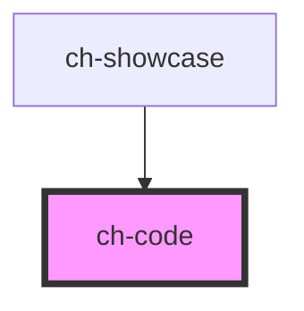

# ch-code

## Table of Contents

- [Overview](#overview)
- [Features](#features)
- [Use when](#use-when)
- [Do not use when](#do-not-use-when)
- [Accessibility](#accessibility)
- [Properties](#properties)
- [Dependencies](#dependencies)
  - [Used by](#used-by)
  - [Graph](#graph)
- [Styling](./docs/styling.md)

<!-- Auto Generated Below -->

## Overview

The `ch-code` component renders read-only, syntax-highlighted code blocks powered by lowlight and highlight.js.

## Features
 - Syntax highlighting by parsing code to [hast](https://github.com/syntax-tree/hast) using [lowlight](https://github.com/wooorm/lowlight), with a custom reactive render layer.
 - Supports all programming languages from [highlight.js](https://github.com/highlightjs/highlight.js).
 - On-demand loading of the code parser and language grammars at runtime.
 - Streaming indicator for real-time code generation scenarios (controlled by `showIndicator`).
 - Extensive set of CSS custom properties (`--ch-code__*`) for token-level color theming of all highlight.js token types.

## Use when
 - Displaying read-only syntax-highlighted code snippets, configuration files, or AI-generated code in documentation or chat responses.

## Do not use when
 - Users need to edit code -- prefer `ch-code-editor` instead.
 - Comparing two versions of code -- prefer `ch-code-diff-editor`.

## Accessibility
 - The component renders a semantic `<code>` element with an `hljs language-{lang}` class for assistive technology identification.
 - The host element uses scrollable overflow, allowing keyboard-driven scrolling of long code blocks.

## Properties

| Property               | Attribute                 | Description                                                                                                                                                                                                                                                                                                                     | Type      | Default               |
| ---------------------- | ------------------------- | ------------------------------------------------------------------------------------------------------------------------------------------------------------------------------------------------------------------------------------------------------------------------------------------------------------------------------- | --------- | --------------------- |
| `language`             | `language`                | Specifies the code language to highlight (e.g., `"typescript"`, `"python"`, `"json"`). Must be a valid highlight.js language identifier. When `undefined` or empty, falls back to `"plaintext"` (no highlighting).                                                                                                              | `string`  | `undefined`           |
| `lastNestedChildClass` | `last-nested-child-class` | CSS class name applied to the deepest nested child element to position the streaming indicator. Used internally by the render layer. Override this when integrating with custom indicator positioning.                                                                                                                          | `string`  | `"last-nested-child"` |
| `showIndicator`        | `show-indicator`          | When `true`, a blinking cursor-like indicator is displayed after the last rendered element. Useful for streaming scenarios where code is being generated in real time.  The indicator's appearance is controlled by the CSS custom properties `--ch-code-indicator-color`, `--ch-code-inline-size`, and `--ch-code-block-size`. | `boolean` | `false`               |
| `value`                | `value`                   | Specifies the code string to highlight. When `undefined` or empty, the component renders nothing.                                                                                                                                                                                                                               | `string`  | `undefined`           |

## Dependencies

### Used by

 - [ch-showcase](../../showcase/assets/components)

### Graph

```mermaid
graph TD;
  ch-showcase --> ch-code
  style ch-code fill:#f9f,stroke:#333,stroke-width:4px
```

----------------------------------------------

*Built with [StencilJS](https://stenciljs.com/)*
