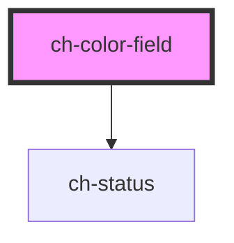

# ch-color-field

<!-- Auto Generated Below -->

## Properties

| Property        | Attribute        | Description                                     | Type                                                                                                                                                                                                | Default                                                                                                                                                                                                                                                                                                                                                                                                                                    |
| --------------- | ---------------- | ----------------------------------------------- | --------------------------------------------------------------------------------------------------------------------------------------------------------------------------------------------------- | ------------------------------------------------------------------------------------------------------------------------------------------------------------------------------------------------------------------------------------------------------------------------------------------------------------------------------------------------------------------------------------------------------------------------------------------ |
| `selectedColor` | `selected-color` | Selected color                                  | `string`                                                                                                                                                                                            | `undefined`                                                                                                                                                                                                                                                                                                                                                                                                                                |
| `step`          | `step`           | Step to navigate on the canvas                  | `number`                                                                                                                                                                                            | `1`                                                                                                                                                                                                                                                                                                                                                                                                                                        |
| `translations`  | --               | Specifies the literals required in the control. | `{ accessibleName: { label: string; description: string; statusLabel: string; statusMessage: string; }; colorFormats: { position: string; rgb: string; hsl: string; hsv: string; hex: string; }; }` | `{     accessibleName: {       label: "Color field",       description: "2D color selector",       statusLabel: "Color information",       statusMessage: `${POSITION}: X: ${CURRENT_X}, Y: ${CURRENT_Y}. ${RGB}: ${RGB_VALUE}. ${HSL}: ${HSL_VALUE}. ${HSV}: ${HSV_VALUE}. ${HEX}: ${HEX_VALUE}`     },     colorFormats: {       position: "Position",       rgb: "RGB",       hsl: "HSL",       hsv: "HSV",       hex: "HEX"     }   }` |

## Events

| Event   | Description              | Type                                                                                                                             |
| ------- | ------------------------ | -------------------------------------------------------------------------------------------------------------------------------- |
| `input` | Emit the new color value | `CustomEvent<{ rgb: string; rgba: string; hsl: string; hsla: string; hex: string; hsv: { h: number; s: number; v: number; }; }>` |

## CSS Custom Properties

| Name                             | Description                                                  |
| -------------------------------- | ------------------------------------------------------------ |
| `--ch-color-field__border-color` | Specifies the color for the marker @default currentColor     |
| `--ch-color-field__border-size`  | Specifies the size for the marker @default 12px              |
| `--ch-color-field__border-width` | Specifies the width of the border on the marker @default 2px |
| `--ch-color-field__height`       | Specifies the height of the color field @default 200px       |
| `--ch-color-field__width`        | Specifies the width of the color field @default 300px        |

## Dependencies

### Depends on

- [ch-status](../../status)

### Graph

----------------------------------------------

*Built with [StencilJS](https://stenciljs.com/)*
