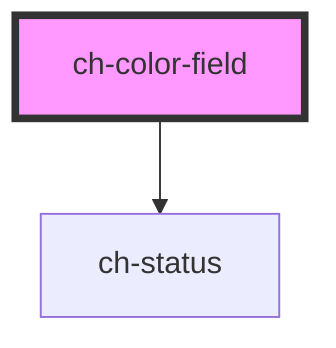

# ch-color-field

<!-- Auto Generated Below -->

## Properties

| Property       | Attribute | Description                                     | Type                                                                                                                                                                                                | Default                                                                                                                                                                                                                                                                                                                                                                                                                                    |
| -------------- | --------- | ----------------------------------------------- | --------------------------------------------------------------------------------------------------------------------------------------------------------------------------------------------------- | ------------------------------------------------------------------------------------------------------------------------------------------------------------------------------------------------------------------------------------------------------------------------------------------------------------------------------------------------------------------------------------------------------------------------------------------ |
| `step`         | `step`    | Step to navigate on the canvas.                 | `number`                                                                                                                                                                                            | `1`                                                                                                                                                                                                                                                                                                                                                                                                                                        |
| `translations` | --        | Specifies the literals required in the control. | `{ accessibleName: { label: string; description: string; statusLabel: string; statusMessage: string; }; colorFormats: { position: string; rgb: string; hsl: string; hsv: string; hex: string; }; }` | `{     accessibleName: {       description: "2D color selector",       label: "Color field",       statusLabel: "Color information",       statusMessage: `${POSITION}: X: ${CURRENT_X}, Y: ${CURRENT_Y}. ${RGB}: ${RGB_VALUE}. ${HSL}: ${HSL_VALUE}. ${HSV}: ${HSV_VALUE}. ${HEX}: ${HEX_VALUE}`     },     colorFormats: {       position: "Position",       hex: "HEX",       hsl: "HSL",       hsv: "HSV",       rgb: "RGB"     }   }` |
| `value`        | `value`   | Selected color value.                           | `string`                                                                                                                                                                                            | `"#000"`                                                                                                                                                                                                                                                                                                                                                                                                                                   |

## Events

| Event   | Description                                                                                                                                                  | Type                                                                                                                             |
| ------- | ------------------------------------------------------------------------------------------------------------------------------------------------------------ | -------------------------------------------------------------------------------------------------------------------------------- |
| `input` | The `input` event is emitted when a change to the element's value is committed by the user.  It contains the new value (in all variants) of the color-field. | `CustomEvent<{ rgb: string; rgba: string; hsl: string; hsla: string; hex: string; hsv: { h: number; s: number; v: number; }; }>` |

## Dependencies

### Depends on

- [ch-status](../../status)

### Graph

----------------------------------------------

*Built with [StencilJS](https://stenciljs.com/)*
