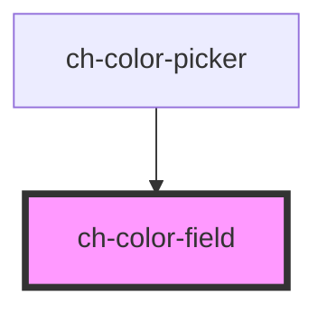

# ch-color-field

<!-- Auto Generated Below -->

## Properties

| Property                    | Attribute                     | Description                                                                                                                                                                                                      | Type      | Default            |
| --------------------------- | ----------------------------- | ---------------------------------------------------------------------------------------------------------------------------------------------------------------------------------------------------------------- | --------- | ------------------ |
| `accessibleName`            | `accessible-name`             | Specifies a short string, typically 1 to 3 words, that authors associate with an element to provide users of assistive technologies with a label for the element.                                                | `string`  | `"Color field"`    |
| `accessibleRoleDescription` | `accessible-role-description` | Specifies a readable description for the component’s role, primarily used by assistive technologies to give users more context about the component's purpose or behavior.                                        | `string`  | `"2D color field"` |
| `disabled`                  | `disabled`                    | This attribute lets you specify if the element is disabled. If disabled, it will not fire any user interaction related event (for example, click event).                                                         | `boolean` | `false`            |
| `readonly`                  | `readonly`                    | This attribute indicates that the user cannot modify the value of the control. Same as [readonly](https://developer.mozilla.org/en-US/docs/Web/HTML/Element/input#attr-readonly) attribute for `input` elements. | `boolean` | `false`            |
| `step`                      | `step`                        | Step size in pixels for keyboard navigation on the canvas. Determines how many pixels the marker moves when using arrow keys. Default = 1.                                                                       | `number`  | `1`                |
| `value`                     | `value`                       | The current value of the `ch-color-field` component, representing a color in one of the following formats:   - HEX   - HSL   - RGB This value determines the selected color and can be updated by the user.      | `string`  | `FALLBACK_COLOR`   |

## Events

| Event   | Description                                                                                                                                                  | Type                                                                                               |
| ------- | ------------------------------------------------------------------------------------------------------------------------------------------------------------ | -------------------------------------------------------------------------------------------------- |
| `input` | The `input` event is emitted when a change to the element's value is committed by the user.  It contains the new value (in all variants) of the color-field. | `CustomEvent<{ rgb: string; rgba: string; hsl: string; hsla: string; hex: string; hsv: string; }>` |

## Dependencies

### Used by

 - [ch-color-picker](..)

### Graph

----------------------------------------------

*Built with [StencilJS](https://stenciljs.com/)*
