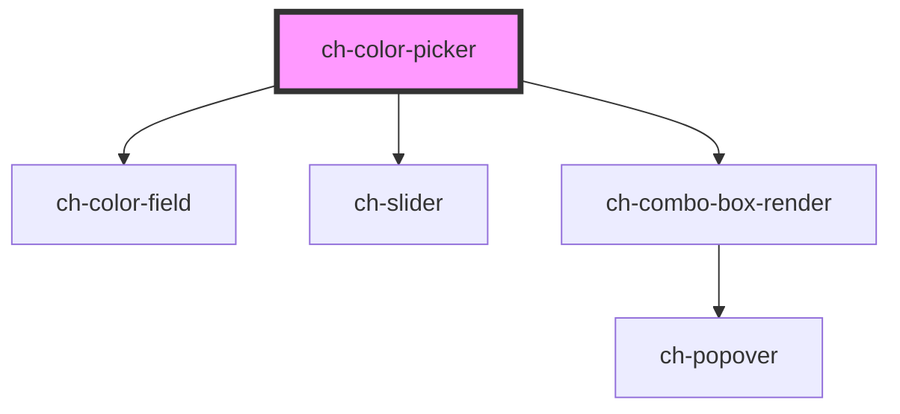

# ch-color-picker

<!-- Auto Generated Below -->

## Properties

| Property                  | Attribute                    | Description                                                                                                                                                                                                      | Type                                                                                                                                                                                                                                                                                                                                                                                                                                                                                                                                                                                                                                                                                                                                                                                                                                                                                                                                                                                                            | Default                                                                                                                                                                                                                                                                                                                                                                                                                                                                                                                                                                                                                                                                                                                                                                                                                                                                                                                                                                                                                                                                                                                                                                                                                                                                                                                                                           |
| ------------------------- | ---------------------------- | ---------------------------------------------------------------------------------------------------------------------------------------------------------------------------------------------------------------- | --------------------------------------------------------------------------------------------------------------------------------------------------------------------------------------------------------------------------------------------------------------------------------------------------------------------------------------------------------------------------------------------------------------------------------------------------------------------------------------------------------------------------------------------------------------------------------------------------------------------------------------------------------------------------------------------------------------------------------------------------------------------------------------------------------------------------------------------------------------------------------------------------------------------------------------------------------------------------------------------------------------- | ----------------------------------------------------------------------------------------------------------------------------------------------------------------------------------------------------------------------------------------------------------------------------------------------------------------------------------------------------------------------------------------------------------------------------------------------------------------------------------------------------------------------------------------------------------------------------------------------------------------------------------------------------------------------------------------------------------------------------------------------------------------------------------------------------------------------------------------------------------------------------------------------------------------------------------------------------------------------------------------------------------------------------------------------------------------------------------------------------------------------------------------------------------------------------------------------------------------------------------------------------------------------------------------------------------------------------------------------------------------- |
| `accessibleName`          | `accessible-name`            | Specifies a short string that authors associate with an element to provide users of assistive technologies with a label for the element.                                                                         | `string`                                                                                                                                                                                                                                                                                                                                                                                                                                                                                                                                                                                                                                                                                                                                                                                                                                                                                                                                                                                                        | `undefined`                                                                                                                                                                                                                                                                                                                                                                                                                                                                                                                                                                                                                                                                                                                                                                                                                                                                                                                                                                                                                                                                                                                                                                                                                                                                                                                                                       |
| `alphaSliderStep`         | `alpha-slider-step`          | Specifies the step size in pixels for the alpha slider. Default = 1.                                                                                                                                             | `number`                                                                                                                                                                                                                                                                                                                                                                                                                                                                                                                                                                                                                                                                                                                                                                                                                                                                                                                                                                                                        | `1`                                                                                                                                                                                                                                                                                                                                                                                                                                                                                                                                                                                                                                                                                                                                                                                                                                                                                                                                                                                                                                                                                                                                                                                                                                                                                                                                                               |
| `colorFieldStep`          | `color-field-step`           | Specifies the step size in pixels for keyboard navigation on the color field. Default = 1.                                                                                                                       | `number`                                                                                                                                                                                                                                                                                                                                                                                                                                                                                                                                                                                                                                                                                                                                                                                                                                                                                                                                                                                                        | `1`                                                                                                                                                                                                                                                                                                                                                                                                                                                                                                                                                                                                                                                                                                                                                                                                                                                                                                                                                                                                                                                                                                                                                                                                                                                                                                                                                               |
| `colorPalette`            | --                           | Array of colors to display in the color palette. Can be used for recent colors, preset colors, brand colors, or any custom palette. Accepts any valid CSS color format (hex, rgb, hsl, etc.).                    | `string[]`                                                                                                                                                                                                                                                                                                                                                                                                                                                                                                                                                                                                                                                                                                                                                                                                                                                                                                                                                                                                      | `[]`                                                                                                                                                                                                                                                                                                                                                                                                                                                                                                                                                                                                                                                                                                                                                                                                                                                                                                                                                                                                                                                                                                                                                                                                                                                                                                                                                              |
| `disabled`                | `disabled`                   | This attribute lets you specify if the element is disabled. If disabled, it will not fire any user interaction related event (for example, click event).                                                         | `boolean`                                                                                                                                                                                                                                                                                                                                                                                                                                                                                                                                                                                                                                                                                                                                                                                                                                                                                                                                                                                                       | `false`                                                                                                                                                                                                                                                                                                                                                                                                                                                                                                                                                                                                                                                                                                                                                                                                                                                                                                                                                                                                                                                                                                                                                                                                                                                                                                                                                           |
| `hueSliderStep`           | `hue-slider-step`            | Specifies the step size in pixels for the alpha slider. Default = 1.                                                                                                                                             | `number`                                                                                                                                                                                                                                                                                                                                                                                                                                                                                                                                                                                                                                                                                                                                                                                                                                                                                                                                                                                                        | `1`                                                                                                                                                                                                                                                                                                                                                                                                                                                                                                                                                                                                                                                                                                                                                                                                                                                                                                                                                                                                                                                                                                                                                                                                                                                                                                                                                               |
| `order`                   | --                           | Specifies the order for the controls.                                                                                                                                                                            | `{ colorField?: number; colorFormatSelector?: number; colorPreview?: number; hueSlider?: number; alphaSlider?: number; colorPalette?: number; }`                                                                                                                                                                                                                                                                                                                                                                                                                                                                                                                                                                                                                                                                                                                                                                                                                                                                | `{     colorField: 1,     colorPreview: 2,     hueSlider: 3,     alphaSlider: 4,     colorFormatSelector: 5,     colorPalette: 6   }`                                                                                                                                                                                                                                                                                                                                                                                                                                                                                                                                                                                                                                                                                                                                                                                                                                                                                                                                                                                                                                                                                                                                                                                                                             |
| `readonly`                | `readonly`                   | This attribute indicates that the user cannot modify the value of the control. Same as [readonly](https://developer.mozilla.org/en-US/docs/Web/HTML/Element/input#attr-readonly) attribute for `input` elements. | `boolean`                                                                                                                                                                                                                                                                                                                                                                                                                                                                                                                                                                                                                                                                                                                                                                                                                                                                                                                                                                                                       | `false`                                                                                                                                                                                                                                                                                                                                                                                                                                                                                                                                                                                                                                                                                                                                                                                                                                                                                                                                                                                                                                                                                                                                                                                                                                                                                                                                                           |
| `showAlphaSlider`         | `show-alpha-slider`          | Shows/hides the alpha (transparency) slider. Allows users to adjust color opacity from 0% (transparent) to 100% (opaque).                                                                                        | `boolean`                                                                                                                                                                                                                                                                                                                                                                                                                                                                                                                                                                                                                                                                                                                                                                                                                                                                                                                                                                                                       | `false`                                                                                                                                                                                                                                                                                                                                                                                                                                                                                                                                                                                                                                                                                                                                                                                                                                                                                                                                                                                                                                                                                                                                                                                                                                                                                                                                                           |
| `showColorFormatSelector` | `show-color-format-selector` | Shows/hides the color format selector dropdown and associated input fields. When enabled, users can switch between HEX, RGB, HSL, and HSV formats and input color values directly.                               | `boolean`                                                                                                                                                                                                                                                                                                                                                                                                                                                                                                                                                                                                                                                                                                                                                                                                                                                                                                                                                                                                       | `false`                                                                                                                                                                                                                                                                                                                                                                                                                                                                                                                                                                                                                                                                                                                                                                                                                                                                                                                                                                                                                                                                                                                                                                                                                                                                                                                                                           |
| `showColorPalette`        | `show-color-palette`         | Shows/hides the color palette section. Displays a customizable grid of color swatches for quick selection.                                                                                                       | `boolean`                                                                                                                                                                                                                                                                                                                                                                                                                                                                                                                                                                                                                                                                                                                                                                                                                                                                                                                                                                                                       | `false`                                                                                                                                                                                                                                                                                                                                                                                                                                                                                                                                                                                                                                                                                                                                                                                                                                                                                                                                                                                                                                                                                                                                                                                                                                                                                                                                                           |
| `showColorPreview`        | `show-color-preview`         | Shows/hides the current color preview box. Displays the currently selected color with proper transparency pattern for alpha values.                                                                              | `boolean`                                                                                                                                                                                                                                                                                                                                                                                                                                                                                                                                                                                                                                                                                                                                                                                                                                                                                                                                                                                                       | `false`                                                                                                                                                                                                                                                                                                                                                                                                                                                                                                                                                                                                                                                                                                                                                                                                                                                                                                                                                                                                                                                                                                                                                                                                                                                                                                                                                           |
| `showHueSlider`           | `show-hue-slider`            | Shows/hides the hue slider control. Allows users to select the color hue (0-360 degrees).                                                                                                                        | `boolean`                                                                                                                                                                                                                                                                                                                                                                                                                                                                                                                                                                                                                                                                                                                                                                                                                                                                                                                                                                                                       | `false`                                                                                                                                                                                                                                                                                                                                                                                                                                                                                                                                                                                                                                                                                                                                                                                                                                                                                                                                                                                                                                                                                                                                                                                                                                                                                                                                                           |
| `translations`            | --                           | Specifies the literals required in the control.                                                                                                                                                                  | `{ accessibleName: { lightnessChannelInput: string; hueChannelInput: string; saturationChannelInput: string; valueChannelInput: string; alphaChannelInput: string; redChannelInput: string; greenChannelInput: string; blueChannelInput: string; hexadecimalInput: string; colorFormatOptions: string; colorFieldDescription: string; colorFieldControl: string; hueSliderControl: string; alphaSliderControl: string; colorPaletteButton: string; currentColorPreview: string; }; text: { colorFieldLabel: string; alphaChannelLabel: string; hueChannelLabel: string; colorPaletteSection: string; colorFormatSelector: string; currentColorPreviewText: string; hexadecimalFormat: string; rgbColorFormat: string; hslColorFormat: string; hsvColorFormat: string; redChannelInputLabel: string; greenChannelInputLabel: string; blueChannelInputLabel: string; hueChannelInputLabel: string; saturationChannelInputLabel: string; lightnessChannelInputLabel: string; valueChannelInputLabel: string; }; }` | `{     accessibleName: {       lightnessChannelInput: "Lightness",       hueChannelInput: "Hue",       saturationChannelInput: "Saturation",       valueChannelInput: "Value",       alphaChannelInput: "Alpha",       redChannelInput: "Red",       greenChannelInput: "Green",       blueChannelInput: "Blue",       hexadecimalInput: "Hexadecimal color",       colorFormatOptions: "Color format options",       colorFieldControl: "Color field",       colorFieldDescription: "2d color field",       hueSliderControl: "Hue Slider",       alphaSliderControl: "Alpha Slider",       colorPaletteButton: `Selected color ${SELECTED_COLOR}`,       currentColorPreview: `Current color: ${SELECTED_COLOR}`     },     text: {       colorFieldLabel: "",       colorPaletteSection: "Color Palette",       colorFormatSelector: "Color Format",       currentColorPreviewText: "Color Preview",       hueChannelLabel: "Hue",       alphaChannelLabel: "Alpha",       hexadecimalFormat: "HEX",       rgbColorFormat: "RGB",       hslColorFormat: "HSL",       hsvColorFormat: "HSV",       redChannelInputLabel: "R",       greenChannelInputLabel: "G",       blueChannelInputLabel: "B",       hueChannelInputLabel: "H",       saturationChannelInputLabel: "S",       lightnessChannelInputLabel: "L",       valueChannelInputLabel: "V"     }   }` |
| `value`                   | `value`                      | The current value of the `ch-color-picker` component, representing a color in one of the following formats:   - HEX   - HSL   - RGB This value determines the selected color and can be updated by the user.     | `string`                                                                                                                                                                                                                                                                                                                                                                                                                                                                                                                                                                                                                                                                                                                                                                                                                                                                                                                                                                                                        | `FALLBACK_COLOR`                                                                                                                                                                                                                                                                                                                                                                                                                                                                                                                                                                                                                                                                                                                                                                                                                                                                                                                                                                                                                                                                                                                                                                                                                                                                                                                                                  |

## Events

| Event   | Description                                                                                                                                  | Type                                                                                               |
| ------- | -------------------------------------------------------------------------------------------------------------------------------------------- | -------------------------------------------------------------------------------------------------- |
| `input` | The `input` event is emitted whenever the color value changes. The event detail contains the color in all available formats for convenience. | `CustomEvent<{ rgb: string; rgba: string; hsl: string; hsla: string; hex: string; hsv: string; }>` |

## CSS Custom Properties

| Name                                           | Description                                                                     |
| ---------------------------------------------- | ------------------------------------------------------------------------------- |
| `--ch-color-picker-palette-button-block-size`  | Specifies the min height of the current color color-palette box. @default 1.5em |
| `--ch-color-picker-palette-button-inline-size` | Specifies the min width of the current color color-palette box. @default 2em    |
| `--ch-color-picker-palette-columns`            | Specifies the number of columns in the color palette grid. @default 10          |
| `--ch-color-picker-preview-block-size`         | Specifies the height of the current color preview box. @default 20px            |
| `--ch-color-picker-preview-inline-size`        | Specifies the width of the current color preview box. @default 20px             |

## Dependencies

### Depends on

- [ch-color-field](color-field)
- [ch-slider](../slider)
- [ch-combo-box-render](../combo-box)

### Graph

----------------------------------------------

*Built with [StencilJS](https://stenciljs.com/)*
