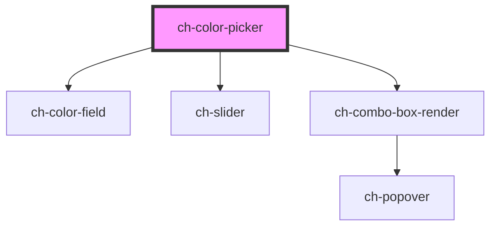

# ch-color-picker

<!-- Auto Generated Below -->

## Overview

The `ch-color-picker` component is a full-featured color selection control that lets users pick colors using a color field, hue slider, and optional alpha slider.

## Features
 - Two-dimensional color field for saturation and brightness selection.
 - Hue slider and optional alpha (opacity) slider.
 - Multiple color formats: HEX, RGB, HSL, and HSV.
 - Built-in format selector for switching formats at runtime.
 - Configurable palette of preset colors.
 - Form-associated via `ElementInternals`.

## Use when
 - Precise color input is required in design tools or theming panels.
 - Users need to switch between color formats.
 - A color palette with preset colors is needed alongside free-form selection.
 - Allowing users to select arbitrary colors in design or customization UIs.

## Do not use when
 - Only a predefined set of colors is needed — prefer `ch-combo-box-render` with color swatches instead.
 - A small curated set of colors is sufficient — use color swatches or tiles instead, which are more scannable and accessible.
 - Color alone is used to convey meaning downstream — always supplement with text or pattern (WCAG 1.4.1).

## Accessibility
 - Form-associated via `ElementInternals` — participates in native form validation and submission.
 - Validates label existence via `ElementInternals` for proper accessible name resolution.

## Properties

| Property                  | Attribute                    | Description                                                                                                                                                                                                                                        | Type                                                                                                                                                                                                                                                                                                                                                                                                                                                                                                                                                                                                                                                                                                                                                                                                                                                                                                                                                                                                            | Default                                                                                                                                                                                                                                                                                                                                                                                                                                                                                                                                                                                                                                                                                                                                                                                                                                                                                                                                                                                                                                                                                                                                                                                                                                                                                                                                                           |
| ------------------------- | ---------------------------- | -------------------------------------------------------------------------------------------------------------------------------------------------------------------------------------------------------------------------------------------------- | --------------------------------------------------------------------------------------------------------------------------------------------------------------------------------------------------------------------------------------------------------------------------------------------------------------------------------------------------------------------------------------------------------------------------------------------------------------------------------------------------------------------------------------------------------------------------------------------------------------------------------------------------------------------------------------------------------------------------------------------------------------------------------------------------------------------------------------------------------------------------------------------------------------------------------------------------------------------------------------------------------------- | ----------------------------------------------------------------------------------------------------------------------------------------------------------------------------------------------------------------------------------------------------------------------------------------------------------------------------------------------------------------------------------------------------------------------------------------------------------------------------------------------------------------------------------------------------------------------------------------------------------------------------------------------------------------------------------------------------------------------------------------------------------------------------------------------------------------------------------------------------------------------------------------------------------------------------------------------------------------------------------------------------------------------------------------------------------------------------------------------------------------------------------------------------------------------------------------------------------------------------------------------------------------------------------------------------------------------------------------------------------------- |
| `accessibleName`          | `accessible-name`            | Specifies a short string that authors associate with an element to provide users of assistive technologies with a label for the element.                                                                                                           | `string`                                                                                                                                                                                                                                                                                                                                                                                                                                                                                                                                                                                                                                                                                                                                                                                                                                                                                                                                                                                                        | `undefined`                                                                                                                                                                                                                                                                                                                                                                                                                                                                                                                                                                                                                                                                                                                                                                                                                                                                                                                                                                                                                                                                                                                                                                                                                                                                                                                                                       |
| `alphaSliderStep`         | `alpha-slider-step`          | Specifies the step size in pixels for the alpha slider. Default = 1.                                                                                                                                                                               | `number`                                                                                                                                                                                                                                                                                                                                                                                                                                                                                                                                                                                                                                                                                                                                                                                                                                                                                                                                                                                                        | `1`                                                                                                                                                                                                                                                                                                                                                                                                                                                                                                                                                                                                                                                                                                                                                                                                                                                                                                                                                                                                                                                                                                                                                                                                                                                                                                                                                               |
| `colorFieldStep`          | `color-field-step`           | Specifies the step size in pixels for keyboard navigation on the color field. Default = 1.                                                                                                                                                         | `number`                                                                                                                                                                                                                                                                                                                                                                                                                                                                                                                                                                                                                                                                                                                                                                                                                                                                                                                                                                                                        | `1`                                                                                                                                                                                                                                                                                                                                                                                                                                                                                                                                                                                                                                                                                                                                                                                                                                                                                                                                                                                                                                                                                                                                                                                                                                                                                                                                                               |
| `colorPalette`            | --                           | Array of colors to display in the color palette. Can be used for recent colors, preset colors, brand colors, or any custom palette. Accepts any valid CSS color format (hex, rgb, hsl, etc.).                                                      | `string[]`                                                                                                                                                                                                                                                                                                                                                                                                                                                                                                                                                                                                                                                                                                                                                                                                                                                                                                                                                                                                      | `[]`                                                                                                                                                                                                                                                                                                                                                                                                                                                                                                                                                                                                                                                                                                                                                                                                                                                                                                                                                                                                                                                                                                                                                                                                                                                                                                                                                              |
| `disabled`                | `disabled`                   | This attribute lets you specify if the element is disabled. If disabled, it will not fire any user interaction related event (for example, click event).                                                                                           | `boolean`                                                                                                                                                                                                                                                                                                                                                                                                                                                                                                                                                                                                                                                                                                                                                                                                                                                                                                                                                                                                       | `false`                                                                                                                                                                                                                                                                                                                                                                                                                                                                                                                                                                                                                                                                                                                                                                                                                                                                                                                                                                                                                                                                                                                                                                                                                                                                                                                                                           |
| `hueSliderStep`           | `hue-slider-step`            | Specifies the step size in pixels for the hue slider control. Default = 1.                                                                                                                                                                         | `number`                                                                                                                                                                                                                                                                                                                                                                                                                                                                                                                                                                                                                                                                                                                                                                                                                                                                                                                                                                                                        | `1`                                                                                                                                                                                                                                                                                                                                                                                                                                                                                                                                                                                                                                                                                                                                                                                                                                                                                                                                                                                                                                                                                                                                                                                                                                                                                                                                                               |
| `order`                   | --                           | Specifies the order for the controls. Uses the CSS `order` property internally to reorder them visually. The default layout order is: colorField (1), colorPreview (2), hueSlider (3), alphaSlider (4), colorFormatSelector (5), colorPalette (6). | `{ colorField?: number; colorFormatSelector?: number; colorPreview?: number; hueSlider?: number; alphaSlider?: number; colorPalette?: number; }`                                                                                                                                                                                                                                                                                                                                                                                                                                                                                                                                                                                                                                                                                                                                                                                                                                                                | `{     colorField: 1,     colorPreview: 2,     hueSlider: 3,     alphaSlider: 4,     colorFormatSelector: 5,     colorPalette: 6   }`                                                                                                                                                                                                                                                                                                                                                                                                                                                                                                                                                                                                                                                                                                                                                                                                                                                                                                                                                                                                                                                                                                                                                                                                                             |
| `readonly`                | `readonly`                   | This attribute indicates that the user cannot modify the value of the control. Same as [readonly](https://developer.mozilla.org/en-US/docs/Web/HTML/Element/input#attr-readonly) attribute for `input` elements.                                   | `boolean`                                                                                                                                                                                                                                                                                                                                                                                                                                                                                                                                                                                                                                                                                                                                                                                                                                                                                                                                                                                                       | `false`                                                                                                                                                                                                                                                                                                                                                                                                                                                                                                                                                                                                                                                                                                                                                                                                                                                                                                                                                                                                                                                                                                                                                                                                                                                                                                                                                           |
| `showAlphaSlider`         | `show-alpha-slider`          | Shows/hides the alpha (transparency) slider. Allows users to adjust color opacity from 0% (transparent) to 100% (opaque). The alpha channel value is only meaningful in the output when the selected color format supports it (RGBA, HSLA).        | `boolean`                                                                                                                                                                                                                                                                                                                                                                                                                                                                                                                                                                                                                                                                                                                                                                                                                                                                                                                                                                                                       | `false`                                                                                                                                                                                                                                                                                                                                                                                                                                                                                                                                                                                                                                                                                                                                                                                                                                                                                                                                                                                                                                                                                                                                                                                                                                                                                                                                                           |
| `showColorFormatSelector` | `show-color-format-selector` | Shows/hides the color format selector dropdown and associated input fields. When enabled, users can switch between HEX, RGB, HSL, and HSV formats and input color values directly.                                                                 | `boolean`                                                                                                                                                                                                                                                                                                                                                                                                                                                                                                                                                                                                                                                                                                                                                                                                                                                                                                                                                                                                       | `false`                                                                                                                                                                                                                                                                                                                                                                                                                                                                                                                                                                                                                                                                                                                                                                                                                                                                                                                                                                                                                                                                                                                                                                                                                                                                                                                                                           |
| `showColorPalette`        | `show-color-palette`         | Shows/hides the color palette section. Displays a customizable grid of color swatches for quick selection. The `colorPalette` property must also have items for the palette to be visible.                                                         | `boolean`                                                                                                                                                                                                                                                                                                                                                                                                                                                                                                                                                                                                                                                                                                                                                                                                                                                                                                                                                                                                       | `false`                                                                                                                                                                                                                                                                                                                                                                                                                                                                                                                                                                                                                                                                                                                                                                                                                                                                                                                                                                                                                                                                                                                                                                                                                                                                                                                                                           |
| `showColorPreview`        | `show-color-preview`         | Shows/hides the current color preview box. Displays the currently selected color with proper transparency pattern for alpha values.                                                                                                                | `boolean`                                                                                                                                                                                                                                                                                                                                                                                                                                                                                                                                                                                                                                                                                                                                                                                                                                                                                                                                                                                                       | `false`                                                                                                                                                                                                                                                                                                                                                                                                                                                                                                                                                                                                                                                                                                                                                                                                                                                                                                                                                                                                                                                                                                                                                                                                                                                                                                                                                           |
| `showHueSlider`           | `show-hue-slider`            | Shows/hides the hue slider control. Allows users to select the color hue (0-360 degrees).                                                                                                                                                          | `boolean`                                                                                                                                                                                                                                                                                                                                                                                                                                                                                                                                                                                                                                                                                                                                                                                                                                                                                                                                                                                                       | `false`                                                                                                                                                                                                                                                                                                                                                                                                                                                                                                                                                                                                                                                                                                                                                                                                                                                                                                                                                                                                                                                                                                                                                                                                                                                                                                                                                           |
| `translations`            | --                           | Specifies the literals required in the control. Some translation strings support the `SELECTED_COLOR` token placeholder which is replaced at runtime with the actual color value (e.g., `colorPaletteButton` and `currentColorPreview`).           | `{ accessibleName: { lightnessChannelInput: string; hueChannelInput: string; saturationChannelInput: string; valueChannelInput: string; alphaChannelInput: string; redChannelInput: string; greenChannelInput: string; blueChannelInput: string; hexadecimalInput: string; colorFormatOptions: string; colorFieldDescription: string; colorFieldControl: string; hueSliderControl: string; alphaSliderControl: string; colorPaletteButton: string; currentColorPreview: string; }; text: { colorFieldLabel: string; alphaChannelLabel: string; hueChannelLabel: string; colorPaletteSection: string; colorFormatSelector: string; currentColorPreviewText: string; hexadecimalFormat: string; rgbColorFormat: string; hslColorFormat: string; hsvColorFormat: string; redChannelInputLabel: string; greenChannelInputLabel: string; blueChannelInputLabel: string; hueChannelInputLabel: string; saturationChannelInputLabel: string; lightnessChannelInputLabel: string; valueChannelInputLabel: string; }; }` | `{     accessibleName: {       lightnessChannelInput: "Lightness",       hueChannelInput: "Hue",       saturationChannelInput: "Saturation",       valueChannelInput: "Value",       alphaChannelInput: "Alpha",       redChannelInput: "Red",       greenChannelInput: "Green",       blueChannelInput: "Blue",       hexadecimalInput: "Hexadecimal color",       colorFormatOptions: "Color format options",       colorFieldControl: "Color field",       colorFieldDescription: "2d color field",       hueSliderControl: "Hue Slider",       alphaSliderControl: "Alpha Slider",       colorPaletteButton: `Selected color ${SELECTED_COLOR}`,       currentColorPreview: `Current color: ${SELECTED_COLOR}`     },     text: {       colorFieldLabel: "",       colorPaletteSection: "Color Palette",       colorFormatSelector: "Color Format",       currentColorPreviewText: "Color Preview",       hueChannelLabel: "Hue",       alphaChannelLabel: "Alpha",       hexadecimalFormat: "HEX",       rgbColorFormat: "RGB",       hslColorFormat: "HSL",       hsvColorFormat: "HSV",       redChannelInputLabel: "R",       greenChannelInputLabel: "G",       blueChannelInputLabel: "B",       hueChannelInputLabel: "H",       saturationChannelInputLabel: "S",       lightnessChannelInputLabel: "L",       valueChannelInputLabel: "V"     }   }` |
| `value`                   | `value`                      | The current value of the `ch-color-picker` component, representing a color in one of the following formats:   - HEX   - HSL   - HSV   - RGB This value determines the selected color and can be updated by the user.                               | `string`                                                                                                                                                                                                                                                                                                                                                                                                                                                                                                                                                                                                                                                                                                                                                                                                                                                                                                                                                                                                        | `FALLBACK_COLOR`                                                                                                                                                                                                                                                                                                                                                                                                                                                                                                                                                                                                                                                                                                                                                                                                                                                                                                                                                                                                                                                                                                                                                                                                                                                                                                                                                  |

## Events

| Event   | Description                                                                                                                                                                                                | Type                                                                                               |
| ------- | ---------------------------------------------------------------------------------------------------------------------------------------------------------------------------------------------------------- | -------------------------------------------------------------------------------------------------- |
| `input` | The `input` event is emitted whenever the color value changes. The event detail payload is a `ColorVariants` object which provides the color in all supported formats simultaneously (HEX, RGB, HSL, HSV). | `CustomEvent<{ rgb: string; rgba: string; hsl: string; hsla: string; hex: string; hsv: string; }>` |

## Shadow Parts

| Part                        | Description                                                                       |
| --------------------------- | --------------------------------------------------------------------------------- |
| `"alpha-suffix"`            | The suffix text (e.g., "%") displayed after the alpha input.                      |
| `"alpha__input"`            | The numeric input for directly entering the alpha value.                          |
| `"alpha__input-group"`      | The container wrapping the alpha input and its label.                             |
| `"alpha__input-label"`      | The label for the alpha numeric input.                                            |
| `"alpha__slider"`           | The slider control for selecting the alpha (opacity) value.                       |
| `"alpha__slider-label"`     | The accessible label for the alpha slider.                                        |
| `"color-field"`             | The two-dimensional gradient area where users pick saturation and brightness.     |
| `"color-field__label"`      | The accessible label for the color field.                                         |
| `"color-format-selector"`   | The container for the color format selector controls.                             |
| `"color-format__combo-box"` | The combo box used to switch between color formats (HEX, RGB, HSL, HSV).          |
| `"color-inputs"`            | The container that holds all color channel inputs for the selected format.        |
| `"color-palette-grid"`      | The grid container for the preset color palette swatches.                         |
| `"color-palette__button"`   | A clickable button representing a single preset color in the palette.             |
| `"color-palette__label"`    | The label for the color palette section.                                          |
| `"color-preview"`           | The swatch element displaying the currently selected color.                       |
| `"color-preview-container"` | The container that wraps the color preview swatch and text.                       |
| `"color-preview__text"`     | The text representation of the current color shown alongside the preview.         |
| `"disabled"`                | Present on the host when the component is disabled.                               |
| `"format-selector__header"` | The header area of the format selector section.                                   |
| `"format-selector__label"`  | The label for the format selector dropdown.                                       |
| `"hex__input"`              | The text input for entering a HEX color value.                                    |
| `"hex__input-group"`        | The container wrapping the HEX input and its label.                               |
| `"hex__input-label"`        | The label for the HEX color input.                                                |
| `"hsl-h__group"`            | The container for the HSL hue input and label.                                    |
| `"hsl-h__input"`            | The numeric input for the HSL hue value (0-360).                                  |
| `"hsl-h__label"`            | The label for the HSL hue input.                                                  |
| `"hsl-inputs__group"`       | The container wrapping all HSL channel inputs.                                    |
| `"hsl-l-suffix"`            | The suffix text displayed after the HSL lightness input.                          |
| `"hsl-l__group"`            | The container for the HSL lightness input and label.                              |
| `"hsl-l__input"`            | The numeric input for the HSL lightness value (0-100).                            |
| `"hsl-l__label"`            | The label for the HSL lightness input.                                            |
| `"hsl-s-suffix"`            | The suffix text displayed after the HSL saturation input.                         |
| `"hsl-s__group"`            | The container for the HSL saturation input and label.                             |
| `"hsl-s__input"`            | The numeric input for the HSL saturation value (0-100).                           |
| `"hsl-s__label"`            | The label for the HSL saturation input.                                           |
| `"hsv-h__group"`            | The container for the HSV hue input and label.                                    |
| `"hsv-h__input"`            | The numeric input for the HSV hue value (0-360).                                  |
| `"hsv-h__label"`            | The label for the HSV hue input.                                                  |
| `"hsv-inputs__group"`       | The container wrapping all HSV channel inputs.                                    |
| `"hsv-s-suffix"`            | The suffix text displayed after the HSV saturation input.                         |
| `"hsv-s__group"`            | The container for the HSV saturation input and label.                             |
| `"hsv-s__input"`            | The numeric input for the HSV saturation value (0-100).                           |
| `"hsv-s__label"`            | The label for the HSV saturation input.                                           |
| `"hsv-v-suffix"`            | The suffix text displayed after the HSV value input.                              |
| `"hsv-v__group"`            | The container for the HSV value input and label.                                  |
| `"hsv-v__input"`            | The numeric input for the HSV value/brightness (0-100).                           |
| `"hsv-v__label"`            | The label for the HSV value input.                                                |
| `"hue-slider__label"`       | The accessible label for the hue slider.                                          |
| `"hue__slider"`             | The slider control for selecting the hue value (0-360).                           |
| `"marker"`                  | The draggable marker inside the color field that indicates the selected position. |
| `"readonly"`                | Present on the host when the component is readonly.                               |
| `"rgb-b__group"`            | The container for the blue channel input and label.                               |
| `"rgb-b__input"`            | The numeric input for the blue channel value (0-255).                             |
| `"rgb-b__label"`            | The label for the blue channel input.                                             |
| `"rgb-g__group"`            | The container for the green channel input and label.                              |
| `"rgb-g__input"`            | The numeric input for the green channel value (0-255).                            |
| `"rgb-g__label"`            | The label for the green channel input.                                            |
| `"rgb-inputs__group"`       | The container wrapping all RGB channel inputs.                                    |
| `"rgb-r__group"`            | The container for the red channel input and label.                                |
| `"rgb-r__input"`            | The numeric input for the red channel value (0-255).                              |
| `"rgb-r__label"`            | The label for the red channel input.                                              |

## CSS Custom Properties

| Name                                               | Description                                                                     |
| -------------------------------------------------- | ------------------------------------------------------------------------------- |
| `--ch-color-picker-palette-button-min-block-size`  | Specifies the min height of the current color color-palette box. @default 1.5em |
| `--ch-color-picker-palette-button-min-inline-size` | Specifies the min width of the current color color-palette box. @default 2em    |
| `--ch-color-picker-palette-columns`                | Specifies the number of columns in the color palette grid. @default 10          |
| `--ch-color-picker-preview-block-size`             | Specifies the height of the current color preview box. @default 20px            |
| `--ch-color-picker-preview-inline-size`            | Specifies the width of the current color preview box. @default 20px             |

## Dependencies

### Depends on

- [ch-color-field](color-field)
- [ch-slider](../slider)
- [ch-combo-box-render](../combo-box)

### Graph

```mermaid
graph TD;
  ch-color-picker --> ch-color-field
  ch-color-picker --> ch-slider
  ch-color-picker --> ch-combo-box-render
  ch-combo-box-render --> ch-popover
  style ch-color-picker fill:#f9f,stroke:#333,stroke-width:4px
```

----------------------------------------------

*Built with [StencilJS](https://stenciljs.com/)*
