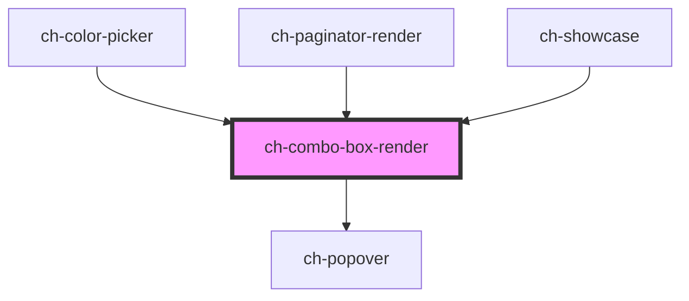

# ch-combo-box-render

## Table of Contents

- [Overview](#overview)
- [Features](#features)
- [Use when](#use-when)
- [Do not use when](#do-not-use-when)
- [Accessibility](#accessibility)
- [Properties](#properties)
- [Events](#events)
- [Dependencies](#dependencies)
  - [Used by](#used-by)
  - [Depends on](#depends-on)
  - [Graph](#graph)
- [Styling](./docs/styling.md)

<!-- Auto Generated Below -->

## Overview

The `ch-combo-box-render` component is a feature-rich combo box that combines an input field with a popover-based dropdown list for selecting values.

## Features
 - Flat lists and expandable item groups.
 - Suggest (autocomplete) mode with strict matching, debounced input, and server-side filtering.
 - Full keyboard navigation: Arrow keys, Home, End, Enter, Tab, and type-ahead search.
 - Multiple selection support.
 - Item images with multi-state support.
 - Automatic min-width sizing based on the largest option.
 - Lazy rendering of items only when the popup is displayed.
 - Native `select` fallback on mobile devices.

## Use when
 - A dropdown selection from a list of options is needed.
 - A searchable or autocomplete input is required.
 - Options should be organized into groups.
 - The list has more than 7 options and space is constrained.
 - A searchable or filterable input improves discoverability of items.
 - Options are organized into named groups.

## Do not use when
 - A simple binary choice is needed — prefer `ch-checkbox` or `ch-switch` instead.
 - All options should be visible at once — prefer `ch-radio-group-render` instead.
 - There are 2–3 options — prefer `ch-radio-group-render` (always visible, no extra click required).
 - The selection has immediate side effects — clearly communicate what will happen on change.
 - Navigation links are needed — never use a combo box to navigate between pages.

## Accessibility
 - Form-associated via `ElementInternals` — participates in native form validation and submission.
 - Delegates focus into the shadow DOM (`delegatesFocus: true`).
 - Implements the WAI-ARIA `combobox` pattern: the input has `role="combobox"` with `aria-expanded`, `aria-controls`, and `aria-haspopup` attributes.
 - The popup list has `role="listbox"`.
 - Keyboard navigation:
   - **Arrow Up / Arrow Down**: Navigate through items in the dropdown. If the dropdown is closed, opens it.
   - **Home / End**: Jump to the first or last item (non-suggest mode).
   - **Enter / NumpadEnter**: Toggle the dropdown open/closed; in suggest mode, confirms the current selection.
   - **Space**: Opens the dropdown (non-suggest mode only).
   - **Tab**: Closes the dropdown and confirms the selection.
   - **Type-ahead**: In non-suggest mode, typing characters while the dropdown is open performs incremental search to jump to matching items.
 - Resolves its accessible name from an external `<label>` element or the `accessibleName` property.
 - On mobile devices, falls back to a native `<select>` element for optimal touch interaction and OS-level accessibility.

## Properties

| Property               | Attribute              | Description                                                                                                                                                                                                                                                                                                                                                                                                                                                                                                                                                                                                                                                                                                                                                                                                                                                                                                                                                                                                                                                      | Type                                                                                                                                                                                                                                         | Default          |
| ---------------------- | ---------------------- | ---------------------------------------------------------------------------------------------------------------------------------------------------------------------------------------------------------------------------------------------------------------------------------------------------------------------------------------------------------------------------------------------------------------------------------------------------------------------------------------------------------------------------------------------------------------------------------------------------------------------------------------------------------------------------------------------------------------------------------------------------------------------------------------------------------------------------------------------------------------------------------------------------------------------------------------------------------------------------------------------------------------------------------------------------------------- | -------------------------------------------------------------------------------------------------------------------------------------------------------------------------------------------------------------------------------------------- | ---------------- |
| `accessibleName`       | `accessible-name`      | Specifies a short string, typically 1 to 3 words, that authors associate with an element to provide users of assistive technologies with a label for the element.                                                                                                                                                                                                                                                                                                                                                                                                                                                                                                                                                                                                                                                                                                                                                                                                                                                                                                | `string`                                                                                                                                                                                                                                     | `undefined`      |
| `disabled`             | `disabled`             | This attribute lets you specify if the element is disabled. If disabled, it will not fire any user interaction related event (for example, click event).                                                                                                                                                                                                                                                                                                                                                                                                                                                                                                                                                                                                                                                                                                                                                                                                                                                                                                         | `boolean`                                                                                                                                                                                                                                    | `false`          |
| `getImagePathCallback` | --                     | This property specifies a callback that is executed when the path for an imgSrc needs to be resolved.                                                                                                                                                                                                                                                                                                                                                                                                                                                                                                                                                                                                                                                                                                                                                                                                                                                                                                                                                            | `(item: ComboBoxItemModel, iconDirection: "start" \| "end") => GxImageMultiState`                                                                                                                                                            | `undefined`      |
| `hostParts`            | `host-parts`           | Specifies a set of parts to use in the Host element (`ch-combo-box-render`).                                                                                                                                                                                                                                                                                                                                                                                                                                                                                                                                                                                                                                                                                                                                                                                                                                                                                                                                                                                     | `string`                                                                                                                                                                                                                                     | `undefined`      |
| `model`                | --                     | Specifies the items of the control.  `ComboBoxModel` is an array of `ComboBoxItemModel` entries. Each entry is either a `ComboBoxItemLeaf` (a selectable item) or a `ComboBoxItemGroup` (a group header containing nested items).                                                                                                                                                                                                                                                                                                                                                                                                                                                                                                                                                                                                                                                                                                                                                                                                                                | `ComboBoxItemModel[]`                                                                                                                                                                                                                        | `[]`             |
| `multiple`             | `multiple`             | This attribute indicates that multiple options can be selected in the list. If it is not specified, then only one option can be selected at a time. When multiple is specified, the control will show a scrolling list box instead of a single line dropdown.  **Note:** Currently declared but not yet implemented. Setting this property has no effect on the component behavior.                                                                                                                                                                                                                                                                                                                                                                                                                                                                                                                                                                                                                                                                              | `boolean`                                                                                                                                                                                                                                    | `false`          |
| `name`                 | `name`                 | This property specifies the `name` of the control when used in a form.                                                                                                                                                                                                                                                                                                                                                                                                                                                                                                                                                                                                                                                                                                                                                                                                                                                                                                                                                                                           | `string`                                                                                                                                                                                                                                     | `undefined`      |
| `placeholder`          | `placeholder`          | A hint to the user of what can be entered in the control. Same as [placeholder](https://developer.mozilla.org/en-US/docs/Web/HTML/Element/input#attr-placeholder) attribute for `input` elements.                                                                                                                                                                                                                                                                                                                                                                                                                                                                                                                                                                                                                                                                                                                                                                                                                                                                | `string`                                                                                                                                                                                                                                     | `undefined`      |
| `popoverInlineAlign`   | `popover-inline-align` | Specifies the inline alignment of the popover.                                                                                                                                                                                                                                                                                                                                                                                                                                                                                                                                                                                                                                                                                                                                                                                                                                                                                                                                                                                                                   | `"center" \| "inside-end" \| "inside-start" \| "outside-end" \| "outside-start"`                                                                                                                                                             | `"inside-start"` |
| `readonly`             | `readonly`             | This attribute indicates that the user cannot modify the value of the control. Same as [readonly](https://developer.mozilla.org/en-US/docs/Web/HTML/Element/input#attr-readonly) attribute for `input` elements.                                                                                                                                                                                                                                                                                                                                                                                                                                                                                                                                                                                                                                                                                                                                                                                                                                                 | `boolean`                                                                                                                                                                                                                                    | `false`          |
| `resizable`            | `resizable`            | Specifies whether the control can be resized. If `true` the control can be resized at runtime by dragging the edges or corners.                                                                                                                                                                                                                                                                                                                                                                                                                                                                                                                                                                                                                                                                                                                                                                                                                                                                                                                                  | `boolean`                                                                                                                                                                                                                                    | `false`          |
| `suggest`              | `suggest`              | This property lets you specify if the control behaves like a suggest. If `true` the combo-box value will be editable and displayed items will be filtered according to the input's value.  When enabled, the `suggestDebounce` property controls how long the control waits before processing input changes, and the `suggestOptions` property configures filtering behavior (e.g., strict matching, case sensitivity, server-side filtering).                                                                                                                                                                                                                                                                                                                                                                                                                                                                                                                                                                                                                   | `boolean`                                                                                                                                                                                                                                    | `false`          |
| `suggestDebounce`      | `suggest-debounce`     | This property lets you determine the debounce time (in ms) that the control waits until it processes the changes to the filter property. Consecutive changes to the `value` property between this range, reset the timeout to process the value. Only works if `suggest === true`.                                                                                                                                                                                                                                                                                                                                                                                                                                                                                                                                                                                                                                                                                                                                                                               | `number`                                                                                                                                                                                                                                     | `250`            |
| `suggestOptions`       | --                     | This property lets you determine the options that will be applied to the suggest. Available options (`ComboBoxSuggestOptions`):   - `alreadyProcessed` (boolean) — `true` if the model is already filtered    server-side and the control should skip client-side filtering.  - `autoExpand` (boolean) — expand matching groups when filtering. *(Not yet implemented.)*  - `hideMatchesAndShowNonMatches` (boolean) — invert the filter: hide    matches and show non-matches.  - `highlightMatchedItems` (boolean) — highlight matched text in items.    *(Not yet implemented.)*  - `matchCase` (boolean) — make the filter case-sensitive (ignored when    `regularExpression` is `true`).  - `regularExpression` (boolean) — treat the filter value as a regular expression.  - `renderActiveItemIconOnExpand` (boolean) — keep the selected item icon    visible in the input while the dropdown is expanded in suggest mode.  - `strict` (boolean) — when the popover closes, revert to the last    confirmed value if the input does not match any item. | `{ alreadyProcessed?: boolean; autoExpand?: boolean; hideMatchesAndShowNonMatches?: boolean; highlightMatchedItems?: boolean; matchCase?: boolean; regularExpression?: boolean; renderActiveItemIconOnExpand?: boolean; strict?: boolean; }` | `{}`             |
| `value`                | `value`                | Specifies the value (selected item) of the control.                                                                                                                                                                                                                                                                                                                                                                                                                                                                                                                                                                                                                                                                                                                                                                                                                                                                                                                                                                                                              | `string`                                                                                                                                                                                                                                     | `undefined`      |

## Events

| Event    | Description                                                                                                                                                                                                                                                                                                                                                    | Type                  |
| -------- | -------------------------------------------------------------------------------------------------------------------------------------------------------------------------------------------------------------------------------------------------------------------------------------------------------------------------------------------------------------- | --------------------- |
| `change` | The `change` event is emitted when a change to the element's value is committed by the user.  - In normal mode (suggest = false), it is emitted after each input event.   - In suggest mode (suggest = true), it is emitted after the popover is closed and a new value is committed by the user.  This event is NOT debounced by the `suggestDebounce` value. | `CustomEvent<string>` |
| `input`  | The `input` event is emitted when a change to the element's value is committed by the user.  When `suggest === true`, this event is debounced by the `suggestDebounce` value (default 250 ms). When `suggest === false`, debouncing does not apply and the event is emitted immediately on value change.                                                       | `CustomEvent<string>` |

## Dependencies

### Used by

 - [ch-color-picker](../color-picker)
 - [ch-paginator-render](../paginator-render)
 - [ch-showcase](../../showcase/assets/components)

### Depends on

- [ch-popover](../popover)

### Graph

----------------------------------------------

*Built with [StencilJS](https://stenciljs.com/)*
