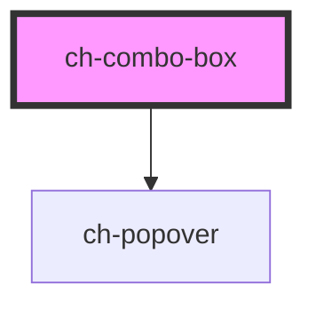

# ch-combo-box

<!-- Auto Generated Below -->

## Properties

| Property         | Attribute         | Description                                                                                                                                                                                                                                                   | Type             | Default     |
| ---------------- | ----------------- | ------------------------------------------------------------------------------------------------------------------------------------------------------------------------------------------------------------------------------------------------------------- | ---------------- | ----------- |
| `accessibleName` | `accessible-name` | Specifies a short string, typically 1 to 3 words, that authors associate with an element to provide users of assistive technologies with a label for the element.                                                                                             | `string`         | `undefined` |
| `disabled`       | `disabled`        | This attribute lets you specify if the element is disabled. If disabled, it will not fire any user interaction related event (for example, click event).                                                                                                      | `boolean`        | `false`     |
| `items`          | --                | Specifies the items of the control                                                                                                                                                                                                                            | `ComboBoxItem[]` | `[]`        |
| `multiple`       | `multiple`        | This attribute indicates that multiple options can be selected in the list. If it is not specified, then only one option can be selected at a time. When multiple is specified, the control will show a scrolling list box instead of a single line dropdown. | `boolean`        | `false`     |
| `placeholder`    | `placeholder`     | A hint to the user of what can be entered in the control. Same as [placeholder](https://developer.mozilla.org/en-US/docs/Web/HTML/Element/input#attr-placeholder) attribute for `input` elements.                                                             | `string`         | `undefined` |
| `readonly`       | `readonly`        | This attribute indicates that the user cannot modify the value of the control. Same as [readonly](https://developer.mozilla.org/en-US/docs/Web/HTML/Element/input#attr-readonly) attribute for `input` elements.                                              | `boolean`        | `false`     |
| `value`          | `value`           | Specifies the value (selected item) of the control.                                                                                                                                                                                                           | `string`         | `undefined` |

## Events

| Event   | Description                                                                                 | Type                  |
| ------- | ------------------------------------------------------------------------------------------- | --------------------- |
| `input` | The `input` event is emitted when a change to the element's value is committed by the user. | `CustomEvent<string>` |

## Shadow Parts

| Part               | Description |
| ------------------ | ----------- |
| `"..."`            | ...         |
| `"group__caption"` |             |
| `"window"`         |             |

## Dependencies

### Depends on

- [ch-popover](../popover)

### Graph

----------------------------------------------

*Built with [StencilJS](https://stenciljs.com/)*
