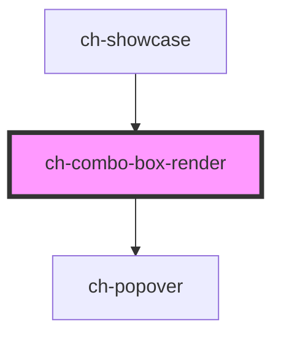

# ch-combo-box-render

<!-- Auto Generated Below -->

## Properties

| Property              | Attribute                | Description                                                                                                                                                                                                                                                                                                                                                                                                                                                                                                                                                                                                                                                                                                                   | Type                                                                                                                                                                                                 | Default          |
| --------------------- | ------------------------ | ----------------------------------------------------------------------------------------------------------------------------------------------------------------------------------------------------------------------------------------------------------------------------------------------------------------------------------------------------------------------------------------------------------------------------------------------------------------------------------------------------------------------------------------------------------------------------------------------------------------------------------------------------------------------------------------------------------------------------- | ---------------------------------------------------------------------------------------------------------------------------------------------------------------------------------------------------- | ---------------- |
| `accessibleName`      | `accessible-name`        | Specifies a short string, typically 1 to 3 words, that authors associate with an element to provide users of assistive technologies with a label for the element.                                                                                                                                                                                                                                                                                                                                                                                                                                                                                                                                                             | `string`                                                                                                                                                                                             | `undefined`      |
| `destroyItemsOnClose` | `destroy-items-on-close` | Specifies whether the items should not stay rendered in the DOM if the control is closed. `true` to destroy the rendered items when the control is closed. Note: By default, the control does not rendered the items until the first expansion. The same applies if the control have groups.                                                                                                                                                                                                                                                                                                                                                                                                                                  | `boolean`                                                                                                                                                                                            | `false`          |
| `disabled`            | `disabled`               | This attribute lets you specify if the element is disabled. If disabled, it will not fire any user interaction related event (for example, click event).                                                                                                                                                                                                                                                                                                                                                                                                                                                                                                                                                                      | `boolean`                                                                                                                                                                                            | `false`          |
| `filter`              | `filter`                 | This property lets you determine the expression that will be applied to the filter. Only works if `filterType = "caption" \| "value"`.                                                                                                                                                                                                                                                                                                                                                                                                                                                                                                                                                                                        | `string`                                                                                                                                                                                             | `undefined`      |
| `filterDebounce`      | `filter-debounce`        | This property lets you determine the debounce time (in ms) that the control waits until it processes the changes to the filter property. Consecutive changes to the `filter` property between this range, reset the timeout to process the filter. Only works if `filterType = "caption" \| "value"`.                                                                                                                                                                                                                                                                                                                                                                                                                         | `number`                                                                                                                                                                                             | `250`            |
| `filterOptions`       | --                       | This property lets you determine the options that will be applied to the filter.                                                                                                                                                                                                                                                                                                                                                                                                                                                                                                                                                                                                                                              | `{ alreadyProcessed?: boolean; autoExpand?: boolean; hideMatchesAndShowNonMatches?: boolean; highlightMatchedItems?: boolean; matchCase?: boolean; regularExpression?: boolean; strict?: boolean; }` | `{}`             |
| `filterType`          | `filter-type`            | This attribute lets you define what kind of filter is applied to items. Only items that satisfy the filter predicate will be displayed.  \| Value     \| Details                                                                                       \| \| --------- \| --------------------------------------------------------------------------------------------- \| \| `caption` \| Show only the items whose `caption` satisfies the regex determinate by the `filter` property. \| \| `value`   \| Show only the items whose `value` satisfies the regex determinate by the `filter` property.   \| \| `none`    \| Show all items.                                                                               \| | `"caption" \| "none" \| "value"`                                                                                                                                                                     | `"none"`         |
| `model`               | --                       | Specifies the items of the control                                                                                                                                                                                                                                                                                                                                                                                                                                                                                                                                                                                                                                                                                            | `ComboBoxItemModel[]`                                                                                                                                                                                | `[]`             |
| `multiple`            | `multiple`               | This attribute indicates that multiple options can be selected in the list. If it is not specified, then only one option can be selected at a time. When multiple is specified, the control will show a scrolling list box instead of a single line dropdown.                                                                                                                                                                                                                                                                                                                                                                                                                                                                 | `boolean`                                                                                                                                                                                            | `false`          |
| `placeholder`         | `placeholder`            | A hint to the user of what can be entered in the control. Same as [placeholder](https://developer.mozilla.org/en-US/docs/Web/HTML/Element/input#attr-placeholder) attribute for `input` elements.                                                                                                                                                                                                                                                                                                                                                                                                                                                                                                                             | `string`                                                                                                                                                                                             | `undefined`      |
| `popoverInlineAlign`  | `popover-inline-align`   | Specifies the inline alignment of the popover.                                                                                                                                                                                                                                                                                                                                                                                                                                                                                                                                                                                                                                                                                | `"center" \| "inside-end" \| "inside-start" \| "outside-end" \| "outside-start"`                                                                                                                     | `"inside-start"` |
| `readonly`            | `readonly`               | This attribute indicates that the user cannot modify the value of the control. Same as [readonly](https://developer.mozilla.org/en-US/docs/Web/HTML/Element/input#attr-readonly) attribute for `input` elements.                                                                                                                                                                                                                                                                                                                                                                                                                                                                                                              | `boolean`                                                                                                                                                                                            | `false`          |
| `resizable`           | `resizable`              | Specifies whether the control can be resized. If `true` the control can be resized at runtime by dragging the edges or corners.                                                                                                                                                                                                                                                                                                                                                                                                                                                                                                                                                                                               | `boolean`                                                                                                                                                                                            | `false`          |
| `value`               | `value`                  | Specifies the value (selected item) of the control.                                                                                                                                                                                                                                                                                                                                                                                                                                                                                                                                                                                                                                                                           | `string`                                                                                                                                                                                             | `undefined`      |

## Events

| Event          | Description                                                                                                                                                                                                                      | Type                  |
| -------------- | -------------------------------------------------------------------------------------------------------------------------------------------------------------------------------------------------------------------------------- | --------------------- |
| `filterChange` | Emitted when a change to the element's filter is committed by the user. Only applies if `filterType !== "none"`. It contains the information about the new filter value.  This event is debounced by the `filterDebounce` value. | `CustomEvent<string>` |
| `input`        | The `input` event is emitted when a change to the element's value is committed by the user.                                                                                                                                      | `CustomEvent<string>` |

## Shadow Parts

| Part                      | Description |
| ------------------------- | ----------- |
| `"..."`                   | ...         |
| `"group__content"`        |             |
| `"group__header-caption"` |             |
| `"window"`                |             |
| `"window__content"`       |             |

## CSS Custom Properties

| Name                                                 | Description                                                                                                                                                                                                                                                                                                 |
| ---------------------------------------------------- | ----------------------------------------------------------------------------------------------------------------------------------------------------------------------------------------------------------------------------------------------------------------------------------------------------------- |
| `--ch-combo-box-group__expandable-button-image-size` | Specifies the image size of the expandable button size in the group items. @default 100%                                                                                                                                                                                                                    |
| `--ch-combo-box-group__expandable-button-size`       | Specifies the expandable button size in the group items. @default 0.875em                                                                                                                                                                                                                                   |
| `--ch-combo-box-item-gap`                            | Specifies the spacing between the images, text and the expandable button on items. @default 0px                                                                                                                                                                                                             |
| `--ch-combo-box-item__background-image-size`         | Specifies the image size of the items. For example, the image size for the startImgSrc and endImgSrc @default 100%                                                                                                                                                                                          |
| `--ch-combo-box-item__image-size`                    | Specifies the box size that contains an image in the items. For example, the box for the startImgSrc and endImgSrc @default 0.875em                                                                                                                                                                         |
| `--ch-combo-box-separation`                          | Specifies the separation between the combo-box and the displayed popover. @default 0px                                                                                                                                                                                                                      |
| `--ch-combo-box-separation-x`                        | Specifies the separation between the combo-box and the popover displayed on the x-axis. @default var(--ch-combo-box-separation)                                                                                                                                                                             |
| `--ch-combo-box-separation-y`                        | Specifies the separation between the combo-box and the popover displayed on the y-axis. @default var(--ch-combo-box-separation)                                                                                                                                                                             |
| `--ch-combo-box__picker`                             | Specifies the image of the combo-box's picker. @default url('data:image/svg+xml,<svg width="8" height="12" viewBox="0 0 8 12" xmlns="http://www.w3.org/2000/svg"><path d="M4.16669 0.666626L7.66669 4.66663H0.666687L4.16669 0.666626ZM4.16669 11.3333L0.666687 7.33329H7.66669L4.16669 11.3333Z"/></svg>') |
| `--ch-combo-box__picker-color`                       | Specifies the color of the combo-box's picker. @default currentColor                                                                                                                                                                                                                                        |
| `--ch-combo-box__picker-mask-size`                   | Specifies the image size of the combo-box's picker. @default 100%                                                                                                                                                                                                                                           |
| `--ch-combo-box__picker-size`                        | Specifies the box size that contains the combo-box's picker. @default 0.875em                                                                                                                                                                                                                               |

## Dependencies

### Used by

 - [ch-showcase](../../showcase/assets/components)

### Depends on

- [ch-popover](../popover)

### Graph

----------------------------------------------

*Built with [StencilJS](https://stenciljs.com/)*
