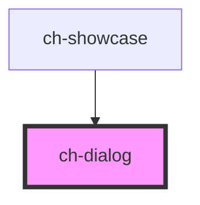

# ch-dialog

<!-- Auto Generated Below -->

## Overview

The `ch-dialog` component represents a modal or non-modal dialog box or other
interactive component.

## Properties

| Property                    | Attribute                      | Description                                                                                                                                                                                                                                                                                                                                                                                         | Type                        | Default     |
| --------------------------- | ------------------------------ | --------------------------------------------------------------------------------------------------------------------------------------------------------------------------------------------------------------------------------------------------------------------------------------------------------------------------------------------------------------------------------------------------- | --------------------------- | ----------- |
| `adjustPositionAfterResize` | `adjust-position-after-resize` | `true` if the dialog should be repositioned after resize.                                                                                                                                                                                                                                                                                                                                           | `boolean`                   | `false`     |
| `allowDrag`                 | `allow-drag`                   | "box" will allow the dialog to be draggable from both the header and the content. "header" will allow the dialog to be draggable only from the header. "no" disables dragging completely.                                                                                                                                                                                                           | `"box" \| "header" \| "no"` | `"no"`      |
| `caption`                   | `caption`                      | Refers to the dialog title. I will ve visible if 'showHeader´is true.                                                                                                                                                                                                                                                                                                                               | `string`                    | `undefined` |
| `closeButtonAccessibleName` | `close-button-accessible-name` | Specifies a short string, typically 1 to 3 words, that authors associate with an element to provide users of assistive technologies with a label for the element. This label is used for the close button of the header.                                                                                                                                                                            | `string`                    | `undefined` |
| `hidden`                    | `hidden`                       | Specifies whether the dialog is hidden or visible.                                                                                                                                                                                                                                                                                                                                                  | `boolean`                   | `true`      |
| `modal`                     | `modal`                        | Specifies whether the dialog is a modal or not. Modal dialog boxes interrupt interaction with the rest of the page being inert, while non-modal dialog boxes allow interaction with the rest of the page.  Note: If `hidden !== false`, this property does not reflect changes on runtime, since at the time of writing browsers do not support switching from modal to not-modal, (or vice-versa). | `boolean`                   | `true`      |
| `resizable`                 | `resizable`                    | Specifies whether the control can be resized. If `true` the control can be resized at runtime by dragging the edges or corners.                                                                                                                                                                                                                                                                     | `boolean`                   | `false`     |
| `showFooter`                | `show-footer`                  | Specifies whether the dialog footer is hidden or visible.                                                                                                                                                                                                                                                                                                                                           | `boolean`                   | `false`     |
| `showHeader`                | `show-header`                  | Specifies whether the dialog header is hidden or visible.                                                                                                                                                                                                                                                                                                                                           | `boolean`                   | `false`     |

## Events

| Event          | Description                        | Type               |
| -------------- | ---------------------------------- | ------------------ |
| `dialogClosed` | Emitted when the dialog is closed. | `CustomEvent<any>` |

## Slots

| Slot        | Description                                                                                                                             |
| ----------- | --------------------------------------------------------------------------------------------------------------------------------------- |
| `"content"` | Main content of the dialog.                                                                                                             |
| `"footer"`  | Rendered below the content of the dialog if `showFooter === true`. It is used to place content that is considered footer of the dialog. |

## Shadow Parts

| Part                                | Description                                                                                                                                                |
| ----------------------------------- | ---------------------------------------------------------------------------------------------------------------------------------------------------------- |
| `"caption"`                         |                                                                                                                                                            |
| `"close-button"`                    |                                                                                                                                                            |
| `"content"`                         | The dialog content. It is a div element that acts as a wrapper of the slotted content.                                                                     |
| `"corner"`                          | Represents any of the dialog corners that appear in-between the edges. These corners are used to resize the dialog dimensions by dragging.                 |
| `"corner-block-end-inline-end"`     | Represents the dialog corner in-between the "edge-block-end" and "edge-inline-end" parts (see also "corner" part).                                         |
| `"corner-block-end-inline-start"`   | Represents the dialog corner in-between the "edge-block-end" and "edge-inline-start" parts (see also "corner" part).                                       |
| `"corner-block-start-inline-end"`   | Represents the dialog corner in-between the "edge-block-start" and "edge-inline-end" parts (see also "corner" part).                                       |
| `"corner-block-start-inline-start"` | Represents the dialog corner in-between the "edge-block-start" and "edge-inline-start" parts (see also "corner" part).                                     |
| `"dialog"`                          | The dialog html element, which is the first element inside the host.                                                                                       |
| `"edge"`                            | Represents any of the dialog edges that appear before, after, above or below the dialog. These edges are used to resize the dialog dimensions by dragging. |
| `"edge-block-end"`                  | Represents the "block-end" dialog edge (see also "edge" part).                                                                                             |
| `"edge-block-start"`                | Represents the "block-start" dialog edge (see also "edge" part).                                                                                           |
| `"edge-inline-end"`                 | Represents the "inline-end" dialog edge (see also "edge" part).                                                                                            |
| `"edge-inline-start"`               | Represents the "inline-start" dialog edge (see also "edge" part).                                                                                          |
| `"footer"`                          | The dialog footer which is only rendered if `showFooter === true`. The footer displays the caption and a close button.                                     |
| `"header"`                          | The dialog header which is only rendered if `showHeader === true`. The header displays the caption and a close button.                                     |

## CSS Custom Properties

| Name                           | Description                                                                                                                                                             |
| ------------------------------ | ----------------------------------------------------------------------------------------------------------------------------------------------------------------------- |
| `--ch-dialog-block-size`       | Specifies the block size of the dialog. Useful for scenarios where the dialog is resizable. @default max-content                                                        |
| `--ch-dialog-block-start`      | This specifies the value used in calculating the dialog's position along the y-axis. The default value centers the dialog along the y-axis. @default calc(50dvh - 50%)  |
| `--ch-dialog-inline-size`      | Specifies the inline size of the dialog. Useful for scenarios where the dialog is resizable. @default max-content                                                       |
| `--ch-dialog-inline-start`     | This specifies the value used in calculating the dialog's position along the x-axis. The default value centers the dialog along the x-axis. @default calc(50dvw - 50%); |
| `--ch-dialog-max-block-size`   | Specifies the maximum block size of the dialog. Useful for scenarios where the dialog is resizable. @default auto                                                       |
| `--ch-dialog-max-inline-size`  | Specifies the maximum inline size of the dialog. Useful for scenarios where the dialog is resizable. @default auto                                                      |
| `--ch-dialog-min-block-size`   | Specifies the minimum block size of the dialog. Useful for scenarios where the dialog is resizable. @default auto                                                       |
| `--ch-dialog-min-inline-size`  | Specifies the minimum inline size of the dialog. Useful for scenarios where the dialog is resizable. @default auto                                                      |
| `--ch-dialog-resize-threshold` | Specifies the size of the threshold to resize the dialog. @default 8px                                                                                                  |

## Dependencies

### Used by

 - [ch-showcase](../../showcase/assets/components)

### Graph

----------------------------------------------

*Built with [StencilJS](https://stenciljs.com/)*
