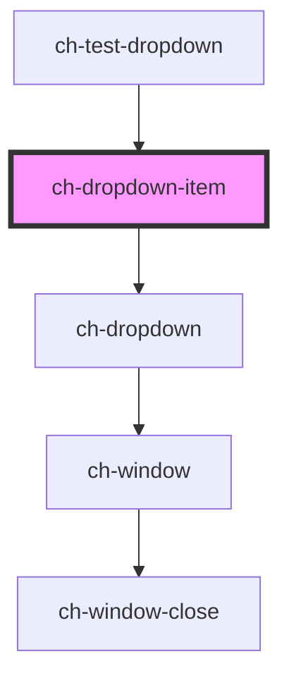

# ch-dropdown-item

<!-- Auto Generated Below -->

## Properties

| Property         | Attribute         | Description                                                                                                                                                       | Type                          | Default            |
| ---------------- | ----------------- | ----------------------------------------------------------------------------------------------------------------------------------------------------------------- | ----------------------------- | ------------------ |
| `expandBehavior` | `expand-behavior` | Determine which actions on the expandable button display the dropdown section. Only works if the control has subitems.                                            | `"Click or Hover" \| "Click"` | `"Click or Hover"` |
| `href`           | `href`            | Specifies the hyperlink of the item. If this property is defined, the control will render an anchor tag with this `href`. Otherwise, it will render a button tag. | `string`                      | `undefined`        |
| `leftImgSrc`     | `left-img-src`    | Specifies the src for the left img.                                                                                                                               | `string`                      | `undefined`        |
| `openOnFocus`    | `open-on-focus`   | Determine if the dropdown section should be opened when the expandable button of the control is focused. Only works if the control has subitems.                  | `boolean`                     | `false`            |
| `rightImgSrc`    | `right-img-src`   | Specifies the src for the right img.                                                                                                                              | `string`                      | `undefined`        |

## Events

| Event         | Description                                            | Type                  |
| ------------- | ------------------------------------------------------ | --------------------- |
| `actionClick` | Fires when the control's anchor or button is clicked.  | `CustomEvent<string>` |
| `focusChange` | Fires when the control's anchor or button is in focus. | `CustomEvent<any>`    |

## Methods

### `handleFocusElement() => Promise<void>`

Focuses the control's anchor or button.

#### Returns

Type: `Promise<void>`

## Shadow Parts

| Part          | Description |
| ------------- | ----------- |
| `"action"`    |             |
| `"button"`    |             |
| `"content"`   |             |
| `"left-img"`  |             |
| `"right-img"` |             |
| `"target"`    |             |

## Dependencies

### Used by

 - [ch-test-dropdown](../test/test-dropdown)

### Depends on

- [ch-dropdown](../dropdown)

### Graph

----------------------------------------------

*Built with [StencilJS](https://stenciljs.com/)*
