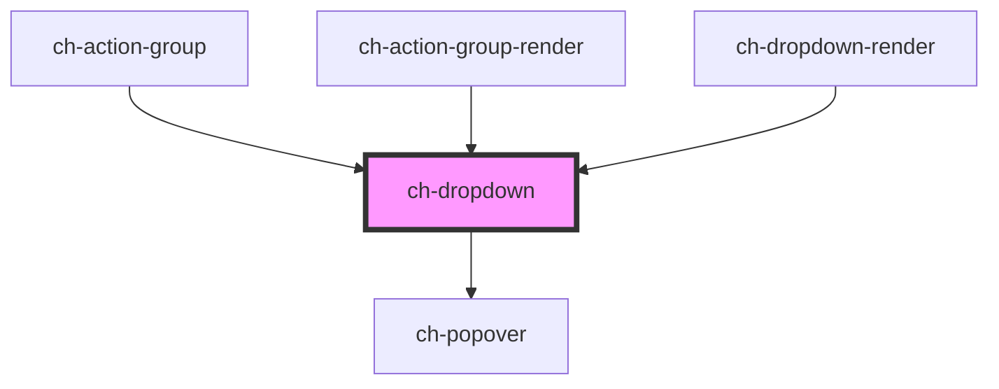

# ch-dropdown

A generic dropdown menu that has 4 slots. One for the layout of the button that
displays the dropdown, one for the dropdown header, one for the dropdown items
and the last one for the dropdown footer.

```html
<ch-dropdown
  align="Center"
  class="Class"
  dropdown-separation="5"
  expand-behavior="Click or hover"
  open-on-focus="false"
  position="Bottom"
>
  <span slot="action">User info</span>

  <div slot="header">
    <h1>John Doe</h1>
    <span>johndoe@example.com</span>
  </div>

  <ch-dropdown-item
    slot="items"
    class="dropdown-item--fancy"
    href="https://..."
    leftImgSrc="./MyProfile.svg"
    rightImgSrc="AnotherImg"
  >
    My profile
  </ch-dropdown-item>

  <ch-dropdown-item-separator slot="items"></ch-dropdown-item-separator>

  <ch-dropdown-item
    slot="items"
    id="2"
    leftImgSrc="./Logout.svg"
    rightImgSrc="item.RightImage"
  >
    Logout
  </ch-dropdown-item>

  <div slot="footer">...</div>
</ch-dropdown>
```

<!-- Auto Generated Below -->


## Properties

| Property               | Attribute                | Description                                                                                                                                                       | Type                                                                                                                                                                                                                                                                                                                                                                                                                                               | Default               |
| ---------------------- | ------------------------ | ----------------------------------------------------------------------------------------------------------------------------------------------------------------- | -------------------------------------------------------------------------------------------------------------------------------------------------------------------------------------------------------------------------------------------------------------------------------------------------------------------------------------------------------------------------------------------------------------------------------------------------- | --------------------- |
| `actionGroupParent`    | `action-group-parent`    | Specifies if the current parent of the item is the action-group control.                                                                                          | `boolean`                                                                                                                                                                                                                                                                                                                                                                                                                                          | `false`               |
| `buttonAccessibleName` | `button-accessible-name` | This attribute lets you specify the label for the expandable button. Important for accessibility.                                                                 | `string`                                                                                                                                                                                                                                                                                                                                                                                                                                           | `undefined`           |
| `caption`              | `caption`                | Specifies the caption that the control will display.                                                                                                              | `string`                                                                                                                                                                                                                                                                                                                                                                                                                                           | `undefined`           |
| `endImgSrc`            | `end-img-src`            | Specifies the src of the end image.                                                                                                                               | `string`                                                                                                                                                                                                                                                                                                                                                                                                                                           | `undefined`           |
| `endImgType`           | `end-img-type`           | Specifies how the end image will be rendered.                                                                                                                     | `"background" \| "img" \| "mask"`                                                                                                                                                                                                                                                                                                                                                                                                                  | `"background"`        |
| `expanded`             | `expanded`               | `true` to display the dropdown section.                                                                                                                           | `boolean`                                                                                                                                                                                                                                                                                                                                                                                                                                          | `false`               |
| `href`                 | `href`                   | Specifies the hyperlink of the item. If this property is defined, the control will render an anchor tag with this `href`. Otherwise, it will render a button tag. | `string`                                                                                                                                                                                                                                                                                                                                                                                                                                           | `undefined`           |
| `itemClickCallback`    | --                       | This callback is executed when an item is clicked.                                                                                                                | `(event: UIEvent) => void`                                                                                                                                                                                                                                                                                                                                                                                                                         | `undefined`           |
| `leaf`                 | `leaf`                   | Specifies whether the item contains a subtree. `true` if the item does not have a subtree.                                                                        | `boolean`                                                                                                                                                                                                                                                                                                                                                                                                                                          | `false`               |
| `level`                | `level`                  | Level in the render at which the item is placed.                                                                                                                  | `number`                                                                                                                                                                                                                                                                                                                                                                                                                                           | `undefined`           |
| `nestedDropdown`       | `nested-dropdown`        | This attribute lets you specify if the control is nested in another dropdown. Useful to manage keyboard interaction.                                              | `boolean`                                                                                                                                                                                                                                                                                                                                                                                                                                          | `false`               |
| `openOnFocus`          | `open-on-focus`          | Determine if the dropdown section should be opened when the expandable button of the control is focused. TODO: Add implementation                                 | `boolean`                                                                                                                                                                                                                                                                                                                                                                                                                                          | `false`               |
| `position`             | `position`               | Specifies the position of the dropdown section that is placed relative to the expandable button.                                                                  | `"Center_OutsideEnd" \| "Center_OutsideStart" \| "InsideEnd_OutsideEnd" \| "InsideEnd_OutsideStart" \| "InsideStart_OutsideEnd" \| "InsideStart_OutsideStart" \| "OutsideEnd_Center" \| "OutsideEnd_InsideEnd" \| "OutsideEnd_InsideStart" \| "OutsideEnd_OutsideEnd" \| "OutsideEnd_OutsideStart" \| "OutsideStart_Center" \| "OutsideStart_InsideEnd" \| "OutsideStart_InsideStart" \| "OutsideStart_OutsideEnd" \| "OutsideStart_OutsideStart"` | `"Center_OutsideEnd"` |
| `shortcut`             | `shortcut`               | Specifies the shortcut caption that the control will display.                                                                                                     | `string`                                                                                                                                                                                                                                                                                                                                                                                                                                           | `undefined`           |
| `showFooter`           | `show-footer`            | `true` to make available a slot to show a footer element.                                                                                                         | `boolean`                                                                                                                                                                                                                                                                                                                                                                                                                                          | `false`               |
| `showHeader`           | `show-header`            | `true` to make available a slot to show a header element.                                                                                                         | `boolean`                                                                                                                                                                                                                                                                                                                                                                                                                                          | `false`               |
| `startImgSrc`          | `start-img-src`          | Specifies the src for the left img.                                                                                                                               | `string`                                                                                                                                                                                                                                                                                                                                                                                                                                           | `undefined`           |
| `startImgType`         | `start-img-type`         | Specifies how the start image will be rendered.                                                                                                                   | `"background" \| "img" \| "mask"`                                                                                                                                                                                                                                                                                                                                                                                                                  | `"background"`        |


## Events

| Event            | Description                                                                       | Type                   |
| ---------------- | --------------------------------------------------------------------------------- | ---------------------- |
| `expandedChange` | Fired when the visibility of the dropdown section is changed by user interaction. | `CustomEvent<boolean>` |


## Methods

### `collapseDropdown() => Promise<void>`

Collapse the content of the dropdown.

#### Returns

Type: `Promise<void>`


### `expandDropdown() => Promise<void>`

Expand the content of the dropdown.

#### Returns

Type: `Promise<void>`


### `focusElement() => Promise<void>`

Focus the dropdown action.

#### Returns

Type: `Promise<void>`


## Dependencies

### Used by

 - [ch-action-group](../action-group/action-group)
 - [ch-action-group-render](../renders/action-group)
 - [ch-dropdown-render](../renders/dropdown)

### Depends on

- [ch-popover](../popover)

### Graph


----------------------------------------------

*Built with [StencilJS](https://stenciljs.com/)*
