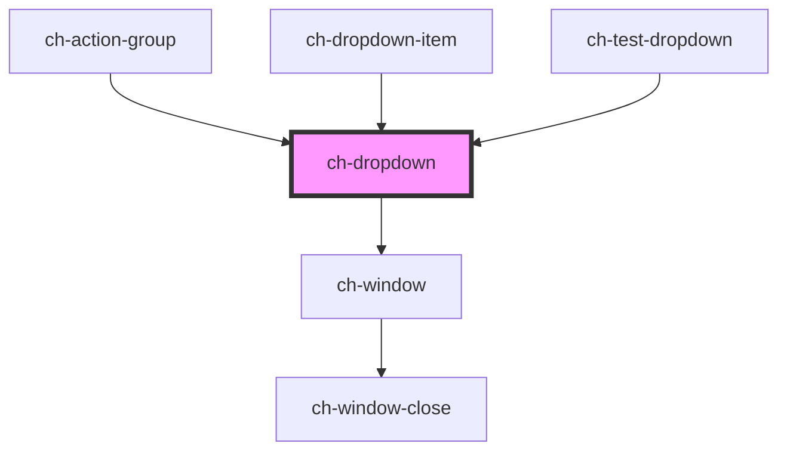

# ch-dropdown

A generic dropdown menu that has 4 slots. One for the layout of the button that
displays the dropdown, one for the dropdown header, one for the dropdown items
and the last one for the dropdown footer.

```html
<ch-dropdown
  align="Center"
  class="Class"
  dropdown-separation="5"
  expand-behavior="Click or hover"
  open-on-focus="false"
  position="Bottom"
>
  <span slot="action">User info</span>

  <div slot="header">
    <h1>John Doe</h1>
    <span>johndoe@example.com</span>
  </div>

  <ch-dropdown-item
    slot="items"
    class="dropdown-item--fancy"
    href="https://..."
    leftImgSrc="./MyProfile.svg"
    rightImgSrc="AnotherImg"
  >
    My profile
  </ch-dropdown-item>

  <ch-dropdown-item-separator slot="items"></ch-dropdown-item-separator>

  <ch-dropdown-item
    slot="items"
    id="2"
    leftImgSrc="./Logout.svg"
    rightImgSrc="item.RightImage"
  >
    Logout
  </ch-dropdown-item>

  <div slot="footer">...</div>
</ch-dropdown>
```

<!-- Auto Generated Below -->


## Properties

| Property         | Attribute         | Description                                                                                                          | Type                                                                                                                                                                                                                                                                                                                                                                                                                                               | Default               |
| ---------------- | ----------------- | -------------------------------------------------------------------------------------------------------------------- | -------------------------------------------------------------------------------------------------------------------------------------------------------------------------------------------------------------------------------------------------------------------------------------------------------------------------------------------------------------------------------------------------------------------------------------------------- | --------------------- |
| `buttonLabel`    | `button-label`    | This attribute lets you specify the label for the expandable button. Important for accessibility.                    | `string`                                                                                                                                                                                                                                                                                                                                                                                                                                           | `"Show options"`      |
| `expandBehavior` | `expand-behavior` | Determine which actions on the expandable button display the dropdown section.                                       | `"Click or Hover" \| "Click"`                                                                                                                                                                                                                                                                                                                                                                                                                      | `"Click or Hover"`    |
| `nestedDropdown` | `nested-dropdown` | This attribute lets you specify if the control is nested in another dropdown. Useful to manage keyboard interaction. | `boolean`                                                                                                                                                                                                                                                                                                                                                                                                                                          | `false`               |
| `openOnFocus`    | `open-on-focus`   | Determine if the dropdown section should be opened when the expandable button of the control is focused.             | `boolean`                                                                                                                                                                                                                                                                                                                                                                                                                                          | `false`               |
| `position`       | `position`        | Specifies the position of the dropdown section that is placed relative to the expandable button.                     | `"Center_OutsideEnd" \| "Center_OutsideStart" \| "InsideEnd_OutsideEnd" \| "InsideEnd_OutsideStart" \| "InsideStart_OutsideEnd" \| "InsideStart_OutsideStart" \| "OutsideEnd_Center" \| "OutsideEnd_InsideEnd" \| "OutsideEnd_InsideStart" \| "OutsideEnd_OutsideEnd" \| "OutsideEnd_OutsideStart" \| "OutsideStart_Center" \| "OutsideStart_InsideEnd" \| "OutsideStart_InsideStart" \| "OutsideStart_OutsideEnd" \| "OutsideStart_OutsideStart"` | `"Center_OutsideEnd"` |


## Events

| Event            | Description                                                  | Type                   |
| ---------------- | ------------------------------------------------------------ | ---------------------- |
| `expandedChange` | Fired when the visibility of the dropdown section is changed | `CustomEvent<boolean>` |


## Shadow Parts

| Part                  | Description |
| --------------------- | ----------- |
| `"expandable-button"` |             |
| `"list"`              |             |
| `"separation"`        |             |
| `"window"`            |             |


## Dependencies

### Used by

 - [ch-action-group](../action-group)
 - [ch-dropdown-item](../dropdown-item)
 - [ch-test-dropdown](../test/test-dropdown)

### Depends on

- [ch-window](../window)

### Graph


----------------------------------------------

*Built with [StencilJS](https://stenciljs.com/)*
