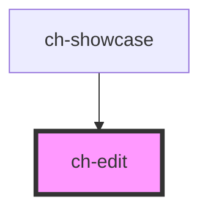

# ch-edit

<!-- Auto Generated Below -->

## Overview

A wrapper for the input and textarea elements. It additionally provides:

- A placeholder for `"date"`, `"datetime-local"` and `"time"` types.
- An action button.
- Useful style resets
- Support to auto grow the control when used with multiline (useful to
  model chat inputs).
- An image which can have multiple states.

## Properties

| Property                      | Attribute                        | Description                                                                                                                                                                                                                                                                                                           | Type                                                                                                                          | Default                            |
| ----------------------------- | -------------------------------- | --------------------------------------------------------------------------------------------------------------------------------------------------------------------------------------------------------------------------------------------------------------------------------------------------------------------- | ----------------------------------------------------------------------------------------------------------------------------- | ---------------------------------- |
| `accessibleName`              | `accessible-name`                | Specifies a short string, typically 1 to 3 words, that authors associate with an element to provide users of assistive technologies with a label for the element.                                                                                                                                                     | `string`                                                                                                                      | `undefined`                        |
| `autoFocus`                   | `auto-focus`                     | Specifies if the control automatically get focus when the page loads.                                                                                                                                                                                                                                                 | `boolean`                                                                                                                     | `false`                            |
| `autoGrow`                    | `auto-grow`                      | This property defines if the control size will grow automatically, to adjust to its content size.                                                                                                                                                                                                                     | `boolean`                                                                                                                     | `false`                            |
| `autocapitalize`              | `autocapitalize`                 | Specifies the auto-capitalization behavior. Same as [autocapitalize](https://developer.apple.com/library/content/documentation/AppleApplications/Reference/SafariHTMLRef/Articles/Attributes.html#//apple_ref/doc/uid/TP40008058-autocapitalize) attribute for `input` elements. Only supported by Safari and Chrome. | `string`                                                                                                                      | `undefined`                        |
| `autocomplete`                | `autocomplete`                   | This attribute indicates whether the value of the control can be automatically completed by the browser. Same as [autocomplete](https://developer.mozilla.org/en-US/docs/Web/HTML/Element/input#attr-autocomplete) attribute for `input` elements.                                                                    | `"off" \| "on"`                                                                                                               | `"off"`                            |
| `disabled`                    | `disabled`                       | This attribute lets you specify if the element is disabled. If disabled, it will not fire any user interaction related event (for example, click event).                                                                                                                                                              | `boolean`                                                                                                                     | `false`                            |
| `getImagePathCallback`        | --                               | This property specifies a callback that is executed when the path for an startImgSrc needs to be resolved.                                                                                                                                                                                                            | `(imageSrc: string) => GxImageMultiState`                                                                                     | `imageSrc => ({ base: imageSrc })` |
| `maxLength`                   | `max-length`                     | This property defines the maximum string length that the user can enter into the control.                                                                                                                                                                                                                             | `number`                                                                                                                      | `undefined`                        |
| `mode`                        | `mode`                           | This attribute hints at the type of data that might be entered by the user while editing the element or its contents. This allows a browser to display an appropriate virtual keyboard. Only works when `multiline === false`.                                                                                        | `"decimal" \| "email" \| "none" \| "numeric" \| "search" \| "tel" \| "text" \| "url"`                                         | `undefined`                        |
| `multiline`                   | `multiline`                      | Controls if the element accepts multiline text.                                                                                                                                                                                                                                                                       | `boolean`                                                                                                                     | `undefined`                        |
| `name`                        | `name`                           | This property specifies the `name` of the control when used in a form.                                                                                                                                                                                                                                                | `string`                                                                                                                      | `undefined`                        |
| `pattern`                     | `pattern`                        | This attribute specifies a regular expression the form control's value should match. Only works when `multiline === false`.                                                                                                                                                                                           | `string`                                                                                                                      | `undefined`                        |
| `picture`                     | `picture`                        | Specifies a picture to apply for the value of the control. Only works if `type === "Text"` and `mode === "numeric"`.                                                                                                                                                                                                  | `string`                                                                                                                      | `undefined`                        |
| `placeholder`                 | `placeholder`                    | A hint to the user of what can be entered in the control. Same as [placeholder](https://developer.mozilla.org/en-US/docs/Web/HTML/Element/input#attr-placeholder) attribute for `input` elements.                                                                                                                     | `string`                                                                                                                      | `undefined`                        |
| `readonly`                    | `readonly`                       | This attribute indicates that the user cannot modify the value of the control. Same as [readonly](https://developer.mozilla.org/en-US/docs/Web/HTML/Element/input#attr-readonly) attribute for `input` elements.                                                                                                      | `boolean`                                                                                                                     | `undefined`                        |
| `showTrigger`                 | `show-trigger`                   | If true, a trigger button is shown next to the edit field. The button can be customized adding a child element with `slot="trigger-content"` attribute to specify the content inside the trigger button.                                                                                                              | `boolean`                                                                                                                     | `undefined`                        |
| `spellcheck`                  | `spellcheck`                     | Specifies whether the element may be checked for spelling errors                                                                                                                                                                                                                                                      | `boolean`                                                                                                                     | `undefined`                        |
| `startImgSrc`                 | `start-img-src`                  | Specifies the source of the start image.                                                                                                                                                                                                                                                                              | `string`                                                                                                                      | `undefined`                        |
| `startImgType`                | `start-img-type`                 | Specifies the source of the start image.                                                                                                                                                                                                                                                                              | `"background" \| "mask"`                                                                                                      | `"background"`                     |
| `triggerButtonAccessibleName` | `trigger-button-accessible-name` | This attribute lets you specify the label for the trigger button. Important for accessibility.                                                                                                                                                                                                                        | `string`                                                                                                                      | `undefined`                        |
| `type`                        | `type`                           | The type of control to render. A subset of the types supported by the `input` element is supported: _ `"date"` _ `"datetime-local"` _ `"email"` _ `"file"` _ `"number"` _ `"password"` _ `"search"` _ `"tel"` _ `"text"` _ `"url"`                                                                                    | `"date" \| "datetime-local" \| "email" \| "file" \| "number" \| "password" \| "search" \| "tel" \| "text" \| "time" \| "url"` | `"text"`                           |
| `value`                       | `value`                          | The initial value of the control.                                                                                                                                                                                                                                                                                     | `string`                                                                                                                      | `undefined`                        |

## Events

| Event          | Description                                                                                                                                                                                                                                | Type               |
| -------------- | ------------------------------------------------------------------------------------------------------------------------------------------------------------------------------------------------------------------------------------------ | ------------------ |
| `change`       | The `change` event is emitted when a change to the element's value is committed by the user. Unlike the `input` event, the `change` event is not necessarily fired for each change to an element's value but when the control loses focus. | `CustomEvent<any>` |
| `input`        | Fired synchronously when the value is changed.                                                                                                                                                                                             | `CustomEvent<any>` |
| `triggerClick` | Fired when the trigger button is clicked.                                                                                                                                                                                                  | `CustomEvent<any>` |

## Slots

| Slot                | Description                                          |
| ------------------- | ---------------------------------------------------- |
| `"trigger-content"` | The slot used for the content of the trigger button. |

## Shadow Parts

| Part                 | Description                                                                                                                                          |
| -------------------- | ---------------------------------------------------------------------------------------------------------------------------------------------------- |
| `"date-placeholder"` | A placeholder displayed when the control is editable (`readonly="false"`), has no value set, and its type is `"datetime-local" \| "date" \| "time"`. |
| `"hidden-multiline"` | The auxiliary content rendered in the control to implement the auto-grow. This part only applies when `multiline="true"`.                            |
| `"trigger-button"`   | The trigger button displayed on the right side of the control when `show-trigger="true"`.                                                            |

## CSS Custom Properties

| Name                                   | Description                                                                                     |
| -------------------------------------- | ----------------------------------------------------------------------------------------------- |
| `--ch-edit-auto-fill-background-color` | Define the background color when the edit is auto filled. (#e8f0fe by default)                  |
| `--ch-edit-gap`                        | Specifies the gap between the start image and the value of the control. @default 0px            |
| `--ch-edit__image-size`                | Specifies the box size that contains the start of the control. @default 0.875em                 |
| `--ch-placeholder-color`               | Define the placeholder color when the edit does not have a value set. (currentColor by default) |

## Dependencies

### Used by

- [ch-showcase](../../showcase/assets/components)

### Graph

---

_Built with [StencilJS](https://stenciljs.com/)_

