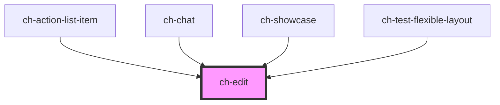

# ch-edit

## Table of Contents

- [Overview](#overview)
- [Features](#features)
- [Use when](#use-when)
- [Do not use when](#do-not-use-when)
- [Accessibility](#accessibility)
- [Properties](#properties)
- [Events](#events)
- [Slots](#slots)
- [Dependencies](#dependencies)
  - [Used by](#used-by)
  - [Graph](#graph)
- [Styling](./docs/styling.md)

<!-- Auto Generated Below -->

## Overview

The `ch-edit` component is a rich wrapper around the native `input` and `textarea` elements, serving as the primary text input building block.

## Features
 - Wide range of input types: text, password, email, number, search, date, datetime-local, time, tel, url, and file.
 - Picture formatting for masked values.
 - Auto-grow multiline mode, ideal for chat inputs.
 - Debounced input events.
 - Clear button for search inputs.
 - Show/hide password toggle.
 - Start images with multi-state support.
 - Custom placeholders for date types.
 - Additional content slots before and after the input.

## Use when
 - Building forms and data entry screens that require text input.
 - A multiline auto-growing text area is needed.
 - Masked or formatted input values are required.
 - Collecting any text, numeric, email, phone, URL, date, or password value from the user.
 - Providing a search input with a clear button.

## Do not use when
 - Selecting from a predefined set of options — prefer `ch-combo-box-render` instead.
 - A simple on/off toggle is needed — prefer `ch-switch` instead.
 - Valid values come from a fixed list — prefer `ch-combo-box-render` or `ch-radio-group-render`.
 - A numeric value has a bounded range and an approximate value is acceptable — prefer `ch-slider`.
 - Never use placeholder text as a substitute for a visible `<label>` — labels must always be visible.

## Accessibility
 - Form-associated via `ElementInternals` — participates in native form validation and submission.
 - Delegates focus into the shadow DOM (`delegatesFocus: true`), so clicking any part of the component focuses the inner `<input>` or `<textarea>`.
 - Resolves its accessible name from an external `<label>` element or the `accessibleName` property.
 - Action buttons (clear search, show/hide password) carry their own `aria-label` and are fully keyboard-operable.
 - The auto-grow helper and date placeholder are hidden from assistive technology with `aria-hidden`.
 - The `additional-content-before` and `additional-content-after` slots are only rendered when `showAdditionalContentBefore` or `showAdditionalContentAfter` are set to `true`, respectively.

## Properties

| Property                        | Attribute                            | Description                                                                                                                                                                                                                                                                                                           | Type                                                                                                                                       | Default                                                                                                                                                           |
| ------------------------------- | ------------------------------------ | --------------------------------------------------------------------------------------------------------------------------------------------------------------------------------------------------------------------------------------------------------------------------------------------------------------------- | ------------------------------------------------------------------------------------------------------------------------------------------ | ----------------------------------------------------------------------------------------------------------------------------------------------------------------- |
| `accessibleName`                | `accessible-name`                    | Specifies a short string, typically 1 to 3 words, that authors associate with an element to provide users of assistive technologies with a label for the element.                                                                                                                                                     | `string`                                                                                                                                   | `undefined`                                                                                                                                                       |
| `autoFocus`                     | `auto-focus`                         | Specifies if the control automatically get focus when the page loads.                                                                                                                                                                                                                                                 | `boolean`                                                                                                                                  | `false`                                                                                                                                                           |
| `autoGrow`                      | `auto-grow`                          | This property defines if the control size will grow automatically, to adjust to its content size. Only takes effect when `multiline === true`.                                                                                                                                                                        | `boolean`                                                                                                                                  | `false`                                                                                                                                                           |
| `autocapitalize`                | `autocapitalize`                     | Specifies the auto-capitalization behavior. Same as [autocapitalize](https://developer.apple.com/library/content/documentation/AppleApplications/Reference/SafariHTMLRef/Articles/Attributes.html#//apple_ref/doc/uid/TP40008058-autocapitalize) attribute for `input` elements. Only supported by Safari and Chrome. | `string`                                                                                                                                   | `undefined`                                                                                                                                                       |
| `autocomplete`                  | `autocomplete`                       | This attribute indicates whether the value of the control can be automatically completed by the browser. Same as [autocomplete](https://developer.mozilla.org/en-US/docs/Web/HTML/Element/input#attr-autocomplete) attribute for `input` elements.                                                                    | `"current-password" \| "new-password" \| "off" \| "on"`                                                                                    | `"off"`                                                                                                                                                           |
| `debounce`                      | `debounce`                           | Specifies a debounce for the `input` event only. The `change` event is NOT debounced by this property.                                                                                                                                                                                                                | `number`                                                                                                                                   | `0`                                                                                                                                                               |
| `disabled`                      | `disabled`                           | This attribute lets you specify if the element is disabled. If disabled, it will not fire any user interaction related event (for example, click event).                                                                                                                                                              | `boolean`                                                                                                                                  | `false`                                                                                                                                                           |
| `getImagePathCallback`          | --                                   | This property specifies a callback that is executed when the path for an startImgSrc needs to be resolved.  Fallback chain: per-instance `getImagePathCallback` → global registry (`getControlRegisterProperty`) → `DEFAULT_GET_IMAGE_PATH_CALLBACK`.                                                                 | `(imageSrc: string) => GxImageMultiState`                                                                                                  | `undefined`                                                                                                                                                       |
| `hostParts`                     | `host-parts`                         | Specifies a set of parts to use in the Host element (`ch-edit`).                                                                                                                                                                                                                                                      | `string`                                                                                                                                   | `undefined`                                                                                                                                                       |
| `maxLength`                     | `max-length`                         | This property defines the maximum string length that the user can enter into the control.                                                                                                                                                                                                                             | `number`                                                                                                                                   | `undefined`                                                                                                                                                       |
| `mode`                          | `mode`                               | This attribute hints at the type of data that might be entered by the user while editing the element or its contents. This allows a browser to display an appropriate virtual keyboard. Only works when `multiline === false`.                                                                                        | `"decimal" \| "email" \| "none" \| "numeric" \| "search" \| "tel" \| "text" \| "url"`                                                      | `undefined`                                                                                                                                                       |
| `multiline`                     | `multiline`                          | Controls if the element accepts multiline text. When `true`, a `<textarea>` is rendered instead of an `<input>`. The `autoGrow`, `picture`, and `mode` props interact with this property.                                                                                                                             | `boolean`                                                                                                                                  | `false`                                                                                                                                                           |
| `name`                          | `name`                               | This property specifies the `name` of the control when used in a form.                                                                                                                                                                                                                                                | `string`                                                                                                                                   | `undefined`                                                                                                                                                       |
| `pattern`                       | `pattern`                            | This attribute specifies a regular expression the form control's value should match. Only works when `multiline === false`.                                                                                                                                                                                           | `string`                                                                                                                                   | `undefined`                                                                                                                                                       |
| `picture`                       | `picture`                            | Specifies a picture to apply for the value of the control. Only works if not `multiline`. The `pictureCallback` property must also be set for picture formatting to take effect.                                                                                                                                      | `string`                                                                                                                                   | `undefined`                                                                                                                                                       |
| `pictureCallback`               | --                                   | Specifies the callback to execute when the picture must computed for the new value.                                                                                                                                                                                                                                   | `(value: any, picture: string) => string`                                                                                                  | `undefined`                                                                                                                                                       |
| `placeholder`                   | `placeholder`                        | A hint to the user of what can be entered in the control. Same as [placeholder](https://developer.mozilla.org/en-US/docs/Web/HTML/Element/input#attr-placeholder) attribute for `input` elements.                                                                                                                     | `string`                                                                                                                                   | `undefined`                                                                                                                                                       |
| `preventEnterInInputEditorMode` | `prevent-enter-in-input-editor-mode` | Specifies whether the ch-edit should prevent the default behavior of the `Enter` key when in input editor mode.  In other words, if `true`, pressing `Enter` will not submit the form or trigger the default action of the `Enter` key in an input field when the user-edit is in input editor mode.                  | `boolean`                                                                                                                                  | `false`                                                                                                                                                           |
| `readonly`                      | `readonly`                           | This attribute indicates that the user cannot modify the value of the control. Same as [readonly](https://developer.mozilla.org/en-US/docs/Web/HTML/Element/input#attr-readonly) attribute for `input` elements.                                                                                                      | `boolean`                                                                                                                                  | `false`                                                                                                                                                           |
| `showAdditionalContentAfter`    | `show-additional-content-after`      | If `true`, a slot is rendered in the edit with `"additional-content-after"` name. This slot is intended to customize the internal content of the edit by adding additional elements after the edit content.                                                                                                           | `boolean`                                                                                                                                  | `false`                                                                                                                                                           |
| `showAdditionalContentBefore`   | `show-additional-content-before`     | If `true`, a slot is rendered in the edit with `"additional-content-before"` name. This slot is intended to customize the internal content of the edit by adding additional elements before the edit content.                                                                                                         | `boolean`                                                                                                                                  | `false`                                                                                                                                                           |
| `showPassword`                  | `show-password`                      | Specifies if the password is displayed as plain text when using `type = "password"`. This property is mutable — the component modifies it internally when the password toggle button is clicked.                                                                                                                      | `boolean`                                                                                                                                  | `false`                                                                                                                                                           |
| `showPasswordButton`            | `show-password-button`               | Specifies if the show password button is displayed when using `type = "password"`.                                                                                                                                                                                                                                    | `boolean`                                                                                                                                  | `false`                                                                                                                                                           |
| `spellcheck`                    | `spellcheck`                         | Specifies whether the element may be checked for spelling errors                                                                                                                                                                                                                                                      | `boolean`                                                                                                                                  | `false`                                                                                                                                                           |
| `startImgSrc`                   | `start-img-src`                      | Specifies the source of the start image.                                                                                                                                                                                                                                                                              | `string`                                                                                                                                   | `undefined`                                                                                                                                                       |
| `startImgType`                  | `start-img-type`                     | Specifies the rendering mode for the start image. `"background"` uses a CSS `background-image`, while `"mask"` uses `-webkit-mask` (which allows the image to inherit `currentColor`).                                                                                                                                | `"background" \| "mask"`                                                                                                                   | `"background"`                                                                                                                                                    |
| `translations`                  | --                                   | Specifies the literals required in the control.                                                                                                                                                                                                                                                                       | `{ accessibleName: { clearSearchButton?: "Clear search"; hidePasswordButton?: "Hide password"; showPasswordButton?: "Show password"; }; }` | `{     accessibleName: {       clearSearchButton: "Clear search",       hidePasswordButton: "Hide password",       showPasswordButton: "Show password"     }   }` |
| `type`                          | `type`                               | The type of control to render. A subset of the types supported by the `input` element is supported:  * `"date"` * `"datetime-local"` * `"email"` * `"file"` * `"number"` * `"password"` * `"search"` * `"tel"` * `"text"` * `"url"`                                                                                   | `"date" \| "datetime-local" \| "email" \| "file" \| "number" \| "password" \| "search" \| "tel" \| "text" \| "time" \| "url"`              | `"text"`                                                                                                                                                          |
| `value`                         | `value`                              | The initial value of the control.                                                                                                                                                                                                                                                                                     | `string`                                                                                                                                   | `undefined`                                                                                                                                                       |

## Events

| Event                      | Description                                                                                                                                                                                                                                                                                          | Type                   |
| -------------------------- | ---------------------------------------------------------------------------------------------------------------------------------------------------------------------------------------------------------------------------------------------------------------------------------------------------- | ---------------------- |
| `change`                   | The `change` event is emitted when a change to the element's value is committed by the user. Unlike the `input` event, the `change` event is not necessarily fired for each change to an element's value but when the control loses focus. This event is _NOT_ debounced by the `debounce` property. | `CustomEvent<any>`     |
| `input`                    | Fired synchronously when the value is changed. This event is debounced by the `debounce` property.                                                                                                                                                                                                   | `CustomEvent<string>`  |
| `passwordVisibilityChange` | Fired when the visibility of the password (when using `type="password"`) is changed by clicking on the show password button.  The detail contains the new value of the `showPassword` property.                                                                                                      | `CustomEvent<boolean>` |

## Slots

| Slot                          | Description                                                                                                     |
| ----------------------------- | --------------------------------------------------------------------------------------------------------------- |
| `"additional-content-after"`  | Rendered when `showAdditionalContentAfter === true`. Use it to place custom elements after the input content.   |
| `"additional-content-before"` | Rendered when `showAdditionalContentBefore === true`. Use it to place custom elements before the input content. |

## Dependencies

### Used by

 - [ch-action-list-item](../action-list/internal/action-list-item)
 - [ch-chat](../chat)
 - [ch-showcase](../../showcase/assets/components)
 - [ch-test-flexible-layout](../test/test-flexible-layout)

### Graph

```mermaid
graph TD;
  ch-action-list-item --> ch-edit
  ch-chat --> ch-edit
  ch-showcase --> ch-edit
  ch-test-flexible-layout --> ch-edit
  style ch-edit fill:#f9f,stroke:#333,stroke-width:4px
```

----------------------------------------------

*Built with [StencilJS](https://stenciljs.com/)*
