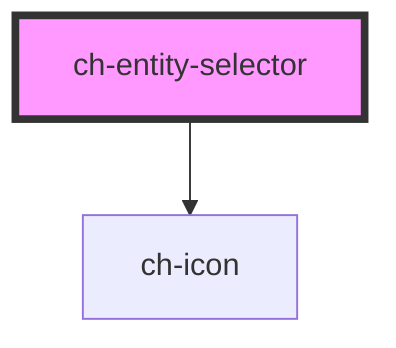

# ch-entity-selector

<!-- Auto Generated Below -->

## Properties

| Property         | Attribute | Description                                                                                                             | Type                                                                       | Default     |
| ---------------- | --------- | ----------------------------------------------------------------------------------------------------------------------- | -------------------------------------------------------------------------- | ----------- |
| `defaultValue`   | --        | Default value to be assigned as the component's value. This value should always be used when the 'X' button is pressed. | `{ id: string; name: string; iconSrc?: string; iconAutocolor?: boolean; }` | `undefined` |
| `label`          | `label`   | Optional label (same as the label of an input).                                                                         | `string`                                                                   | `undefined` |
| `onSelectEntity` | --        | Callback that will be called when the user presses the action button. Returns the new value assigned to the component.  | `() => Promise<EntityData>`                                                | `undefined` |
| `value`          | --        | Value currently assigned.                                                                                               | `{ id: string; name: string; iconSrc?: string; iconAutocolor?: boolean; }` | `undefined` |

## Shadow Parts

| Part              | Description |
| ----------------- | ----------- |
| `"button"`        |             |
| `"button-clear"`  |             |
| `"button-select"` |             |
| `"icon"`          |             |
| `"input"`         |             |
| `"input-entity"`  |             |
| `"label"`         |             |
| `"wrapper"`       |             |

## Dependencies

### Depends on

- [ch-icon](../icon)

### Graph

----------------------------------------------

*Built with [StencilJS](https://stenciljs.com/)*
