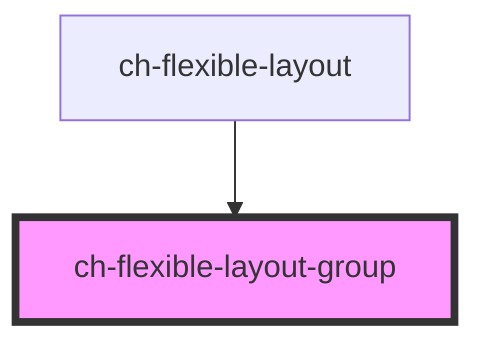

# ch-flexible-layout-group

<!-- Auto Generated Below -->

## Properties

| Property         | Attribute         | Description                                                                                                                                                       | Type                                                                       | Default     |
| ---------------- | ----------------- | ----------------------------------------------------------------------------------------------------------------------------------------------------------------- | -------------------------------------------------------------------------- | ----------- |
| `accessibleName` | `accessible-name` | Specifies a short string, typically 1 to 3 words, that authors associate with an element to provide users of assistive technologies with a label for the element. | `string`                                                                   | `undefined` |
| `items`          | --                | Specifies the items that are displayed in the group.                                                                                                              | `FlexibleLayoutItemBase[] \| FlexibleLayoutItem[]`                         | `undefined` |
| `showPageName`   | `show-page-name`  | `true` to display the name of the page.                                                                                                                           | `boolean`                                                                  | `true`      |
| `type`           | `type`            | Specifies the flexible layout type.                                                                                                                               | `"block-end" \| "block-start" \| "inline-end" \| "inline-start" \| "main"` | `undefined` |

## Events

| Event                | Description                          | Type                                                                                                                                                           |
| -------------------- | ------------------------------------ | -------------------------------------------------------------------------------------------------------------------------------------------------------------- |
| `selectedItemChange` | Fired when the selected item change. | `CustomEvent<{ group: "inline-start" \| "main" \| "inline-end" \| "block-end"; lastSelectedIndex: number; newSelectedId: string; newSelectedIndex: number; }>` |

## Dependencies

### Used by

 - [ch-flexible-layout](../flexible-layout)

### Graph

----------------------------------------------

*Built with [StencilJS](https://stenciljs.com/)*
