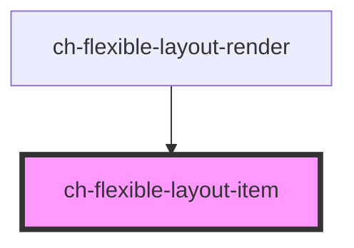

# ch-flexible-layout-item

<!-- Auto Generated Below -->

## Properties

| Property  | Attribute  | Description                                   | Type      | Default     |
| --------- | ---------- | --------------------------------------------- | --------- | ----------- |
| `addSlot` | `add-slot` | `true` to add the slot attribute in the item. | `boolean` | `true`      |
| `itemId`  | `item-id`  | Specifies the id of the flexible layout item. | `string`  | `undefined` |

## Dependencies

### Used by

 - [ch-flexible-layout-render](../../renders/flexible-layout)

### Graph

----------------------------------------------

*Built with [StencilJS](https://stenciljs.com/)*
