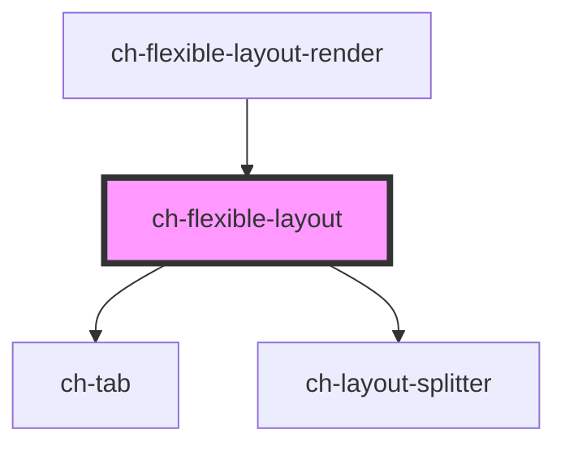

# ch-flexible-layout

<!-- Auto Generated Below -->

## Properties

| Property              | Attribute               | Description                                                     | Type                                                                               | Default     |
| --------------------- | ----------------------- | --------------------------------------------------------------- | ---------------------------------------------------------------------------------- | ----------- |
| `layoutModel`         | --                      | Specifies the distribution of the items in the flexible layout. | `{ direction: LayoutSplitterDirection; items: LayoutSplitterDistributionItem[]; }` | `undefined` |
| `layoutSplitterParts` | `layout-splitter-parts` | Specifies additional parts to export.                           | `string`                                                                           | `undefined` |
| `viewsInfo`           | --                      | Specifies the information of each view displayed.               | `Map<string, FlexibleLayoutView>`                                                  | `new Map()` |

## Events

| Event                    | Description                                       | Type                                                                                                                          |
| ------------------------ | ------------------------------------------------- | ----------------------------------------------------------------------------------------------------------------------------- |
| `selectedViewItemChange` | Fired when the selected item change.              | `CustomEvent<{ lastSelectedIndex: number; newSelectedId: string; newSelectedIndex: number; type: TabType; viewId: string; }>` |
| `viewItemClose`          | Fired when a item of a view request to be closed. | `CustomEvent<{ itemId: string; itemIndex: number; type: TabType; viewId: string; }>`                                          |

## Methods

### `removeItemInView(viewId: string, index: number, forceRerender?: boolean) => Promise<void>`

Given the view ID and the item index, remove the item from the view

#### Parameters

| Name            | Type      | Description |
| --------------- | --------- | ----------- |
| `viewId`        | `string`  |             |
| `index`         | `number`  |             |
| `forceRerender` | `boolean` |             |

#### Returns

Type: `Promise<void>`

## Dependencies

### Used by

 - [ch-flexible-layout-render](../../renders/flexible-layout)

### Depends on

- [ch-tab](../../tab)
- [ch-layout-splitter](../../layout-splitter)

### Graph

----------------------------------------------

*Built with [StencilJS](https://stenciljs.com/)*
