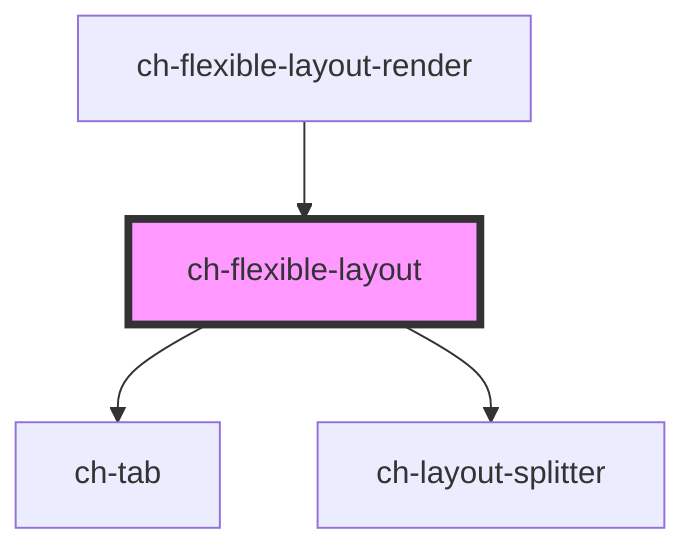

# ch-flexible-layout

<!-- Auto Generated Below -->

## Properties

| Property      | Attribute | Description                                                     | Type                                                                               | Default     |
| ------------- | --------- | --------------------------------------------------------------- | ---------------------------------------------------------------------------------- | ----------- |
| `layoutModel` | --        | Specifies the distribution of the items in the flexible layout. | `{ direction: LayoutSplitterDirection; items: LayoutSplitterDistributionItem[]; }` | `undefined` |
| `viewsInfo`   | --        | Specifies the information of each view displayed.               | `Map<string, FlexibleLayoutView>`                                                  | `new Map()` |

## Events

| Event                    | Description                          | Type                                                                                                                          |
| ------------------------ | ------------------------------------ | ----------------------------------------------------------------------------------------------------------------------------- |
| `selectedViewItemChange` | Fired when the selected item change. | `CustomEvent<{ lastSelectedIndex: number; newSelectedId: string; newSelectedIndex: number; type: TabType; viewId: string; }>` |

## Dependencies

### Used by

 - [ch-flexible-layout-render](../../renders/flexible-layout)

### Depends on

- [ch-tab](../../tab)
- [ch-layout-splitter](../../layout-splitter)

### Graph

----------------------------------------------

*Built with [StencilJS](https://stenciljs.com/)*
