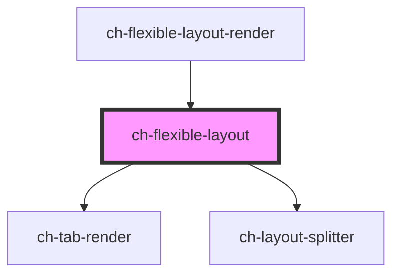

# ch-flexible-layout

<!-- Auto Generated Below -->

## Properties

| Property              | Attribute               | Description                                                                                                                                                                                                                                                                                                                                                                                                                                       | Type                                                                                                                                                                                                                                                                                                                                                                                                                                                                               | Default     |
| --------------------- | ----------------------- | ------------------------------------------------------------------------------------------------------------------------------------------------------------------------------------------------------------------------------------------------------------------------------------------------------------------------------------------------------------------------------------------------------------------------------------------------- | ---------------------------------------------------------------------------------------------------------------------------------------------------------------------------------------------------------------------------------------------------------------------------------------------------------------------------------------------------------------------------------------------------------------------------------------------------------------------------------- | ----------- |
| `contain`             | `contain`               | Same as the contain CSS property. This property indicates that an widget and its contents are, as much as possible, independent from the rest of the document tree. Containment enables isolating a subsection of the DOM, providing performance benefits by limiting calculations of layout, style, paint, size, or any combination to a DOM subtree rather than the entire page. Containment can also be used to scope CSS counters and quotes. | `"content" \| "inline-size" \| "layout" \| "none" \| "paint" \| "size" \| "strict" \| "style"`                                                                                                                                                                                                                                                                                                                                                                                     | `"none"`    |
| `itemsInfo`           | --                      | Specifies the information of each view displayed.                                                                                                                                                                                                                                                                                                                                                                                                 | `Map<string, FlexibleLayoutItemExtended<FlexibleLayoutItemModel, FlexibleLayoutLeafType>>`                                                                                                                                                                                                                                                                                                                                                                                         | `undefined` |
| `layoutSplitterParts` | `layout-splitter-parts` | Specifies additional parts to export.                                                                                                                                                                                                                                                                                                                                                                                                             | `string`                                                                                                                                                                                                                                                                                                                                                                                                                                                                           | `undefined` |
| `model`               | --                      | Specifies the distribution of the items in the flexible layout.                                                                                                                                                                                                                                                                                                                                                                                   | `Omit<LayoutSplitterModel, "items"> & { items: FlexibleLayoutItemModel[]; }`                                                                                                                                                                                                                                                                                                                                                                                                       | `undefined` |
| `overflowBehavior`    | `overflow-behavior`     | Same as the overflow CSS property. This property sets the desired behavior when content does not fit in the widget's padding box (overflows) in the horizontal and/or vertical direction.                                                                                                                                                                                                                                                         | `CssOverflowProperty \| "auto auto" \| "auto hidden" \| "auto clip" \| "auto scroll" \| "auto visible" \| "hidden auto" \| "hidden hidden" \| "hidden clip" \| "hidden scroll" \| "hidden visible" \| "clip auto" \| "clip hidden" \| "clip clip" \| "clip scroll" \| "clip visible" \| "scroll auto" \| "scroll hidden" \| "scroll clip" \| "scroll scroll" \| "scroll visible" \| "visible auto" \| "visible hidden" \| "visible clip" \| "visible scroll" \| "visible visible"` | `"visible"` |

## Events

| Event                    | Description                                             | Type                                                                                                           |
| ------------------------ | ------------------------------------------------------- | -------------------------------------------------------------------------------------------------------------- |
| `selectedViewItemChange` | Fired when the selected item change.                    | `CustomEvent<{ lastSelectedIndex: number; newSelectedId: string; newSelectedIndex: number; viewId: string; }>` |
| `viewItemClose`          | Fired when a item of a view request to be closed.       | `CustomEvent<{ itemId: string; itemIndex: number; viewId: string; }>`                                          |
| `viewItemReorder`        | Fired when a widget is dragged and dropped into a view. | `CustomEvent<WidgetDragInfo & WidgetDropInfo>`                                                                 |

## Methods

### `addSiblingView(parentGroup: string, siblingItem: string, placedInTheSibling: "before" | "after", viewInfo: FlexibleLayoutLeafModel, takeHalfTheSpaceOfTheSiblingItem: boolean) => Promise<boolean>`

#### Parameters

| Name                               | Type                                                                                                   | Description |
| ---------------------------------- | ------------------------------------------------------------------------------------------------------ | ----------- |
| `parentGroup`                      | `string`                                                                                               |             |
| `siblingItem`                      | `string`                                                                                               |             |
| `placedInTheSibling`               | `"after" \| "before"`                                                                                  |             |
| `viewInfo`                         | `LayoutSplitterLeafModel & { accessibleRole?: ViewAccessibleRole; } & FlexibleLayoutLeafConfiguration` |             |
| `takeHalfTheSpaceOfTheSiblingItem` | `boolean`                                                                                              |             |

#### Returns

Type: `Promise<boolean>`

### `refreshLeaf(leafId: string) => Promise<void>`

Schedules a new render for a leaf even if no state changed.

#### Parameters

| Name     | Type     | Description |
| -------- | -------- | ----------- |
| `leafId` | `string` |             |

#### Returns

Type: `Promise<void>`

### `removeItemPageInView(viewId: string, itemId: string, forceRerender?: boolean) => Promise<void>`

Given the view ID and the item id, remove the page of the item from the view.

#### Parameters

| Name            | Type      | Description |
| --------------- | --------- | ----------- |
| `viewId`        | `string`  |             |
| `itemId`        | `string`  |             |
| `forceRerender` | `boolean` |             |

#### Returns

Type: `Promise<void>`

### `removeView(itemId: string) => Promise<FlexibleLayoutViewRemoveResult>`

Removes the view that is identified by the given ID.
The layout is rearranged depending on the state of the removed view.

#### Parameters

| Name     | Type     | Description |
| -------- | -------- | ----------- |
| `itemId` | `string` |             |

#### Returns

Type: `Promise<FlexibleLayoutViewRemoveResult>`

## Shadow Parts

| Part               | Description |
| ------------------ | ----------- |
| `"droppable-area"` |             |

## Dependencies

### Used by

 - [ch-flexible-layout-render](../..)

### Depends on

- [ch-tab-render](../../../tab)
- [ch-layout-splitter](../../../layout-splitter)

### Graph

----------------------------------------------

*Built with [StencilJS](https://stenciljs.com/)*
