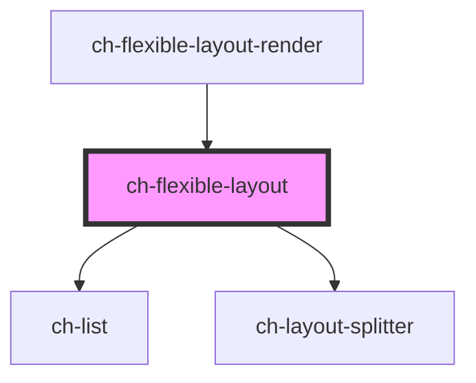

# ch-flexible-layout

<!-- Auto Generated Below -->

## Properties

| Property              | Attribute               | Description                                                     | Type                                                                                           | Default     |
| --------------------- | ----------------------- | --------------------------------------------------------------- | ---------------------------------------------------------------------------------------------- | ----------- |
| `itemsInfo`           | --                      | Specifies the information of each view displayed.               | `Map<string, FlexibleLayoutItemExtended<FlexibleLayoutItem>>`                                  | `undefined` |
| `layoutModel`         | --                      | Specifies the distribution of the items in the flexible layout. | `{ id: "root"; direction: LayoutSplitterDirection; items: LayoutSplitterDistributionItem[]; }` | `undefined` |
| `layoutSplitterParts` | `layout-splitter-parts` | Specifies additional parts to export.                           | `string`                                                                                       | `undefined` |

## Events

| Event                    | Description                                             | Type                                                                                                           |
| ------------------------ | ------------------------------------------------------- | -------------------------------------------------------------------------------------------------------------- |
| `selectedViewItemChange` | Fired when the selected item change.                    | `CustomEvent<{ lastSelectedIndex: number; newSelectedId: string; newSelectedIndex: number; viewId: string; }>` |
| `viewItemClose`          | Fired when a item of a view request to be closed.       | `CustomEvent<{ itemId: string; itemIndex: number; viewId: string; }>`                                          |
| `viewItemReorder`        | Fired when a widget is dragged and dropped into a view. | `CustomEvent<WidgetDragInfo & WidgetDropInfo>`                                                                 |

## Methods

### `addSiblingView(parentGroup: string, siblingItem: string, placedInTheSibling: "before" | "after", viewInfo: FlexibleLayoutLeaf, takeHalfTheSpaceOfTheSiblingItem: boolean) => Promise<boolean>`

#### Parameters

| Name                               | Type                                                                                                                                                        | Description |
| ---------------------------------- | ----------------------------------------------------------------------------------------------------------------------------------------------------------- | ----------- |
| `parentGroup`                      | `string`                                                                                                                                                    |             |
| `siblingItem`                      | `string`                                                                                                                                                    |             |
| `placedInTheSibling`               | `"before" \| "after"`                                                                                                                                       |             |
| `viewInfo`                         | `LayoutSplitterDistributionLeaf & { accessibleRole?: ViewAccessibleRole; selectedWidgetId?: string; viewType: ViewType; widgets: FlexibleLayoutWidget[]; }` |             |
| `takeHalfTheSpaceOfTheSiblingItem` | `boolean`                                                                                                                                                   |             |

#### Returns

Type: `Promise<boolean>`

### `refreshLayout() => Promise<void>`

Schedules a new render of the control even if no state changed.

#### Returns

Type: `Promise<void>`

### `removeItemPageInView(viewId: string, itemId: string, forceRerender?: boolean) => Promise<void>`

Given the view ID and the item id, remove the page of the item from the view.

#### Parameters

| Name            | Type      | Description |
| --------------- | --------- | ----------- |
| `viewId`        | `string`  |             |
| `itemId`        | `string`  |             |
| `forceRerender` | `boolean` |             |

#### Returns

Type: `Promise<void>`

### `removeView(itemId: string) => Promise<FlexibleLayoutViewRemoveResult>`

Removes the view that is identified by the given ID.
The layout is rearranged depending on the state of the removed view.

#### Parameters

| Name     | Type     | Description |
| -------- | -------- | ----------- |
| `itemId` | `string` |             |

#### Returns

Type: `Promise<FlexibleLayoutViewRemoveResult>`

## Shadow Parts

| Part               | Description |
| ------------------ | ----------- |
| `"droppable-area"` |             |

## Dependencies

### Used by

 - [ch-flexible-layout-render](../renders/flexible-layout)

### Depends on

- [ch-list](../list)
- [ch-layout-splitter](../layout-splitter)

### Graph

----------------------------------------------

*Built with [StencilJS](https://stenciljs.com/)*
