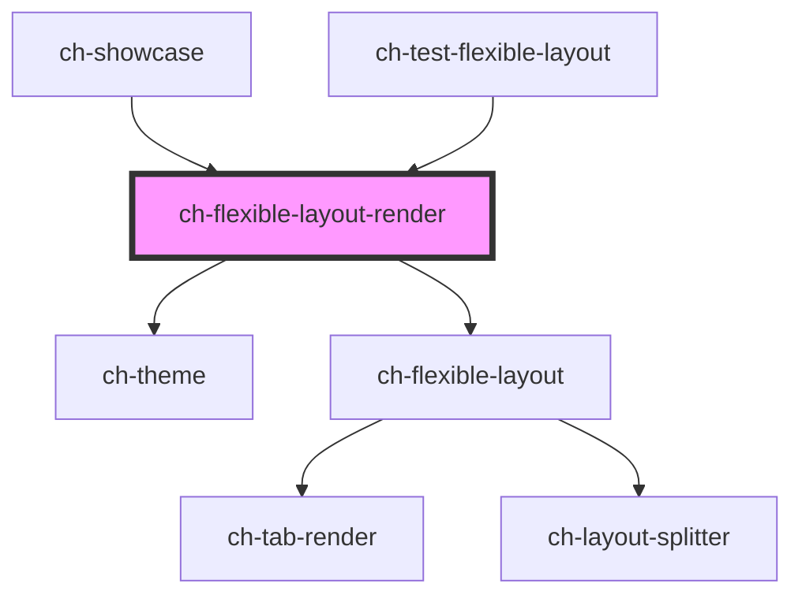

# ch-flexible-layout-render

The `ch-flexible-layout-render` control is a shell composed of lightweight modular widgets that provide a solid foundation for draggable dock layouts.

<!-- Auto Generated Below -->

## Properties

| Property         | Attribute         | Description                                                                                                                                                                                                                                                                                                                                                                                                                                       | Type                                                                                                                                                                                                                                                                                                                                                                                                                                                                               | Default     |
| ---------------- | ----------------- | ------------------------------------------------------------------------------------------------------------------------------------------------------------------------------------------------------------------------------------------------------------------------------------------------------------------------------------------------------------------------------------------------------------------------------------------------- | ---------------------------------------------------------------------------------------------------------------------------------------------------------------------------------------------------------------------------------------------------------------------------------------------------------------------------------------------------------------------------------------------------------------------------------------------------------------------------------- | ----------- |
| `closeButton`    | `close-button`    | `true` to display a close button for the `"tabbed"` type leafs.                                                                                                                                                                                                                                                                                                                                                                                   | `boolean`                                                                                                                                                                                                                                                                                                                                                                                                                                                                          | `false`     |
| `contain`        | `contain`         | Same as the contain CSS property. This property indicates that an widget and its contents are, as much as possible, independent from the rest of the document tree. Containment enables isolating a subsection of the DOM, providing performance benefits by limiting calculations of layout, style, paint, size, or any combination to a DOM subtree rather than the entire page. Containment can also be used to scope CSS counters and quotes. | `"content" \| "inline-size" \| "layout" \| "none" \| "paint" \| "size" \| "strict" \| "style"`                                                                                                                                                                                                                                                                                                                                                                                     | `"none"`    |
| `dragOutside`    | `drag-outside`    | When the "tabbed" type leafs are sortable, the items can be dragged outside of its tab-list.  This property lets you specify if this behavior is enabled.                                                                                                                                                                                                                                                                                         | `boolean`                                                                                                                                                                                                                                                                                                                                                                                                                                                                          | `false`     |
| `model`          | --                | Specifies the distribution of the items in the flexible layout.                                                                                                                                                                                                                                                                                                                                                                                   | `Omit<LayoutSplitterModel, "items"> & { items: FlexibleLayoutItemModel[]; }`                                                                                                                                                                                                                                                                                                                                                                                                       | `undefined` |
| `overflow`       | `overflow`        | Same as the overflow CSS property. This property sets the desired behavior when content does not fit in the widget's padding box (overflows) in the horizontal and/or vertical direction.                                                                                                                                                                                                                                                         | `CssOverflowProperty \| "auto auto" \| "auto hidden" \| "auto clip" \| "auto scroll" \| "auto visible" \| "hidden auto" \| "hidden hidden" \| "hidden clip" \| "hidden scroll" \| "hidden visible" \| "clip auto" \| "clip hidden" \| "clip clip" \| "clip scroll" \| "clip visible" \| "scroll auto" \| "scroll hidden" \| "scroll clip" \| "scroll scroll" \| "scroll visible" \| "visible auto" \| "visible hidden" \| "visible clip" \| "visible scroll" \| "visible visible"` | `"visible"` |
| `renders`        | --                | Specifies the distribution of the items in the flexible layout.                                                                                                                                                                                                                                                                                                                                                                                   | `{ [key: string]: (widgetInfo: FlexibleLayoutWidget) => any; }`                                                                                                                                                                                                                                                                                                                                                                                                                    | `undefined` |
| `slottedWidgets` | `slotted-widgets` | Specifies whether widgets are rendered outside of the ch-flexible-layout-render by default by projecting a slot.                                                                                                                                                                                                                                                                                                                                  | `boolean`                                                                                                                                                                                                                                                                                                                                                                                                                                                                          | `false`     |
| `sortable`       | `sortable`        | `true` to enable sorting the tab buttons in the `"tabbed"` type leafs by dragging them in the tab-list.  If `false`, the tab buttons can not be dragged out either.                                                                                                                                                                                                                                                                               | `boolean`                                                                                                                                                                                                                                                                                                                                                                                                                                                                          | `false`     |
| `theme`          | `theme`           | Specifies the theme to be used for rendering the control. If `undefined`, no theme will be applied.                                                                                                                                                                                                                                                                                                                                               | `ThemeItemBaseModel & { styleSheet: string; } \| ThemeItemBaseModel & { url?: string; } \| ThemeItemModel[] \| string \| string[]`                                                                                                                                                                                                                                                                                                                                                 | `undefined` |

## Events

| Event                   | Description                                                                                                                                                                                                                         | Type                                                      |
| ----------------------- | ----------------------------------------------------------------------------------------------------------------------------------------------------------------------------------------------------------------------------------- | --------------------------------------------------------- |
| `renderedWidgetsChange` | Emitted every time the rendered widgets changes. It contains the detail of which widgets are rendered inside the `ch-flexible-layout-render` (`rendered` member) and those widgets that are rendered in an slot (`slotted` member). | `CustomEvent<{ rendered: string[]; slotted: string[]; }>` |
| `widgetClose`           | Emitted when the user pressed the close button in a widget.                                                                                                                                                                         | `CustomEvent<{ widgetId: string; viewId: string; }>`      |

## Methods

### `addSiblingView(parentGroup: string, siblingItem: string, placedInTheSibling: "before" | "after", viewInfo: FlexibleLayoutLeafModel, takeHalfTheSpaceOfTheSiblingItem: boolean) => Promise<boolean>`

Add a view with widgets to render. The view will take the half space of
the sibling view that its added with.

#### Parameters

| Name                               | Type                                                                                                   | Description |
| ---------------------------------- | ------------------------------------------------------------------------------------------------------ | ----------- |
| `parentGroup`                      | `string`                                                                                               |             |
| `siblingItem`                      | `string`                                                                                               |             |
| `placedInTheSibling`               | `"after" \| "before"`                                                                                  |             |
| `viewInfo`                         | `LayoutSplitterLeafModel & { accessibleRole?: ViewAccessibleRole; } & FlexibleLayoutLeafConfiguration` |             |
| `takeHalfTheSpaceOfTheSiblingItem` | `boolean`                                                                                              |             |

#### Returns

Type: `Promise<boolean>`

### `addWidget(leafId: string, widget: FlexibleLayoutWidget, selectWidget?: boolean) => Promise<void>`

Add a widget in a `"tabbed"` type leaf.
Only works if the parent leaf is `"tabbed"` type.
If a widget with the same ID already exists, this method has not effect.

To add a widget in a `"single-content"` type leaf, use the
`addSiblingView` method.

#### Parameters

| Name           | Type                                                                                                                                                                                                                                     | Description |
| -------------- | ---------------------------------------------------------------------------------------------------------------------------------------------------------------------------------------------------------------------------------------- | ----------- |
| `leafId`       | `string`                                                                                                                                                                                                                                 |             |
| `widget`       | `{ addWrapper?: boolean; conserveRenderState?: boolean; id: string; accessibleName?: string; disabled?: boolean; name?: string; startImgSrc?: string; startImgType?: ImageRender; wasRendered?: boolean; } & FlexibleLayoutWidgetRender` |             |
| `selectWidget` | `boolean`                                                                                                                                                                                                                                |             |

#### Returns

Type: `Promise<void>`

### `removeView(leafId: string, removeRenderedWidgets: boolean) => Promise<FlexibleLayoutViewRemoveResult>`

Removes a view and optionally all its rendered widget from the render.
The reserved space will be given to the closest view.

#### Parameters

| Name                    | Type      | Description |
| ----------------------- | --------- | ----------- |
| `leafId`                | `string`  |             |
| `removeRenderedWidgets` | `boolean` |             |

#### Returns

Type: `Promise<FlexibleLayoutViewRemoveResult>`

### `removeWidget(widgetId: string) => Promise<void>`

Remove a widget from a `"tabbed"` type leaf.
Only works if the parent leaf is `"tabbed"` type.

To remove a widget from a `"single-content"` type leaf, use the
`removeView` method.

#### Parameters

| Name       | Type     | Description |
| ---------- | -------- | ----------- |
| `widgetId` | `string` |             |

#### Returns

Type: `Promise<void>`

### `updateSelectedWidget(parentLeafId: string, newSelectedWidgetId: string) => Promise<void>`

Update the selected widget from a `"tabbed"` type leaf.
Only works if the parent leaf is `"tabbed"` type.

#### Parameters

| Name                  | Type     | Description |
| --------------------- | -------- | ----------- |
| `parentLeafId`        | `string` |             |
| `newSelectedWidgetId` | `string` |             |

#### Returns

Type: `Promise<void>`

### `updateViewInfo(viewId: string, properties: Partial<Omit<FlexibleLayoutLeafConfigurationTabbed, "selectedWidgetId" | "widget" | "widgets">>) => Promise<void>`

Given the viewId, it updates the info of the view if the view is a leaf.
The `type` of the properties argument must match the `type` of the view to
update.

#### Parameters

| Name         | Type                                                                                                                                                                                               | Description |
| ------------ | -------------------------------------------------------------------------------------------------------------------------------------------------------------------------------------------------- | ----------- |
| `viewId`     | `string`                                                                                                                                                                                           |             |
| `properties` | `{ disabled?: boolean; type?: "tabbed"; closeButton?: boolean; dragOutside?: boolean; sortable?: boolean; showCaptions?: boolean; tabButtonHidden?: boolean; tabListPosition?: TabListPosition; }` |             |

#### Returns

Type: `Promise<void>`

### `updateWidgetInfo(widgetId: string, properties: Partial<Omit<FlexibleLayoutWidget, "id" | "wasRendered">>) => Promise<void>`

Update the widget info.

#### Parameters

| Name         | Type                                                                                                                                                                                                                                                                                                                                                                                                                                                                                                                                                                                                                                                                                                                                                          | Description |
| ------------ | ------------------------------------------------------------------------------------------------------------------------------------------------------------------------------------------------------------------------------------------------------------------------------------------------------------------------------------------------------------------------------------------------------------------------------------------------------------------------------------------------------------------------------------------------------------------------------------------------------------------------------------------------------------------------------------------------------------------------------------------------------------- | ----------- |
| `widgetId`   | `string`                                                                                                                                                                                                                                                                                                                                                                                                                                                                                                                                                                                                                                                                                                                                                      |             |
| `properties` | `{ name?: string; slot?: boolean; disabled?: boolean; overflow?: CssOverflowProperty \| "auto auto" \| "auto hidden" \| "auto clip" \| "auto scroll" \| "auto visible" \| "hidden auto" \| "hidden hidden" \| "hidden clip" \| "hidden scroll" \| "hidden visible" \| "clip auto" \| "clip hidden" \| "clip clip" \| "clip scroll" \| "clip visible" \| "scroll auto" \| "scroll hidden" \| "scroll clip" \| "scroll scroll" \| "scroll visible" \| "visible auto" \| "visible hidden" \| "visible clip" \| "visible scroll" \| "visible visible"; accessibleName?: string; startImgSrc?: string; startImgType?: ImageRender; closeButton?: boolean; contain?: CssContainProperty; addWrapper?: boolean; conserveRenderState?: boolean; renderId?: string; }` |             |

#### Returns

Type: `Promise<void>`

## Dependencies

### Used by

 - [ch-showcase](../../showcase/assets/components)
 - [ch-test-flexible-layout](../test/test-flexible-layout)

### Depends on

- [ch-theme](../theme)
- [ch-flexible-layout](./internal/flexible-layout)

### Graph

----------------------------------------------

*Built with [StencilJS](https://stenciljs.com/)*
