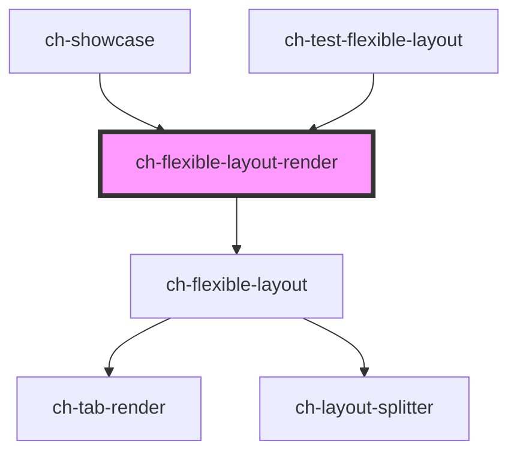

# ch-flexible-layout-render

The `ch-flexible-layout-render` control is a shell composed of lightweight modular widgets that provide a solid foundation for draggable dock layouts.

<!-- Auto Generated Below -->

## Properties

| Property   | Attribute   | Description                                                     | Type                                                                         | Default             |
| ---------- | ----------- | --------------------------------------------------------------- | ---------------------------------------------------------------------------- | ------------------- |
| `cssClass` | `css-class` | A CSS class to set as the `ch-flexible-layout` element class.   | `string`                                                                     | `"flexible-layout"` |
| `model`    | --          | Specifies the distribution of the items in the flexible layout. | `Omit<LayoutSplitterModel, "items"> & { items: FlexibleLayoutItemModel[]; }` | `undefined`         |
| `renders`  | --          | Specifies the distribution of the items in the flexible layout. | `{ [key: string]: (widgetInfo: FlexibleLayoutWidget) => any; }`              | `undefined`         |

## Events

| Event         | Description                                                 | Type                                                 |
| ------------- | ----------------------------------------------------------- | ---------------------------------------------------- |
| `widgetClose` | Emitted when the user pressed the close button in a widget. | `CustomEvent<{ widgetId: string; viewId: string; }>` |

## Methods

### `addSiblingView(parentGroup: string, siblingItem: string, placedInTheSibling: "before" | "after", viewInfo: FlexibleLayoutLeafModel, takeHalfTheSpaceOfTheSiblingItem: boolean) => Promise<boolean>`

Add a view with widgets to render. The view will take the half space of
the sibling view that its added with.

#### Parameters

| Name                               | Type                                                                                                   | Description |
| ---------------------------------- | ------------------------------------------------------------------------------------------------------ | ----------- |
| `parentGroup`                      | `string`                                                                                               |             |
| `siblingItem`                      | `string`                                                                                               |             |
| `placedInTheSibling`               | `"after" \| "before"`                                                                                  |             |
| `viewInfo`                         | `LayoutSplitterLeafModel & { accessibleRole?: ViewAccessibleRole; } & FlexibleLayoutLeafConfiguration` |             |
| `takeHalfTheSpaceOfTheSiblingItem` | `boolean`                                                                                              |             |

#### Returns

Type: `Promise<boolean>`

### `addWidget(leafId: string, widget: FlexibleLayoutWidget, selectWidget?: boolean) => Promise<void>`

Add a widget in a `"tabbed"` type leaf.
Only works if the parent leaf is `"tabbed"` type.
If a widget with the same ID already exists, this method has not effect.

To add a widget in a `"single-content"` type leaf, use the
`addSiblingView` method.

#### Parameters

| Name           | Type                                                                                                                                                                                       | Description |
| -------------- | ------------------------------------------------------------------------------------------------------------------------------------------------------------------------------------------ | ----------- |
| `leafId`       | `string`                                                                                                                                                                                   |             |
| `widget`       | `{ addWrapper?: boolean; conserveRenderState?: boolean; id: string; name: string; startImgSrc?: string; startImgType?: ImageRender; wasRendered?: boolean; } & FlexibleLayoutWidgetRender` |             |
| `selectWidget` | `boolean`                                                                                                                                                                                  |             |

#### Returns

Type: `Promise<void>`

### `removeView(leafId: string, removeRenderedWidgets: boolean) => Promise<FlexibleLayoutViewRemoveResult>`

Removes a view and optionally all its rendered widget from the render.
The reserved space will be given to the closest view.

#### Parameters

| Name                    | Type      | Description |
| ----------------------- | --------- | ----------- |
| `leafId`                | `string`  |             |
| `removeRenderedWidgets` | `boolean` |             |

#### Returns

Type: `Promise<FlexibleLayoutViewRemoveResult>`

### `removeWidget(widgetId: string) => Promise<void>`

Remove a widget from a `"tabbed"` type leaf.
Only works if the parent leaf is `"tabbed"` type.

To remove a widget from a `"single-content"` type leaf, use the
`removeView` method.

#### Parameters

| Name       | Type     | Description |
| ---------- | -------- | ----------- |
| `widgetId` | `string` |             |

#### Returns

Type: `Promise<void>`

### `updateSelectedWidget(parentLeafId: string, newSelectedWidgetId: string) => Promise<void>`

Update the selected widget from a `"tabbed"` type leaf.
Only works if the parent leaf is `"tabbed"` type.

#### Parameters

| Name                  | Type     | Description |
| --------------------- | -------- | ----------- |
| `parentLeafId`        | `string` |             |
| `newSelectedWidgetId` | `string` |             |

#### Returns

Type: `Promise<void>`

### `updateViewInfo(viewId: string, properties: Partial<Omit<FlexibleLayoutLeafConfigurationTabbed, "selectedWidgetId" | "widget" | "widgets">>) => Promise<void>`

Given the viewId, it updates the info of the view if the view is a leaf.
The `type` of the properties argument must match the `type` of the view to
update.

#### Parameters

| Name         | Type                                                                                                                                                                                                                       | Description |
| ------------ | -------------------------------------------------------------------------------------------------------------------------------------------------------------------------------------------------------------------------- | ----------- |
| `viewId`     | `string`                                                                                                                                                                                                                   |             |
| `properties` | `{ type?: "tabbed"; closeButtonHidden?: boolean; dragOutsideDisabled?: boolean; showCaptions?: boolean; sortable?: boolean; tabDirection?: FlexibleLayoutLeafTabDirection; tabPosition?: FlexibleLayoutLeafTabPosition; }` |             |

#### Returns

Type: `Promise<void>`

### `updateWidgetInfo(widgetId: string, properties: Partial<Omit<FlexibleLayoutWidget, "id" | "wasRendered">>) => Promise<void>`

Update the widget info.

#### Parameters

| Name         | Type                                                                                                                                           | Description |
| ------------ | ---------------------------------------------------------------------------------------------------------------------------------------------- | ----------- |
| `widgetId`   | `string`                                                                                                                                       |             |
| `properties` | `{ name?: string; startImgSrc?: string; startImgType?: ImageRender; addWrapper?: boolean; conserveRenderState?: boolean; renderId?: string; }` |             |

#### Returns

Type: `Promise<void>`

## Dependencies

### Used by

 - [ch-showcase](../../showcase/assets/components)
 - [ch-test-flexible-layout](../test/test-flexible-layout)

### Depends on

- [ch-flexible-layout](./internal/flexible-layout)

### Graph

----------------------------------------------

*Built with [StencilJS](https://stenciljs.com/)*
